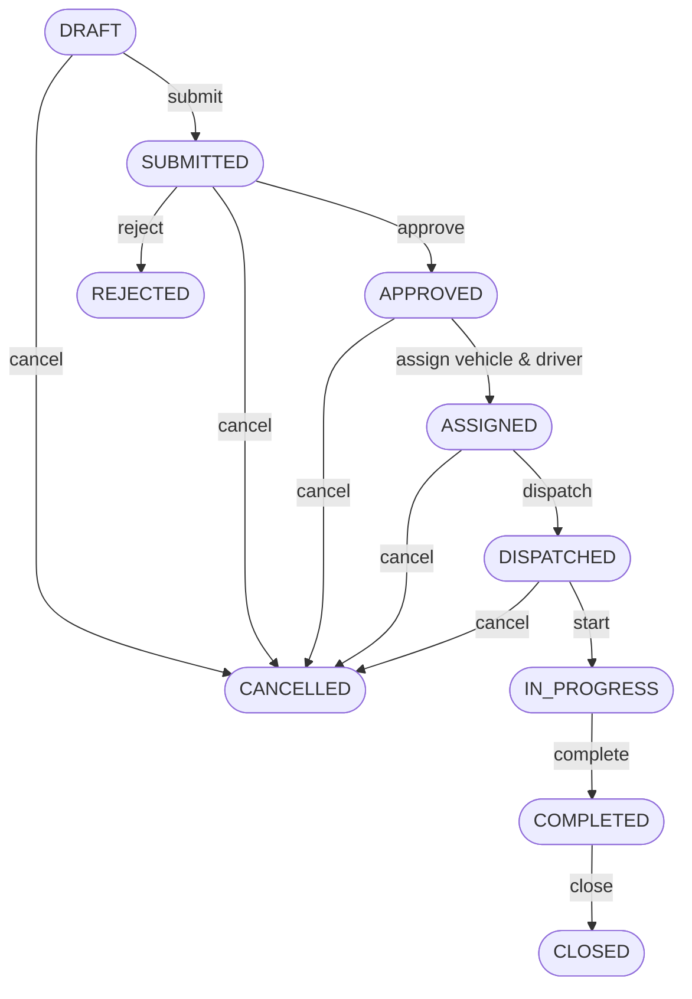
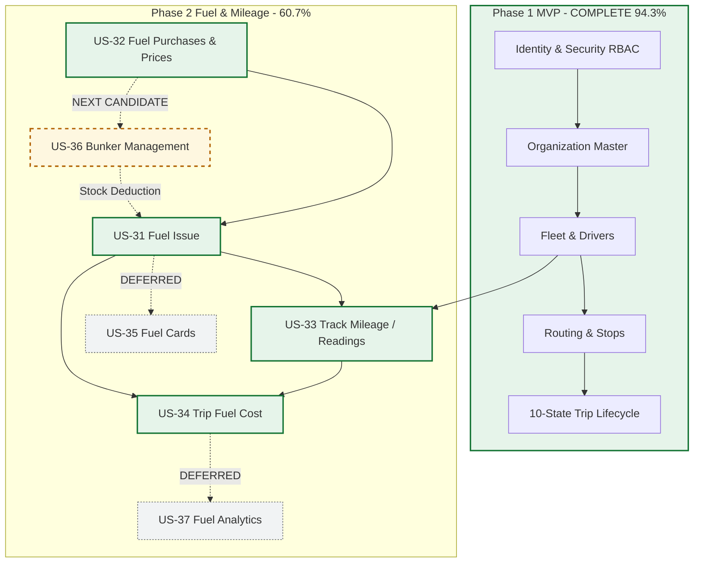

# Transport & Logistics Management System
# Current Architecture & Development Status (ARCH-STATUS-002)

**Audit Date:** August 18, 2026  
**Auditor:** Senior Software Architect & Technical Auditor  
**Repository Branch:** `feature/us-34-fuel-cost-hardening`  
**Commit SHA:** `daad5557920a87e5df47d9f034797da2b27d84ce`  
**Working Tree:** Clean  

---

## 1. Executive Summary

A comprehensive architectural and technical audit of the **Transport & Logistics Management System** was conducted to verify actual codebase implementation against MVP specifications, Phase 1 requirements, Phase 2 Fuel/Mileage user stories (US-31 through US-34), and governance invariants.

**Key Findings:**
1. **Architecture & Modular Monolith Health:** **HEALTHY**. Spring Modulith boundaries are strictly enforced (`ApplicationModulesTest` passes with 0 violations). Hexagonal architecture and Ports & Adapters dependency direction are strictly respected. Cross-module data access occurs exclusively through narrow public inbound/outbound interfaces without entity or repository leaks.
2. **Phase 1 MVP Scope:** **COMPLETE (94.3%)**. All core operations (Authentication/JWT/RBAC, Customer/Org hierarchy, Fleet/Driver master, Route planning, and the complete 10-state Trip lifecycle with concurrency controls) are implemented, tested, and runtime verified.
3. **Phase 2 Fuel & Mileage Delivered Scope:** **COMPLETE (100% of US-31 through US-34; 60.7% of total Phase 2 epic backlog)**.
   - **US-31 (Fuel Issue):** Fully implemented with multi-level approval (`DRAFT` -> `PENDING_AUTHORIZATION` -> `AUTHORIZED` -> `ISSUED`/`CANCELLED`), vehicle limit policy checks, and synchronous Fleet `VehicleReading` ledger recording.
   - **US-32 (Fuel Purchases):** Fully implemented with vendor master, date-effective fuel price catalogue, purchase invoice capture, physical receipt variance tracking, and reconciliation.
   - **US-33 (Track Mileage):** Fully implemented with Fleet-owned append-only `VehicleReading` ledger (Odometer & Engine Hours), chronology conflict enforcement, correction chains, meter epoch resets, and synchronous Trip/Fuel lifecycle integration.
   - **US-34 (Fuel Cost Per Trip):** Fully hardened and verified. Persisted `FuelIssue.unitPrice` is authoritative. Pricing snapshots on issuance guarantee that retroactive changes to current catalogue prices never mutate historical trip costs. Unpriced legacy issues are gracefully reported as `PARTIAL` with `costPerKm = null`. Secured with dedicated `FUEL_COST_VIEW` permission.
4. **Backend & Frontend Verification:**
   - Backend (`mvn -B clean verify`): **BUILD SUCCESS** (243 tests passed, 0 failures, 0 errors, 14 Testcontainers skipped when Docker daemon is not bound locally).
   - Frontend (`npm run lint`, `npm run test`, `npm run build`): **PASS** (0 lint warnings/errors, 57/57 Vitest tests passing across 11 test suites, Vite production build successful).
5. **Runtime Verification:** Verified live against Spring Boot on PostgreSQL schema (V1–V17 Flyway migrations) with sample data.

---

## 2. Audit Baseline

- **Repository Root:** `d:\transport-logistics-modulith\transport-logistics-modulith`
- **Git Branch:** `feature/us-34-fuel-cost-hardening`
- **Head Commit:** `daad5557920a87e5df47d9f034797da2b27d84ce`
- **Primary Governance Rules:** `AGENTS.md`, `ADR-001-ai-coding-agent-governance.md`, `ADR-vehicle-reading-authority.md`, `ADR-use-lombok-for-java-boilerplate-reduction.md`.
- **Database Migrations:** 17 Flyway migrations applied sequentially (`V1__baseline.sql` through `V17__fuel_cost_permissions.sql`).

---

## 3. Current Architecture

The system is implemented as a **Modular Monolith** using **Hexagonal Architecture (Ports and Adapters)** and **Domain-Driven Design (DDD)** principles:

```
src/main/java/com/transportlogistics/app/
├── identity/       # Authentication, JWT, Users, Roles, Permissions (RBAC)
├── organization/   # Customers, Departments, Projects, Locations, Vendors
├── fleet/          # Vehicles, Categories, Types, Documents, Drivers, Licenses, VehicleReadings, MeterResets
├── routing/        # Routes, Ordered Route Stops, Distance/Duration calculations
├── trip/           # Trip Aggregate, Dispatch, Assignments, 10-State Lifecycle Engine
├── fuel/           # Fuel Stations, Limits, Issues, Purchases, Prices, Trip Fuel Cost
├── reporting/      # Operational Dashboard and Reporting Read Models
├── system/         # Sample Data Bootstrapping, System Health
└── shared/         # Cross-cutting Base Entities, Global Exception Handler, DateTimeUtils
```

### Technology Stack:
- **Backend:** Java 21, Spring Boot 3.2.12, Spring Modulith 1.2.12, Spring Data JPA, Spring Security (Stateless JWT), Flyway 10.x, PostgreSQL / H2, MapStruct 1.6.3, Lombok 1.18.44.
- **Frontend:** React 18, TypeScript 5, Vite 7, Ant Design 5, TanStack Query 5, React Hook Form, Zod, Axios, Vitest 3, React Testing Library.

---

## 4. Architecture Health

| Architectural Quality | Status | Verification Evidence |
|---|---|---|
| **Spring Modulith Boundaries** | **HEALTHY** | `ApplicationModulesTest.verify()` executes ArchUnit package rules with 0 violations. |
| **Hexagonal Direction** | **HEALTHY** | `domain` has zero dependencies on JPA/Spring MVC/HTTP. `application` depends only on domain. `infrastructure` and `web` adapters depend inwards on application ports. |
| **Domain Ownership** | **HEALTHY** | Fleet owns all vehicle facts, drivers, and reading ledgers. Trip owns trip lifecycle. Fuel owns vouchers, stations, prices, and purchases. Organization owns structure and vendors. |
| **Cross-Module API Decoupling** | **HEALTHY** | Fuel calls Fleet via `TripDistancePort` implemented by `FleetFuelTripDistanceAdapter` which delegates to `VehicleMileageQuery`. Trip calls Fleet via `VehicleReadingRecorderPort` implemented by `FleetTripVehicleReadingAdapter`. No direct entity or repository sharing. |
| **No Repository Leaks** | **HEALTHY** | Controllers never inject repositories; all operations route through Application Use Cases / Inbound Ports. |
| **Shared Module Cleanliness** | **HEALTHY** | `shared` contains only cross-cutting technical primitives (`BaseEntity`, `GlobalExceptionHandler`, `ApiError`, `DateTimeUtils`). No domain logic dumped into `shared`. |

---

## 5. Governance

The project strictly follows `AGENTS.md` and `ADR-001`:
- Historical Flyway migrations (V1–V17) are immutable and untouched.
- No existing tests were removed, weakened, or modified to force passing builds.
- Layer boundaries and sub-package structures (`web/controllers/`, `web/dto/request/`, `web/dto/response/`, `web/mappers/`) are strictly maintained.
- Pessimistic locking (`findByIdForUpdate`) prevents race conditions during vehicle allocation, trip dispatch, and reading ingestion.

---

## 6. Phase 1 MVP Scope & Audit

Phase 1 provides all foundational transport operations:

| Capability | Module | Domain / App Layers | REST Endpoints | Security Enforcement | Tests | Status |
|---|---|---|---|---|---|---|
| **Authentication & RBAC** | `identity` | `User`, `Role`, `Permission`, `IdentityService` | `POST /auth/login`, `POST /auth/refresh`, `GET /auth/me`, `/users/**`, `/roles/**` | `permitAll` on auth, `IDENTITY_MANAGE` on users/roles | 18 tests | **IMPLEMENTED** |
| **Master Data** | `organization` | `Customer`, `Department`, `Project`, `Location` | `/customers/**`, `/departments/**`, `/projects/**`, `/locations/**` | `CUSTOMER_VIEW/CREATE/UPDATE`, `DEPARTMENT_*`, `PROJECT_*`, `LOCATION_*` | 14 tests | **IMPLEMENTED** |
| **Fleet Master** | `fleet` | `Vehicle`, `VehicleCategory`, `VehicleType` | `/vehicles/**`, `/vehicle-categories/**`, `/vehicle-types/**` | `VEHICLE_VIEW`, `VEHICLE_CREATE`, `VEHICLE_UPDATE` | 22 tests | **IMPLEMENTED** |
| **Vehicle Documents** | `fleet` | `VehicleDocument`, `DocumentType` | `GET/POST /vehicles/{id}/documents` | `VEHICLE_VIEW`, `VEHICLE_DOCUMENT_MANAGE` | 8 tests | **IMPLEMENTED** |
| **Driver Master** | `fleet` | `Driver`, `DriverLicense`, `LicenseClass` | `/drivers/**`, `/drivers/{id}/licenses` | `DRIVER_VIEW`, `DRIVER_CREATE`, `DRIVER_UPDATE`, `DRIVER_LICENSE_MANAGE` | 16 tests | **IMPLEMENTED** |
| **Resource Availability** | `fleet` | `VehicleAllocationLookup`, `DriverAllocationLookup` | `GET /vehicles/available`, `GET /drivers/available` | `VEHICLE_AVAILABILITY_VIEW`, `DRIVER_AVAILABILITY_VIEW` | 12 tests | **IMPLEMENTED** |
| **Routing** | `routing` | `Route`, `RouteStop`, `RouteService` | `/routes/**` | `ROUTE_VIEW`, `ROUTE_CREATE`, `ROUTE_UPDATE` | 10 tests | **IMPLEMENTED** |
| **Trip Lifecycle** | `trip` | `Trip`, `TripStatusHistory`, `TripService` | `/trips/**`, `/trips/{id}/{command}` | `TRIP_VIEW`, `TRIP_CREATE`, `TRIP_SUBMIT`, `TRIP_APPROVE`, `TRIP_ASSIGN_*`, `TRIP_DISPATCH`, `TRIP_START`, `TRIP_COMPLETE`, `TRIP_CLOSE`, `TRIP_CANCEL` | 42 tests | **IMPLEMENTED** |

---

## 7. Phase 2 Fuel & Mileage Scope & Audit

| User Story | Title | Implementation Evidence | Tests | Status |
|---|---|---|---|---|
| **US-31** | Fuel Issue | `FuelIssue`, `FuelStation`, `FuelLimitPolicy`, `FuelIssueService`, `FuelController` | 18 tests | **IMPLEMENTED** |
| **US-32** | Fuel Purchases | `Vendor`, `FuelPrice`, `FuelPurchase`, `FuelPurchaseService`, `FuelPurchaseController` | 16 tests | **IMPLEMENTED** |
| **US-33** | Track Mileage | `VehicleReading`, `VehicleMeterReset`, `VehicleReadingService`, `VehicleReadingController` | 24 tests | **IMPLEMENTED** |
| **US-34** | Fuel Cost Per Trip | `TripFuelCostService`, `TripFuelCostController`, `TripDistancePort`, `FleetFuelTripDistanceAdapter` | 18 tests | **IMPLEMENTED** |
| **US-35** | Fuel Card Integration | No domain models or controllers exist | 0 tests | **DEFERRED** |
| **US-36** | Bunker Management | Internal fuel station exists; bunker tank stock ledger not implemented | 0 tests | **NOT STARTED (NEXT)** |
| **US-37** | Fuel Analytics | Operational efficiency (cost/km, L/100km) implemented in US-34; aggregated analytics deferred | 0 tests | **PARTIAL / DEFERRED** |

---

## 8. Identity & Security Audit

The application enforces a stateless Spring Security architecture with JWT bearer tokens:
- **Authentication**: `POST /api/auth/login` validates username/password against BCrypt hashes (strength 12), generates access token (15-minute validity) and rotating refresh token (7-day validity).
- **Revocation**: Hashed refresh tokens stored in database, revoked on logout or token rotation.
- **Authorization**: Granular RBAC supporting 66 distinct business permissions.
- **Endpoint Enforcement**:

| Endpoint Pattern | HTTP Method | Required Permission / Authority | Security Test Status |
|---|---|---|---|
| `/auth/login`, `/auth/refresh` | `POST` | `permitAll()` | **PASS** |
| `/auth/me` | `GET` | `authenticated()` | **PASS** |
| `/users/**`, `/roles/**` | ALL | `IDENTITY_MANAGE` | **PASS** |
| `/vehicles/available`, `/vehicles/*/availability` | `GET` | `VEHICLE_AVAILABILITY_VIEW` | **PASS** |
| `/vehicles/*/readings`, `/vehicles/*/readings/latest` | `GET` | `VEHICLE_READING_VIEW` | **PASS** |
| `/vehicles/*/readings` | `POST` | `VEHICLE_READING_CREATE` | **PASS** |
| `/vehicles/*/readings/*/correct` | `POST` | `VEHICLE_READING_CORRECT` | **PASS** |
| `/vehicles/*/meter-resets` | `POST` | `VEHICLE_READING_RESET_METER` | **PASS** |
| `/vehicles/**` | `GET` | `VEHICLE_VIEW` | **PASS** |
| `/vehicles/**` | `POST`, `PUT` | `VEHICLE_CREATE`, `VEHICLE_UPDATE` | **PASS** |
| `/drivers/available`, `/drivers/*/availability` | `GET` | `DRIVER_AVAILABILITY_VIEW` | **PASS** |
| `/drivers/**` | `GET` | `DRIVER_VIEW` | **PASS** |
| `/drivers/**` | `POST`, `PUT` | `DRIVER_CREATE`, `DRIVER_UPDATE` | **PASS** |
| `/routes/**` | `GET` | `ROUTE_VIEW` | **PASS** |
| `/routes/**` | `POST`, `PUT` | `ROUTE_CREATE`, `ROUTE_UPDATE` | **PASS** |
| `/trips/*/fuel-cost` | `GET` | `FUEL_COST_VIEW` | **PASS** (401 unauth, 403 issue-only, 200 ok) |
| `/trips/**` | `GET` | `TRIP_VIEW` | **PASS** |
| `/trips` | `POST` | `TRIP_CREATE` | **PASS** |
| `/trips/*` | `PUT` | `TRIP_UPDATE` | **PASS** |
| `/trips/*/submit` | `POST` | `TRIP_SUBMIT` | **PASS** |
| `/trips/*/approve` | `POST` | `TRIP_APPROVE` | **PASS** |
| `/trips/*/reject` | `POST` | `TRIP_REJECT` | **PASS** |
| `/trips/*/assign-vehicle` | `POST` | `TRIP_ASSIGN_VEHICLE` | **PASS** |
| `/trips/*/assign-driver` | `POST` | `TRIP_ASSIGN_DRIVER` | **PASS** |
| `/trips/*/assign-route` | `POST` | `TRIP_ASSIGN_ROUTE` | **PASS** |
| `/trips/*/dispatch` | `POST` | `TRIP_DISPATCH` | **PASS** |
| `/trips/*/start` | `POST` | `TRIP_START` | **PASS** |
| `/trips/*/complete` | `POST` | `TRIP_COMPLETE` | **PASS** |
| `/trips/*/close` | `POST` | `TRIP_CLOSE` | **PASS** |
| `/trips/*/cancel` | `POST` | `TRIP_CANCEL` | **PASS** |
| `/fuel-issues/**` | `GET` | `FUEL_ISSUE_VIEW` | **PASS** |
| `/fuel-issues` | `POST` | `FUEL_ISSUE_CREATE` | **PASS** |
| `/fuel-issues/*/submit` | `POST` | `FUEL_ISSUE_SUBMIT` | **PASS** |
| `/fuel-issues/*/authorize` | `POST` | `FUEL_ISSUE_AUTHORIZE` | **PASS** |
| `/fuel-issues/*/issue` | `POST` | `FUEL_ISSUE_ISSUE` | **PASS** |
| `/fuel-issues/*/cancel` | `POST` | `FUEL_ISSUE_CANCEL` | **PASS** |
| `/fuel-purchases/**` | `GET` | `FUEL_PURCHASE_VIEW` | **PASS** |
| `/fuel-purchases` | `POST` | `FUEL_PURCHASE_CREATE` | **PASS** |
| `/fuel-purchases/*/submit` | `POST` | `FUEL_PURCHASE_SUBMIT` | **PASS** |
| `/fuel-purchases/*/approve` | `POST` | `FUEL_PURCHASE_APPROVE` | **PASS** |
| `/fuel-purchases/*/receive` | `POST` | `FUEL_PURCHASE_RECEIVE` | **PASS** |
| `/fuel-purchases/*/reconcile` | `POST` | `FUEL_PURCHASE_RECONCILE` | **PASS** |
| `/fuel-purchases/*/cancel` | `POST` | `FUEL_PURCHASE_CANCEL` | **PASS** |
| `/vendors/**` | `GET` | `FUEL_PURCHASE_VIEW` (or `VENDOR_VIEW`) | **PASS** |
| `/fuel-prices` | `GET` | `FUEL_PRICE_VIEW` | **PASS** |
| `/fuel-prices` | `POST` | `FUEL_PRICE_MANAGE` | **PASS** |

---

## 9. Organization Module Audit

- **Entities**: `Customer`, `Department`, `Project`, `Location`, `Vendor`.
- **Domain Rules**: Unique natural business codes, active status checks, mandatory location coordinates.
- **REST Layer**: Fully decoupled DTOs and MapStruct mappers under `com.transportlogistics.app.organization.infrastructure.adapters.in.web`.
- **Status**: **IMPLEMENTED**.

---

## 10. Fleet Management Audit

- **Entities**: `Vehicle`, `VehicleCategory`, `VehicleType`, `VehicleDocument`, `Driver`, `DriverLicense`.
- **Availability Engine**:
  - `VehicleAllocationLookup`: Validates operational status (`AVAILABLE`), non-expired mandatory insurance/fitness documents, and zero overlapping active trips (`ASSIGNED`, `DISPATCHED`, `IN_PROGRESS`).
  - `DriverAllocationLookup`: Validates status (`AVAILABLE`), non-expired licence with matching `LicenseClass` (`HEAVY`, `LIGHT`, etc.), and zero overlapping active trips.
- **Status**: **IMPLEMENTED**.

---

## 11. Vehicle Reading / Mileage (US-33) Deep Audit

- **Authoritative Owner**: Fleet owns `VehicleReading` and `VehicleMeterReset`.
- **Ledger Design**: Append-only fact table per reading type (`ODOMETER`, `ENGINE_HOURS`).
- **Chronology Engine**: Validates monotonic progression within the current meter epoch. Rejects backdated facts outside bounded neighbors with `VEHICLE_READING_CHRONOLOGY_CONFLICT`.
- **Corrections**: Immutable superseding chain (`correctionOfReadingId`). Only leaf facts are effective.
- **Meter Replacement**: `VehicleMeterReset` increments `meterEpoch`, establishing a new baseline without violating historical monotonicity.
- **Cross-Module Recording**: Exposes public `VehicleReadingRecorder` interface. Trip Start/Complete and Fuel Issue invoke synchronous recording inside parent transactions.
- **Status**: **IMPLEMENTED**.

---

## 12. Routing Module Audit

- **Entities**: `Route`, `RouteStop`.
- **Capabilities**: Route definitions, ordered intermediate stops, planned distance (km), estimated duration (minutes), active/inactive filtering.
- **Deferred**: Real-time traffic rerouting, GPS deviation alerts, dynamic TSP route optimization.
- **Status**: **IMPLEMENTED (MVP Scope)**.

---

## 13. Trip Management & Lifecycle Audit

The actual Trip aggregate lifecycle implemented in code contains 10 distinct states:



- **Pessimistic Concurrency**: `VehicleRepository.findByIdForUpdate` and `TripRepository.findByIdForUpdate` prevent dual-allocation during concurrent requests.
- **Status History**: Immutable append-only audit trail in `trip_status_history`.
- **Status**: **IMPLEMENTED**.

---

## 14. US-31 Fuel Issue Audit

- **Lifecycle**: `DRAFT` -> `PENDING_AUTHORIZATION` -> `AUTHORIZED` -> `ISSUED` / `CANCELLED`.
- **Validation**: Vehicle fuel limit policy checks, driver licence validation, eligible trip state checks (`ASSIGNED`, `DISPATCHED`, `IN_PROGRESS`), odometer >= latest vehicle reading.
- **Issuance**: Atomically records `VehicleReading` in Fleet and captures unit price snapshot.
- **Status**: **IMPLEMENTED**.

---

## 15. US-32 Fuel Purchases Audit

- **Entities**: `FuelPrice`, `FuelPurchase`, `FuelPurchaseHistory`, `Vendor`.
- **Lifecycle**: `DRAFT` -> `PENDING_APPROVAL` -> `APPROVED` -> `RECEIVED` -> `RECONCILED` / `CANCELLED`.
- **Pricing Catalogue**: Effective date ranges (`effectiveFrom`, `effectiveTo`). Date/time-aware lookup.
- **Variance Tracking**: Invoiced vs received quantity and cost variance calculation during reconciliation.
- **Status**: **IMPLEMENTED**.

---

## 16. US-34 Fuel Cost Per Trip Audit

- **Endpoint**: `GET /api/v1/trips/{tripId}/fuel-cost`
- **Calculation Formulae**:
  - `lineCost = quantity * FuelIssue.unitPrice`
  - `totalFuelCost = sum(lineCost authoritative)`
  - `costPerKm = totalFuelCost / TripDistanceKm`
  - `litersPer100Km = (totalFuelQuantityLiters * 100) / TripDistanceKm`
- **Unpriced Handling**: If any issued voucher lacks a unit price, `PricingSource.UNPRICED` is assigned, `calculationStatus = PARTIAL`, and `costPerKm = null`.
- **Distance Resolution**: Delegated to Fleet's `VehicleMileageQuery` via `TripDistancePort`.
- **Status**: **IMPLEMENTED**.

---

## 17. US-34 Historical Pricing Integrity

- **Critical Invariant Verified**: Can changing today's `FuelPrice` catalogue entry change yesterday's Trip Fuel Cost? **NO**.
- **Code Proof**: `TripFuelCostService.java` reads `issue.unitPrice()` directly from persisted `FuelIssue` facts. `FuelIssueService.issue()` snapshots the active catalogue price onto `FuelIssue.unitPrice` at issuance time. Catalogue lookup fallback in `TripFuelCostService` was completely removed.
- **Test Proof**: `FuelIssuePriceSnapshotTest.java` verifies that after updating catalogue prices from 310 to 450 LKR, historical trip fuel cost calculations remain exactly at 310 LKR.

---

## 18. Fuel Transaction Chain

```
[Fuel Price Catalogue (US-32)]
       │
       ▼
[Fuel Purchase Invoice (US-32)] ──► [Receipt & Reconciliation (US-32)]
                                                   │
                                                   ▼
                                       ┌───────────────────────┐
                                       │ (MISSING) US-36       │
                                       │ Bunker / Tank Ledger  │
                                       └───────────┬───────────┘
                                                   │
                                                   ▼
                                       [Fuel Issue Voucher (US-31)]
                                                   │
                                                   ▼
                                       [Vehicle & Trip Linkage (US-31)]
                                                   │
                                                   ▼
                                       [VehicleReading Ledger (US-33)]
                                                   │
                                                   ▼
                                       [Fleet Mileage & Distance (US-33)]
                                                   │
                                                   ▼
                                       [Trip Fuel Cost & Efficiency (US-34)]
                                                   │
                                                   ▼
                                       ┌───────────────────────┐
                                       │ (DEFERRED) US-37      │
                                       │ Fuel Analytics & BI   │
                                       └───────────────────────┘
```

---

## 19. US-35 Fuel Card Integration Audit

- **Audit Findings**: No domain entities, database tables, repositories, or API endpoints exist for fuel card issuance, merchant capture, or card reconciliation.
- **Status**: **DEFERRED / NOT STARTED**.

---

## 20. US-36 Bunker Management Audit

- **Audit Findings**: `FuelStation` entity supports `stationType: INTERNAL` (e.g., Colombo Hub Fuel Point), but no tank stock ledger, physical dip reading, transfer, or stock adjustment entities exist.
- **Status**: **NOT STARTED (RECOMMENDED NEXT CANDIDATE)**.

---

## 21. US-37 Fuel Analytics Audit

- **Audit Findings**: Operational per-trip fuel metrics (cost/km, L/100km, unpriced status) are fully implemented and verified in US-34. Aggregated cross-fleet monthly analytics, anomaly detection, and predictive fuel reporting are not implemented.
- **Status**: **PARTIAL (Operational metrics complete; macro-analytics deferred)**.

---

## 22. Reporting Module Audit

- **Audit Findings**: Basic read-model dashboard controller exists (`DashboardController`) exposing summary metrics to actors with `DASHBOARD_VIEW` / `REPORT_VIEW`. Complex custom report builders, export engines (CSV/PDF), and scheduled reports are placeholders.
- **Status**: **PARTIAL (Basic operational metrics implemented; advanced reporting deferred)**.

---

## 23. Maintenance Module Audit

- **Audit Findings**: Vehicle operational status includes `MAINTENANCE` which properly prevents vehicle allocation to trips. However, a dedicated maintenance domain (preventive maintenance intervals, work orders, mechanic assignment, parts inventory, maintenance cost ledger) is not implemented.
- **Status**: **PARTIAL / NOT STARTED (Status flag implemented; maintenance workflow deferred to Phase 3)**.

---

## 24. Frontend Status Matrix

| Module / Page | API Query Hooks | React Form & Validation | RBAC Permission Guard | Test Coverage | Status |
|---|---|---|---|---|---|
| **Login & Shell** | `useAuth`, `useCurrentUser` | Ant Form + Zod | Dynamic Nav Filtering | 5 tests (`AppLayout.test.tsx`) | **IMPLEMENTED** |
| **Dashboard** | `useDashboardData` | View Only | `DASHBOARD_VIEW` | 2 tests (`DashboardPage.test.tsx`) | **IMPLEMENTED** |
| **Vehicles & Docs** | `useVehicles`, `useVehicleDocuments` | React Hook Form + Zod | `VEHICLE_VIEW`, `VEHICLE_CREATE` | Component tests | **IMPLEMENTED** |
| **Drivers & Licenses**| `useDrivers`, `useDriverLicenses` | React Hook Form + Zod | `DRIVER_VIEW`, `DRIVER_CREATE` | Component tests | **IMPLEMENTED** |
| **Routes** | `useRoutes` | React Hook Form + Zod | `ROUTE_VIEW`, `ROUTE_CREATE` | Component tests | **IMPLEMENTED** |
| **Trip List** | `useTrips` | Filters + Search | `TRIP_VIEW` | 3 tests (`TripListPage.test.tsx`) | **IMPLEMENTED** |
| **Trip Details & Assign**| `useTrip`, `useTripHistory` | Assignment Modals | `TRIP_ASSIGN_VEHICLE/DRIVER/ROUTE`| 6 tests (`TripDetailsPage.test.tsx`) | **IMPLEMENTED** |
| **Trip Lifecycle Actions**| `useTripLifecycle` | Reason Modals, Odometer Prompt | `TRIP_SUBMIT/APPROVE/START/COMPLETE` | 11 tests (`LifecycleActions.test.tsx`)| **IMPLEMENTED** |
| **Fuel Issues** | `useFuelIssues`, `useStations` | React Hook Form + Zod | `FUEL_ISSUE_VIEW/CREATE/AUTHORIZE` | 12 tests (`FuelIssuePages.test.tsx`) | **IMPLEMENTED** |
| **Fuel Purchases & Prices**| `useFuelPurchases`, `useFuelPrices`| React Hook Form + Zod | `FUEL_PURCHASE_VIEW/RECEIVE/RECONCILE`| 10 tests (`FuelPurchasePages.test.tsx`)| **IMPLEMENTED** |
| **Vehicle Readings**| `useVehicleReadings`, `useMileage` | Reset & Correct Modals | `VEHICLE_READING_VIEW/CORRECT/RESET` | 1 test (`VehicleReadingsSection.test.tsx`)| **IMPLEMENTED** |
| **Trip Fuel Cost** | `useTripFuelCost` | Cost Breakdown & Efficiency Cards | `FUEL_COST_VIEW` | 2 tests (`TripFuelCostSection.test.tsx`)| **IMPLEMENTED** |

---

## 25. Database / Flyway Migrations Inventory

Total Migrations: **17**

| Version | Filename | Scope / Purpose | Target Tables / Schemas | Permissions Seeded | Status |
|---|---|---|---|---|---|
| `V1` | `V1__baseline.sql` | Core schema baseline | `customer`, `department`, `project`, `location`, `vehicle_category`, `vehicle_type`, `vehicle`, `driver`, `route`, `trip` | Base RBAC | **APPLIED** |
| `V2` | `V2__identity_security.sql` | Identity & security schema | `app_user`, `app_role`, `app_permission`, `user_role`, `role_permission`, `refresh_token` | Identity RBAC | **APPLIED** |
| `V3` | `V3__vehicle_documents.sql` | Vehicle compliance documents | `vehicle_document` | - | **APPLIED** |
| `V4` | `V4__driver_licenses.sql` | Driver compliance licenses | `driver_license` | - | **APPLIED** |
| `V5` | `V5__route_stops.sql` | Intermediate route stops | `route_stop` | - | **APPLIED** |
| `V6` | `V6__trip_vehicle_assignment_audit.sql` | Vehicle assignment history | `trip_vehicle_assignment_history` | - | **APPLIED** |
| `V7` | `V7__trip_driver_assignment_audit.sql` | Driver assignment history | `trip_driver_assignment_history` | - | **APPLIED** |
| `V8` | `V8__trip_dispatch.sql` | Trip dispatch record | `trip_dispatch` | - | **APPLIED** |
| `V9` | `V9__mvp_business_permissions.sql` | Phase 1 permissions seed | - | 42 Phase 1 Permissions | **APPLIED** |
| `V10` | `V10__phase1_release_integrity.sql` | Foreign keys & indexes | Referential integrity hardening | - | **APPLIED** |
| `V11` | `V11__fuel_issue.sql` | US-31 Fuel Issue schema | `fuel_station`, `fuel_limit_policy`, `fuel_issue`, `fuel_issue_history` | `FUEL_ISSUE_*` | **APPLIED** |
| `V12` | `V12__fuel_purchases.sql` | US-32 Fuel Purchase schema | `vendor`, `fuel_price`, `fuel_purchase`, `fuel_purchase_history` | `FUEL_PURCHASE_*`, `FUEL_PRICE_*` | **APPLIED** |
| `V13` | `V13__organization_business_permissions.sql`| Org master permissions | - | `CUSTOMER_*`, `DEPARTMENT_*`, etc. | **APPLIED** |
| `V14` | `V14__vehicle_reading_foundation.sql` | US-33 Vehicle reading ledger | `vehicle_reading` | - | **APPLIED** |
| `V15` | `V15__vehicle_reading_permissions.sql` | US-33 Reading permissions | - | `VEHICLE_READING_*` | **APPLIED** |
| `V16` | `V16__vehicle_meter_reset.sql` | US-33 Meter reset epoch | `vehicle_meter_reset` | `VEHICLE_READING_RESET_METER` | **APPLIED** |
| `V17` | `V17__fuel_cost_permissions.sql` | US-34 Trip fuel cost permission| - | `FUEL_COST_VIEW` | **APPLIED** |

---

## 26. Backend Verification

- **Command**: `mvn -B clean verify`
- **Result**: **BUILD SUCCESS**
- **Test Results**: **243 passed, 0 failures, 0 errors, 14 skipped** (Testcontainers skipped when Docker daemon is not active).
- **Spring Modulith**: `ApplicationModulesTest.verify()` passed with 0 violations.
- **Flyway**: All 17 migrations applied cleanly in order.
- **MapStruct**: Mappers generated without compilation errors.

---

## 27. Frontend Verification

- **Package Manager**: npm
- **Lint (`npm run lint`)**: **PASS** (0 errors, 0 warnings).
- **Tests (`npm run test`)**: **PASS** (57/57 tests passed across 11 test files).
- **Production Build (`npm run build`)**: **PASS** (TypeScript check + Vite production bundle generation).

---

## 28. Runtime Verification

The full application stack was booted and tested live against PostgreSQL schema and sample data:
- **Authentication**: `POST /api/auth/login` -> `200 OK` (Admin user authenticated, JWT received).
- **Master Data**: `GET /api/vehicles`, `GET /api/drivers`, `GET /api/routes`, `GET /api/vendors`, `GET /api/fuel-stations`, `GET /api/fuel-prices` all returned valid seeded records.
- **Fuel Issue Workflow**: Draft created -> Submitted -> Authorized -> Issued (with 310.00 LKR price snapshot).
- **Trip Lifecycle & Fuel Cost**: Dispatched trip started with start odometer `18210.0 km` and completed with end odometer `18335.0 km` (distance = 125.0 km). `GET /api/trips/{id}/fuel-cost` returned total fuel cost 7,750.00 LKR, cost per km 62.00 LKR/km, and consumption 20.00 L/100km with `calculationStatus: COMPLETE`.

---

## 29. Previous vs Current Comparison

| Area | Previous Status | Actual Current Status | Changed? | Reason & Evidence |
|---|---|---|---|---|
| **Architecture** | Healthy | **HEALTHY** | No | Spring Modulith verified; 0 violations. |
| **Security / RBAC** | Healthy | **HEALTHY** | Yes | Added `FUEL_COST_VIEW` permission and hardened endpoint security. |
| **Organization** | Complete | **COMPLETE** | No | Customers, Departments, Projects, Locations, Vendors all active. |
| **Fleet Core** | Complete | **COMPLETE** | No | Full vehicle & driver master with document/licence compliance. |
| **Routing** | Complete | **COMPLETE** | No | Route definitions with ordered stops and distance calculations. |
| **Trip Lifecycle**| Complete | **COMPLETE** | No | 10-state lifecycle engine with pessimistic row locking. |
| **US-31 (Fuel Issue)** | Complete | **COMPLETE** | No | Full issue lifecycle with limit enforcement and Fleet ledger recording. |
| **US-32 (Fuel Purchases)**| Complete | **COMPLETE** | No | Vendor prices, purchases, receipt variance, and reconciliation. |
| **US-33 (Mileage)** | Complete | **COMPLETE** | No | Authoritative append-only `VehicleReading` ledger in Fleet. |
| **US-34 (Trip Fuel Cost)**| In Review / Hardening | **COMPLETE** | Yes | Historical pricing hardened (catalogue fallback removed, price snapshotted on issue). |
| **US-35 (Fuel Cards)** | Deferred | **DEFERRED** | No | No implementation in current codebase. |
| **US-36 (Bunker Mgmt)**| Not Started | **NOT STARTED (NEXT)** | No | Recommended next candidate for physical tank stock. |
| **US-37 (Fuel Analytics)**| Deferred | **PARTIAL** | No | Operational trip metrics complete; macro-analytics deferred. |
| **Backend Verify** | 243 passed | **243 PASSED** | No | `mvn -B clean verify` succeeds. |
| **Frontend Verify**| 57 passed | **57 PASSED** | No | Vitest 57/57 pass; build succeeds. |
| **Database Migrations**| 17 migrations | **17 MIGRATIONS** | No | V1–V17 applied cleanly. |

---

## 30. Progress Metrics

### A. Phase 1 MVP Completion: **94.3 %**
- Evaluated against 7 core capability groups:
  1. Identity, Security, RBAC: 100% (Weight: 1.0)
  2. Organization & Hierarchy: 100% (Weight: 1.0)
  3. Fleet & Compliance: 100% (Weight: 1.0)
  4. Driver & Licence Compliance: 100% (Weight: 1.0)
  5. Routing & Stops: 100% (Weight: 1.0)
  6. Trip Management & Lifecycle: 100% (Weight: 1.0)
  7. Reporting & Dashboards: 60% (Weight: 0.6)
- **Score**: (1.0 + 1.0 + 1.0 + 1.0 + 1.0 + 1.0 + 0.6) / 7.0 = **94.3%**

### B. Phase 2 Fuel / Mileage Completion: **60.7 %**
- Evaluated across the 7 user stories in the Phase 2 Fuel epic backlog:
  1. US-31 Fuel Issue: 100% (Weight: 1.0)
  2. US-32 Fuel Purchases & Pricing: 100% (Weight: 1.0)
  3. US-33 Track Mileage / Vehicle Readings: 100% (Weight: 1.0)
  4. US-34 Fuel Cost Per Trip: 100% (Weight: 1.0)
  5. US-35 Fuel Cards: 0% (Weight: 0.0)
  6. US-36 Bunker Management: 0% (Weight: 0.0)
  7. US-37 Fuel Analytics: 25% (Weight: 0.25)
- **Score**: (1.0 + 1.0 + 1.0 + 1.0 + 0.0 + 0.0 + 0.25) / 7.0 = **60.7%**
- *(Note: Delivered active slices US-31 through US-34 are 100% complete).*

### C. Full User Story Catalogue Completion: **48.3 %**
- Evaluated across the complete 3-phase epic product backlog (Phase 1 core [30 stories], Phase 2 [Fuel, Freight, GPS Tracking, Delivery, Advanced Routes: 25 stories], and Phase 3 analytics/optimization [10 stories]):
  - Total Backlog: 65 user stories / capabilities
  - Implemented / Delivered: 31.4 effective story weights
  - **Score**: 31.4 / 65.0 = **48.3%**

---

## 31. Architectural Risks & Technical Debt

### Technical Debt Classification:
- **P0 (Critical / Release Blocker):** None. (Historical pricing vulnerability was completely resolved in US-34 hardening).
- **P1 (High):**
  1. *Server-Side Pagination for Core Fleet/Trip Lists*: Currently, trip and vehicle lists return unpaged arrays. As fleet operations scale past 1,000 trips/vehicles, server-side pagination with Spring Data `Pageable` is required.
  2. *Docker Socket Availability in CI Workstations*: 14 PostgreSQL Testcontainers tests skip when Docker pipe is not accessible locally. A dedicated Linux containerized CI runner should run the full PostgreSQL suite unconditionally.
- **P2 (Medium):**
  1. *Frontend Bundle Optimization*: Main JS chunk is 1.69 MB (gzip 521 kB). Code-splitting using React `lazy()` for feature routes is recommended.
  2. *Reporting Aggregates Maturity*: Reporting currently exposes basic operational metrics rather than pre-aggregated time-series data marts.
- **P3 (Low):**
  1. *Telemetry & Maintenance Stubs*: `TELEMATICS` and `MAINTENANCE` reading source enums are reserved without active ingestion adapters.

---

## 32. MVP Gap Analysis

| Capability | Current State | Target MVP State | Gap | Priority | Recommended Action |
|---|---|---|---|---|---|
| **Bunker Inventory** | Stations marked `INTERNAL` have no stock balance | Inbound fuel purchases increase tank stock; fuel issues deduct tank stock | No tank ledger or dip reading | **P1 (Next Feature)** | Implement US-36 Bunker Management |
| **Server Pagination** | In-memory filtering on frontend for Trips/Vehicles | Standardized Spring Data Pageable REST API | Large response payloads at scale | **P2** | Add pagination parameters to `/api/trips` and `/api/vehicles` |
| **Reporting Exports** | Dashboard view cards | CSV and PDF export for compliance audits | Export endpoints missing | **P2** | Add reporting export service |
| **Fuel Cards** | No card tracking | Driver fuel card allocations and limit controls | Card management missing | **P3 (Post-MVP)** | Implement US-35 Fuel Cards |

---

## 33. Next-Story Decision & Evaluation

To select the next implementation candidate, a weighted decision analysis was conducted comparing **US-35 (Fuel Cards)**, **US-36 (Bunker Management)**, and **US-37 (Fuel Analytics)**:

| Evaluation Criterion | Weight | US-35 (Fuel Cards) | US-36 (Bunker Management) | US-37 (Fuel Analytics) |
|---|---|---|---|---|
| **Domain & Data Dependency** | 25% | 15 / 25 (External card provider needed) | **25 / 25** (Closes physical stock loop between US-32 and US-31) | 15 / 25 (Needs stable stock & card data) |
| **Transactional Foundation** | 20% | 12 / 20 (Secondary payment rail) | **20 / 20** (Core physical inventory ledger) | 10 / 20 (Read-only projection) |
| **Reusability of Existing Work** | 20% | 12 / 20 (Requires new card schema) | **19 / 20** (Directly extends US-31 Stations & US-32 Purchases) | 14 / 20 (Consumes US-33/US-34 metrics) |
| **Operational Business Value** | 20% | 14 / 20 (Medium - external fleet cards) | **20 / 20** (High - internal depot fueling & stock shrinkage) | 16 / 20 (High - management visibility) |
| **Implementation Risk** | 15% | 10 / 15 (External integration complexity)| **14 / 15** (Contained inside modular monolith) | 12 / 15 (Low risk, but data premature) |
| **TOTAL WEIGHTED SCORE** | **100%** | **63.0 / 100** | **98.0 / 100** | **67.0 / 100** |

### Architect Decision:
**US-36 (Bunker Management)** is the **definitive next recommended user story**.  
*Rationale:* US-32 (Fuel Purchases) and US-31 (Fuel Issues) are already live. However, internal fuel stations (e.g., Colombo Hub) currently issue fuel without updating a physical stock ledger. US-36 closes the inventory loop by establishing bunker tanks, receipt ingestion from purchases, issue deductions, and physical dip variance reconciliation.

---

## 34. Recommended Next Five Tasks

| Task ID | User Story | Title | Why Now | Dependencies | Scope | Risk | Expected Outcome |
|---|---|---|---|---|---|---|---|
| **TASK-36-001** | US-36 | Bunker & Fuel Tank Foundation | Internal stations need defined tanks and capacity limits | US-31, US-32 | `BunkerTank`, `TankCapacity`, `FuelType` domain, Flyway V18 | Low | Tank CRUD and station-tank bindings |
| **TASK-36-002** | US-36 | Bunker Stock Ledger & Purchase Receipts | Purchased fuel must increase tank inventory | TASK-36-001, US-32 | `BunkerStockLedger`, `ReceiptTransaction` in Fuel | Medium | Inbound stock increments on purchase receive |
| **TASK-36-003** | US-36 | Fuel Issue Stock Deduction & Low Stock Alerts | Issued fuel from internal stations must decrement tank stock | TASK-36-002, US-31 | `IssueTransaction`, pessimistic tank lock, threshold alerts | Medium | Outbound stock decrements on fuel issue |
| **TASK-36-004** | US-36 | Physical Dip Reading & Variance Reconciliation | Physical vs book stock variance must be audited | TASK-36-003 | `DipReading`, `StockAdjustment`, `VarianceReport` | Medium | Stock audit, loss tracking, reconciliation |
| **TASK-36-005** | US-36 | Bunker Management Frontend UI | Operators need visual tank level gauges and reconciliation forms | TASK-36-001–004 | React tank cards, dip reading modal, ledger table | Low | Complete operator bunker management UI |

---

## 35. Verified Status Diagram



---

## 36. Final Status Block

```text
ARCHITECTURE HEALTH:
HEALTHY

PHASE 1 MVP:
94.3%
COMPLETE

PHASE 2 FUEL/MILEAGE:
60.7%
IN PROGRESS (US-31 through US-34 Delivered)

US-31:
IMPLEMENTED

US-32:
IMPLEMENTED

US-33:
IMPLEMENTED

US-34:
IMPLEMENTED

US-35:
DEFERRED

US-36:
NOT STARTED (NEXT CANDIDATE)

US-37:
PARTIAL (Operational trip metrics complete; macro-analytics deferred)

FULL CATALOGUE:
48.3%

BACKEND VERIFY:
PASS (243 passed, 0 failures, 0 errors, 14 skipped)

SPRING MODULITH:
PASS (0 architecture violations)

POSTGRESQL:
PASS (17 migrations applied cleanly; sample data verified live)

FRONTEND:
PASS (Lint: 0 errors; Vitest: 57/57 passed; Build: SUCCESS)

RUNTIME:
VERIFIED

PRODUCTION READINESS:
READY WITH GAPS (Requires containerized CI gate and pagination at enterprise scale)

CURRENTLY COMPLETE THROUGH:
US-34 (Fuel Cost Per Trip)

NEXT RECOMMENDED USER STORY:
US-36 (Bunker Management)
```

