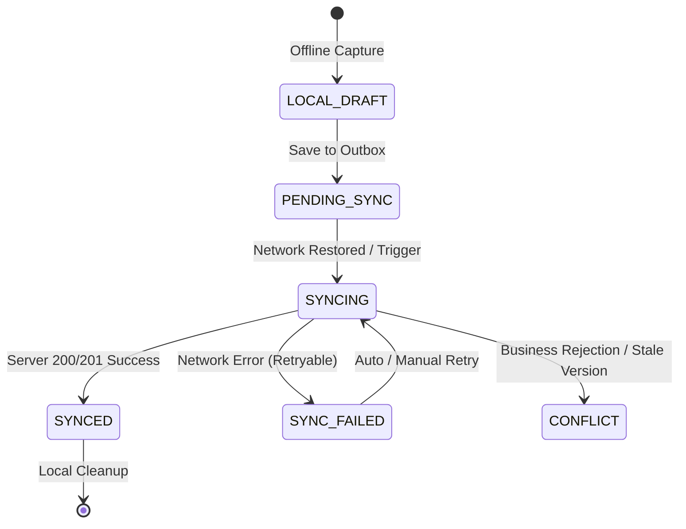

# MVP 1.3 US-58 — Offline Signature and Photo Capture Product Decisions

**Task ID:** `MVP-1.3-US58-OFFLINE-POD-PRODUCT-DECISIONS-001`  
**Date:** 2026-08-30  
**Mode:** PRODUCT DECISION FREEZE ONLY  
**Requirement:** `US-58 — Capture Signature and Photo Offline`  
**Status:** `PRODUCT_DECISIONS_FROZEN`  
**Implementation Authorization:** Not authorized by this document (`US-58 IMPLEMENTATION = NOT_STARTED`)  

---

## 1. Precondition Gate Verification

- `US-56`: `COMPLETE` (Manage Delivery Orders)
- `US-57`: `COMPLETE` (Capture Proof of Delivery — Online)
- `MVP 1.3 Release Band`: `2 / 7 COMPLETE` (US-56 ✅, US-57 ✅)
- `Overall Story Register`: `52 / 87 COMPLETE`
- `US-58 through US-62`: `NOT_STARTED`
- **Gate Status:** `PASS` — Baseline verified against `docs/mvp/MVP-1.3-US57-PROOF-OF-DELIVERY-FINAL-ACCEPTANCE-001.md` and repository status.

---

## 2. Source Authority & Decision Classification

### Authority Order
1. Original Requirements (`docs/requirements/Traspotation & logistic.docx`, lines 452-492, 1881-1968, 2546-2573)
2. Frozen Contracts (`docs/mvp/MVP-1.3-DELIVERY-OPERATIONS-CONTRACT-001.md`)
3. Accepted US-57 Baseline (`docs/mvp/MVP-1.3-US57-POD-PRODUCT-DECISIONS-001.md`, `V47__delivery_proof_of_delivery_us57.sql`)
4. Verified Implementation Architecture (`delivery`, `offlinesync`, `shared`, `tenancy`)
5. Derived UML (`docs/requirements/US-51-US-60-UseCase-Activity-Sequence-Diagrams.md`)

### Classification Summary

| Topic / Decision Area | Classification |
| :--- | :--- |
| Core US-57 Server POD Contract & Limits | `ALREADY_FROZEN_BY_US57` |
| Offline Signature & Photo Capture Scope | `SOURCE_DEFINED` |
| Quality Controls, Retake Controls, Customer Consent | `SOURCE_DEFINED` |
| Offline Client Architecture (React + IndexedDB Outbox) | `ARCHITECTURAL_CONSTRAINT` |
| Offline Authorization & Tenant Revalidation | `ARCHITECTURAL_CONSTRAINT` |
| Barcode Offline Support Policy | `REQUIRES_PRODUCT_DECISION` |
| Sync Granularity & Finalization Atomicity | `REQUIRES_PRODUCT_DECISION` |
| Conflict & Stale Version Handling Policy | `REQUIRES_PRODUCT_DECISION` |
| Offline-to-Delivery Module Integration Boundary | `ARCHITECTURAL_CONSTRAINT` |
| Native Mobile App, AI Image Scoring, Biometrics | `OUT_OF_SCOPE` |
| Failed Deliveries (US-59) & Re-Delivery (US-60) | `DEFERRED` |

---

## 3. Preserved US-57 Online POD Contract Invariants

US-58 extends US-57 to disconnected operation; it does NOT modify or weaken accepted online POD semantics:

1. **POD Lifecycle:** `DRAFT -> FINALIZED` (one-way, strict state machine).
2. **Delivery Lifecycle:** `DRAFT -> READY_FOR_ASSIGNMENT -> DELIVERED` (atomic transition upon POD finalization).
3. **Primary Evidence:** `SIGNATURE` / `PHOTO` / `BARCODE`. Finalization requires at least one valid primary evidence item.
4. **Signature Constraints:** Mandatory PNG/JPEG, maximum 2 MiB, requires non-blank signer name (<= 200 chars), optional relationship (<= 100 chars). Maximum 1 signature per POD.
5. **Photo Constraints:** PNG/JPEG, maximum 3 photos, maximum 10 MiB each.
6. **Barcode Constraints:** Normalized uppercase matching server-generated delivery number (`DEL-YYYY-NNNNNN`), maximum 64 chars. Maximum 1 barcode per POD.
7. **Authoritative Timestamp:** Server UTC `acceptedAt` is the authoritative completion timestamp.
8. **Geolocation:** Optional paired coordinates (latitude [-90, 90], longitude [-180, 180]). Geolocation alone does NOT satisfy evidence requirement.
9. **Finalized Immutability:** Once a POD is `FINALIZED` on the server, the POD and its evidence items are immutable.

---

## 4. US-58 Scope & Feature Boundaries

### 4.1 In-Scope Capabilities
- **Offline Signature Capture:** Touch/canvas drawing or file upload saved locally when disconnected.
- **Offline Photo Capture:** Camera capture or file selection saved locally when disconnected (up to 3 photos).
- **Offline Barcode Capture:** Local entry/scan validated against cached delivery order number.
- **Image Quality Validation:** Client-side validation for minimum dimensions, decodability, non-empty content, and file size limits.
- **Retake & Clear Controls:** Local preview, clear, and retake controls while evidence remains in local draft state.
- **Customer Consent:** Mandatory explicit consent acknowledgment for recipient signature/photo collection.
- **Durable Local Storage:** Browser IndexedDB storage for offline operation queue and binary evidence blobs.
- **Outbox Synchronization:** Automatic/manual sync via existing `offlinesync` module upon network restoration.
- **Conflict & Replay Protection:** Deterministic handling for duplicate syncs, stale delivery versions, and concurrent online completions.

### 4.2 Explicit Exclusions
- No native mobile application or custom mobile OS SDKs (operates within approved React web application stack).
- No AI/computer-vision blur detection or ML quality scoring.
- No biometric verification or signature pattern recognition.
- No geofencing or mandatory GPS enforcement.
- No US-59 Failed Deliveries, US-60 Re-Delivery, US-61 Analytics, or US-62 Exceptions implementation.

---

## 5. Client Execution Model & Technology Baseline

- **Client Runtime:** Existing React 19 + TypeScript + Ant Design SPA.
- **PWA Policy:** `PWA_NOT_REQUIRED_FOR_US58` — Offline queuing operates directly through the browser IndexedDB outbox architecture without requiring full PWA conversion or service worker push.
- **Local Persistence Store:** Browser `IndexedDB` (using existing `features/offlineSync` infrastructure).
- **Binary Evidence Storage:** Evidence blobs (PNG/JPEG signatures and photos) stored in IndexedDB object store with generated UUID keys.
- **Storage Exclusions:** Large binary evidence is strictly prohibited in `localStorage`, `sessionStorage`, URL search parameters, or plaintext application console logs.

---

## 6. Offline Authorization & Multi-Tenant Security

1. **Prerequisite for Disconnected Capture:**
   - User must have previously authenticated online and acquired a valid JWT access/refresh token.
   - User must have `DELIVERY_POD_CAPTURE` permission assigned within their active Tenant membership.
   - The target Delivery Order must be cached in local client storage in `READY_FOR_ASSIGNMENT` status.
2. **Offline Context Preservation:**
   - Offline records capture `tenantId`, `userId`, `username`, and `capturedAt` for local context.
   - Client-supplied metadata is NEVER authoritative for server execution.
3. **Synchronization Authorization Revalidation:**
   - When the client reconnects and syncs, the server revalidates:
     - Bearer JWT token authenticity.
     - Active Tenant context (`CurrentTenant` / `TenantExecutionContext`).
     - Active user membership in the Tenant.
     - Presence of `DELIVERY_POD_CAPTURE` authority.
     - Matching `tenant_id` on the target Delivery Order.
   - If authorization fails, the sync operation is rejected with `FORBIDDEN` / `UNAUTHORIZED` and discarded.
4. **Cross-Tenant Replay Prevention:**
   - A payload queued under Tenant A can NEVER be synced or accepted into Tenant B.

---

## 7. Evidence Capture, Quality, Retake & Consent Specifications

### 7.1 Offline Signature
- **Representation:** Canvas touch drawing export or PNG/JPEG image.
- **File Limits:** Maximum 2 MiB; format PNG or JPEG.
- **Signer Metadata:** Signer name is mandatory (non-blank, 1..200 characters); signer relationship is optional (<= 100 characters).
- **Quality Check:** Minimum resolution 100x50 px, non-empty canvas check (at least 20 non-white pixels drawn), decodable image bytes.
- **Retake Policy:** User may clear the signature canvas or remove the draft signature anytime prior to server synchronization.

### 7.2 Offline Photo
- **Representation:** JPEG or PNG image from camera or file input.
- **File Limits:** Maximum 3 photos per POD; maximum 10 MiB per photo.
- **Quality Check:** Minimum resolution 320x240 px, valid image header inspection (magic bytes), file size > 0 bytes.
- **Retake Policy:** User may delete any individual photo and capture a replacement while in local draft.

### 7.3 Offline Barcode
- **Representation:** Alphanumeric barcode value matching delivery number (`DEL-YYYY-NNNNNN`).
- **Validation:** Client validates match against cached `DeliveryOrder.deliveryNumber`.
- **Policy:** `SUPPORTED_OFFLINE` as a primary evidence option.

### 7.4 Customer Consent
- **Consent Rule:** When capturing signature or photo evidence from a customer/recipient, explicit consent acknowledgment is required.
- **Representation:** Checkbox / toggle on the capture form: *"Recipient confirms delivery acceptance and agrees to electronic signature/photo capture"*.
- **Stored Record:** `consentGiven: true`, `consentVersion: "POD-CONSENT-V1"`, `consentTimestamp: ISO-8601`.
- **Refusal Behavior:** If consent is refused, signature/photo evidence cannot be submitted.

---

## 8. Timestamp & Geolocation Semantics

| Timestamp Field | Source | Authority | Purpose |
| :--- | :--- | :--- | :--- |
| `deviceCapturedAt` | Client Device Clock | Informational | Records client-side moment of physical capture |
| `queuedAt` | Client Device Clock | Informational | Records when operation entered local IndexedDB outbox |
| `syncAttemptedAt` | Client Device Clock | Transport | Diagnostics and exponential retry scheduling |
| `serverReceivedAt` | Server UTC Clock | Audit | Server network arrival timestamp |
| `acceptedAt` | Server UTC Clock | **Authoritative** | Authoritative business completion timestamp set on finalization |

- **Geolocation:** Optional client coordinates (`latitude`, `longitude`, `accuracyMeters`) captured via `navigator.geolocation` when available. If location permission is denied or GPS is unavailable, capture proceeds without blocking.

---

## 9. Synchronization Architecture & Idempotency

### 9.1 Synchronization Unit
- **Sync Granularity:** **Single Composite POD Operation** (`DELIVERY_POD_OFFLINE_SYNC`).
- The operation contains:
  - `deliveryId` & `deliveryVersion`
  - `signerName` & `signerRelationship`
  - `consentGiven` & `consentVersion`
  - `deviceCapturedAt`, `latitude`, `longitude`, `accuracyMeters`
  - `evidenceList`: Array of evidence items (type, base64 content / barcode value, captureSource, originalFilename, clientChecksum)
  - `finalizeIntent`: `true`
- **Execution Atomicity:** The server processes the draft creation, evidence persistence, storage hashing, and finalization atomically in a single database transaction.

### 9.2 Idempotency & Replay Protection
- Client generates a unique UUIDv4 `operationId` per offline capture session.
- Server records `operationId` in `offline_sync_operation` (via `offlinesync` module).
- Retried synchronizations with the same `operationId` return the cached result without duplicate execution.

### 9.3 Client Synchronization States



- **UI Status Mapping:**
  - `LOCAL_DRAFT`: Saved locally on device.
  - `PENDING_SYNC`: Queued for background synchronization.
  - `SYNCING`: Transmission in flight.
  - `SYNCED`: Successfully verified and finalized by server.
  - `CONFLICT` / `SYNC_FAILED`: Action required / retryable error.
  - **Rule:** A locally queued POD is NEVER displayed as `DELIVERED` until server confirmation is received.

---

## 10. Conflict Classification & Resolution Policies

| Conflict Scenario | Local State | Server Response | Resolution Policy | User Experience |
| :--- | :--- | :--- | :--- | :--- |
| **Network Timeout / 503 Server Error** | `SYNCING` | Connection Error / 5xx | `RETRY` (Exponential backoff) | Remains `PENDING_SYNC`; retries automatically when online |
| **Delivery Already DELIVERED Online** | `SYNCING` | 409 Conflict (`DELIVERY_ALREADY_DELIVERED`) | `REJECT_PERMANENTLY` / `DISCARD_LOCAL_OPERATION` | Shows notification: *"Delivery was already completed online by another operator"*; local queue cleared after user acknowledgment |
| **POD Already FINALIZED** | `SYNCING` | 409 Conflict (`POD_ALREADY_FINALIZED`) | `REJECT_PERMANENTLY` | Shows conflict notice; existing server POD remains immutable |
| **Stale Delivery Requirements Version** | `SYNCING` | 409 Conflict (`DELIVERY_VERSION_CONFLICT`) | `USER_ACTION_REQUIRED` | Alerts user to review updated delivery requirements |
| **Signer Name Missing for Signature** | `SYNCING` | 400 Bad Request (`POD_SIGNER_NAME_REQUIRED`) | `USER_ACTION_REQUIRED` | Allows user to input signer name and retry sync |
| **Unsupported / Corrupt File Content** | `SYNCING` | 400 Bad Request (`POD_MEDIA_TYPE_UNSUPPORTED`) | `USER_ACTION_REQUIRED` | Prompts user to retake photo/signature |
| **User Permission Revoked Offline** | `SYNCING` | 403 Forbidden | `REJECT_PERMANENTLY` | Alerts user of insufficient permissions |
| **User Membership Inactive** | `SYNCING` | 401 Unauthorized / 403 Forbidden | `REJECT_PERMANENTLY` | Requires user re-authentication |

---

## 11. Module Boundaries & Architecture

```
+-------------------------------------------------------------------+
|                        FRONTEND (React SPA)                       |
|   ProofOfDeliverySection <---> useOfflineSync / IndexedDB Queue   |
+-------------------------------------------------------------------+
                                  |
                                  | POST /api/v1/offline-sync/batches
                                  v
+-------------------------------------------------------------------+
|                       OFFLINESYNC MODULE                          |
|   OfflineSyncController                                           |
|   OfflineSyncBatchService                                         |
|   OfflineOperationHandlerRegistry                                 |
+-------------------------------------------------------------------+
                                  |
                                  | invokes OfflineOperationHandler
                                  v
+-------------------------------------------------------------------+
|                         DELIVERY MODULE                           |
|   DeliveryOfflineOperationHandler (implements handler port)       |
|   ProofOfDeliveryUseCase / ProofOfDeliveryService                 |
|   ProofOfDeliveryRepository / DeliveryEvidenceStoragePort         |
+-------------------------------------------------------------------+
```

- **Decoupling Rules:**
  - `offlinesync` module handles transport, authentication, batch processing, idempotency keys, and retry schedules.
  - `delivery` module implements `OfflineOperationHandler` for `DELIVERY_POD_OFFLINE_SYNC` and retains 100% ownership of Delivery/POD domain rules, invariants, validation, and storage.
  - Delivery NEVER queries OfflineSync internal tables or repositories.

---

## 12. Local Security, Privacy & Session Lifecycle

1. **User Logout Policy:**
   - If pending offline operations exist when the user attempts logout, a warning dialog is displayed: *"You have unsynchronized Proof of Delivery records. Logging out may delay delivery completion."*
   - Pending operations remain encrypted/scoped to the originating `userId` + `tenantId` in IndexedDB.
2. **Multi-User Device Switching:**
   - IndexedDB records are indexed by `ownerUserId` and `tenantId`.
   - When User B logs in on a shared device, User B cannot view or modify User A's pending outbox queue.
3. **Privacy & Telemetry Protection:**
   - Signature and photo binary data are NEVER logged in telemetry, analytics, or plaintext application console logs.
4. **Local Cleanup:**
   - Once the server acknowledges successful synchronization (`SYNCED`), local evidence blobs are removed from IndexedDB immediately to preserve device storage.

---

## 13. Future Database Schema Expectation

- **Server-Side Migrations:**
  - `V47__delivery_proof_of_delivery_us57.sql` is the active migration head.
  - US-58 reuses the existing `offline_sync_operation` table (`V29__offline_sync.sql`) and `proof_of_delivery` / `pod_evidence` tables (`V47`).
  - **No new Flyway migration is required for US-58** unless a dedicated offline metadata audit table is requested. If a schema change is introduced during implementation, it will be `V48`.
  - Historical migrations `V1` through `V47` remain immutable.

---

## 14. Validation Matrix (30 Test Scenarios)

| ID | Scenario Description | Offline Client Action | Sync Dispatch | Expected Server Outcome | Final Delivery Status |
| :--- | :--- | :--- | :--- | :--- | :--- |
| **VM-01** | Valid offline signature + consent | Captures canvas drawing + signer name + consent | Syncs payload | 201 Created -> Finalized | `DELIVERED` |
| **VM-02** | Valid offline photo + consent | Captures 1 camera photo + consent | Syncs payload | 201 Created -> Finalized | `DELIVERED` |
| **VM-03** | Valid offline signature + 3 photos | Captures signature and 3 photos | Syncs payload | 201 Created -> Finalized | `DELIVERED` |
| **VM-04** | Valid offline barcode scan | Scans matching `DEL-YYYY-NNNNNN` | Syncs payload | 201 Created -> Finalized | `DELIVERED` |
| **VM-05** | Missing customer consent | Checkbox unchecked | Local block | Form validation error | `READY_FOR_ASSIGNMENT` |
| **VM-06** | Missing signer name with signature | Name blank | Local block | Form validation error | `READY_FOR_ASSIGNMENT` |
| **VM-07** | Signature file > 2MB | Uploads oversized file | Local block | "File exceeds 2MB limit" | `READY_FOR_ASSIGNMENT` |
| **VM-08** | Photo file > 10MB | Uploads oversized file | Local block | "Photo exceeds 10MB limit" | `READY_FOR_ASSIGNMENT` |
| **VM-09** | More than 3 photos captured | Attempts 4th photo | Local block | "Maximum 3 photos allowed" | `READY_FOR_ASSIGNMENT` |
| **VM-10** | Retake photo before sync | Deletes photo 1, captures photo 2 | Updates local state | Syncs updated photo 2 | `DELIVERED` |
| **VM-11** | Clear signature before sync | Clears canvas, redraws | Updates local state | Syncs new signature | `DELIVERED` |
| **VM-12** | Optional geolocation unavailable | GPS disabled | Captures null geo | 201 Created (geo null) | `DELIVERED` |
| **VM-13** | Geolocation captured offline | GPS coordinates recorded | Syncs lat/lng/accuracy | 201 Created with geo | `DELIVERED` |
| **VM-14** | Browser reload while offline | Stores in IndexedDB, refreshes | Restores outbox queue | Re-attempts sync on load | `DELIVERED` |
| **VM-15** | Network offline on capture | Device offline | Queues `PENDING_SYNC` | No HTTP call made | `READY_FOR_ASSIGNMENT` |
| **VM-16** | Network restored trigger | Device comes online | Auto-triggers sync | 200 OK batch result | `DELIVERED` |
| **VM-17** | 500 Server error during sync | HTTP 500 returned | Sets `SYNC_FAILED` | Retries with backoff | `READY_FOR_ASSIGNMENT` |
| **VM-18** | Duplicate sync replay | Replays same `operationId` | Idempotent response | Returns cached success | `DELIVERED` |
| **VM-19** | Delivery completed online concurrently | Delivery status is `DELIVERED` | Returns 409 Conflict | Rejects local offline POD | `DELIVERED` (preserved) |
| **VM-20** | POD finalized online concurrently | POD status is `FINALIZED` | Returns 409 Conflict | Rejects local offline POD | `DELIVERED` (preserved) |
| **VM-21** | Stale delivery version | Delivery updated online | Returns 409 Conflict | Flags conflict for review | `DRAFT` / `READY` |
| **VM-22** | Non-matching barcode offline | Enters wrong delivery number | Local block | "Barcode mismatch" | `READY_FOR_ASSIGNMENT` |
| **VM-23** | User permission revoked offline | Role removed on server | Returns 403 Forbidden | Rejects sync permanently | `READY_FOR_ASSIGNMENT` |
| **VM-24** | Tenant inactive on sync | Tenant disabled | Returns 403 Forbidden | Rejects sync permanently | `READY_FOR_ASSIGNMENT` |
| **VM-25** | Signer relationship <= 100 chars | Enters relationship | Syncs field | Stored in `proof_of_delivery` | `DELIVERED` |
| **VM-26** | User logout with pending queue | Clicks logout | Warns user | Retains data in IndexedDB | Unchanged |
| **VM-27** | Multi-user device switch | User B logs in | Isolates queue | User B cannot see User A data | Unchanged |
| **VM-28** | Storage cleanup on sync success | Sync acknowledged | Clears IndexedDB blobs | Device storage freed | `DELIVERED` |
| **VM-29** | Server storage error on sync | Local disk full on server | Returns 500 error | Retries later | `READY_FOR_ASSIGNMENT` |
| **VM-30** | Direct ID cross-tenant replay | Payload sent with wrong tenant | Returns 404/403 | Rejects cross-tenant leak | Unchanged |

---

## 15. Future Acceptance Test Contract

### 15.1 Unit Tests (`delivery` + `offlinesync`)
- `DeliveryOfflineOperationHandlerTest`: Tests payload parsing, validation, and delegation to `ProofOfDeliveryUseCase`.
- `OfflinePodQualityValidationTest`: Verifies dimensions, byte size, and format checks.
- `OfflinePodConsentTest`: Verifies consent requirement and rejection when consent is absent.
- `OfflinePodIdempotencyTest`: Verifies duplicate operation ID returns idempotent result without re-executing business logic.

### 15.2 Frontend Tests (Vitest)
- `useOfflinePodCapture.test.ts`: Verifies local draft saving, retake, and IndexedDB interaction.
- `OfflinePodSection.test.tsx`: Tests offline banner, capture controls, retake buttons, consent checkbox, and pending sync indicators.

### 15.3 End-to-End Tests (Playwright Chromium)
- `offlineProofOfDelivery.spec.ts`:
  1. **E2E-MVP13-OFFLINE-POD-001:** Disconnect network -> capture offline signature with consent -> verify `PENDING_SYNC` -> reconnect network -> auto-sync -> verify `FINALIZED` and `DELIVERED`.
  2. **E2E-MVP13-OFFLINE-POD-002:** Disconnect network -> capture offline photo -> reload page -> verify outbox persistence -> reconnect network -> verify sync completion.
  3. **E2E-MVP13-OFFLINE-POD-003:** Offline photo retake before sync -> verify only retaken photo is submitted.
  4. **E2E-MVP13-OFFLINE-POD-004:** Offline capture conflict handling when delivery is concurrently finalized online.

---

## 16. Implementation Readiness & Immediate Next Task

All implementation-critical product decisions for US-58 are frozen:
- Scope: Signatures, photos, barcodes, quality controls, retake, customer consent, IndexedDB outbox, and idempotent server synchronization.
- Decoupling: Delivery module owns domain rules; OfflineSync module owns outbox transport.
- Security: Server-side RBAC and Tenant revalidation enforced upon sync.

**Exact Next Task:** `MVP-1.3-US58-OFFLINE-POD-IMPLEMENTATION-001` — Production Implementation and Verification of US-58 Offline Proof of Delivery.
