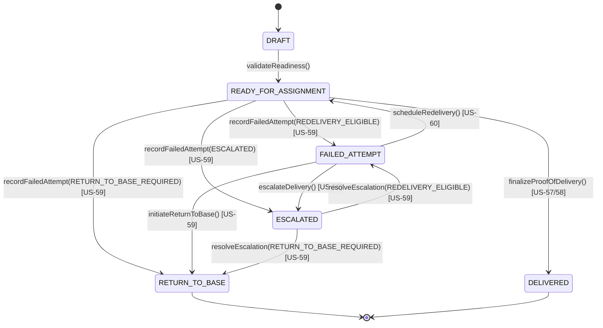
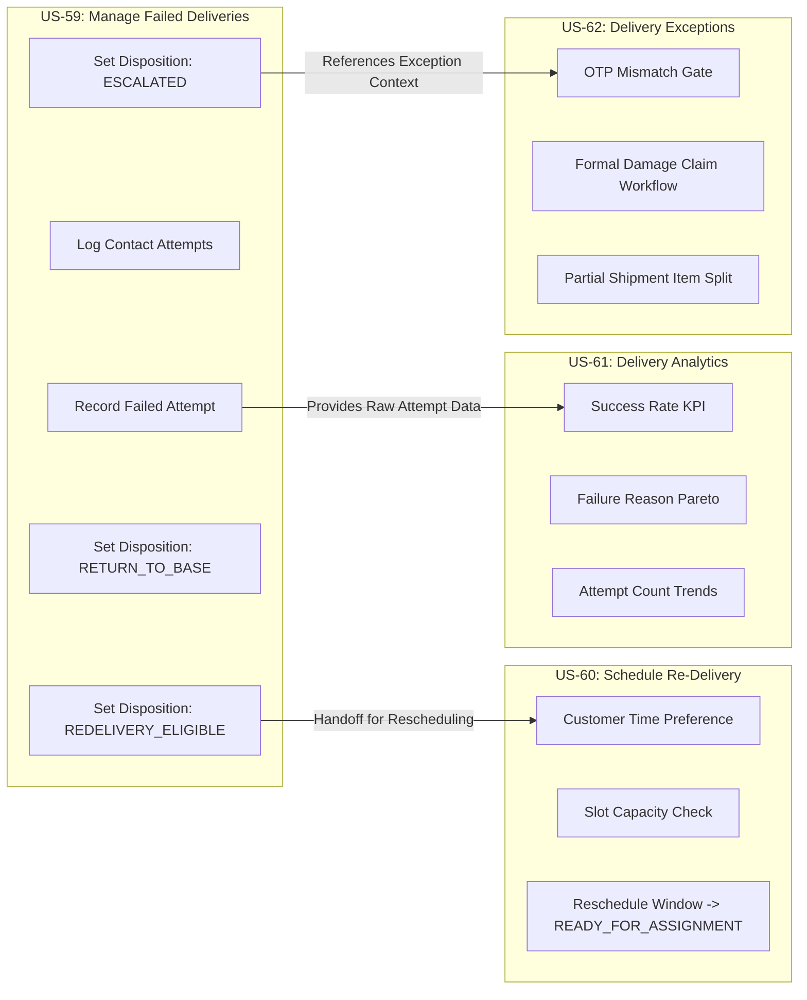

# MVP 1.3 US-59 — Manage Failed Deliveries Product Decisions & Domain Contract

**Task ID:** `MVP-1.3-US59-FAILED-DELIVERIES-PRODUCT-DECISIONS-001`  
**Date:** 2026-08-31  
**Status:** `PRODUCT_DECISIONS_FROZEN`  
**Implementation Mode:** `DECISION FREEZE ONLY — DO NOT IMPLEMENT CODE`  
**Application Baseline:** `feat/us58-offline-pod-final-acceptance` (commit `4c22f2a`)  
**Flyway Head:** `V47` (zero new migrations created during decision freeze)  

---

## 1. Executive Summary & Precondition Gate

This document authoritatively freezes all domain, lifecycle, failure taxonomy, contact attempt, escalation, return-to-base, concurrency, RBAC, API, and boundary decisions for **US-59: Manage Failed Deliveries**.

### Precondition & Release Accounting Gate:
- **US-56 (Manage Delivery Orders):** `COMPLETE`
- **US-57 (Capture Proof of Delivery — Online):** `COMPLETE`
- **US-58 (Offline Proof of Delivery):** `COMPLETE`
- **US-59 (Manage Failed Deliveries):** `PRODUCT_DECISIONS_FROZEN` (Implementation: `NOT_STARTED`)
- **US-60 through US-62:** `NOT_STARTED`
- **MVP 1.3 Delivery Operations Progress:** `3 / 7 COMPLETE`
- **Overall Project Accounting:** **53 COMPLETE, 4 NOT_STARTED, 30 DEFERRED (87 TOTAL)**

---

## 2. Authoritative Source Requirements

From `Traspotation & logistic.docx`, `Mind-Map-Trasportation-and-Logistic.txt`, and `US-51-US-60-UseCase-Activity-Sequence-Diagrams.md`:

| Requirement Ref | Requirement Clause | Source Classification | Authoritative Intent |
| :--- | :--- | :--- | :--- |
| **REQ-US59-01** | Record Failure Reason | `SOURCE_DEFINED` | Failed attempts must capture an explicit reason code from an approved taxonomy and optional/mandatory notes. |
| **REQ-US59-02** | Record Customer Contact Attempts | `SOURCE_DEFINED` | Field contact attempts (phone, SMS, WhatsApp, in-person) with timestamps and outcomes must be logged alongside the failed attempt. |
| **REQ-US59-03** | Escalate Failed Delivery | `SOURCE_DEFINED` | Severe non-delivery events, repeated failures, or disputes can be escalated with explicit reasons and operator tracking. |
| **REQ-US59-04** | Initiate Return to Origin / Base (RTO) | `SOURCE_DEFINED` | Permanent failures (e.g. refusal, cargo damage) trigger a Return-to-Base disposition distinguishable from delivered orders. |
| **REQ-US59-05** | Determine Re-Delivery Eligibility | `SOURCE_DEFINED` | Failure handling determines if the delivery is eligible for another attempt (handing off to US-60 for scheduling). |
| **REQ-US59-06** | Update Delivery Attempt Status | `SOURCE_DEFINED` | Maintains an immutable chronological audit trail of delivery attempts. |

---

## 3. Failure Reason Taxonomy & Dispositions

US-59 adopts a standardized, enum-based failure reason taxonomy. Arbitrary free-text-only status mutation is prohibited.

| Reason Code | Display Label | Description | Notes Constraint | Contact Required? | Default Disposition | Redelivery Eligible? |
| :--- | :--- | :--- | :--- | :---: | :--- | :---: |
| `CUSTOMER_UNAVAILABLE` | Customer Unavailable | Recipient was not present at the delivery location during the attempt window. | Optional (max 1000 chars) | Yes (Recommended) | `REDELIVERY_ELIGIBLE` | **YES** |
| `WRONG_ADDRESS` | Wrong / Incomplete Address | Destination address is incorrect, incomplete, or building/unit cannot be located. | Optional (max 1000 chars) | Yes (Recommended) | `REDELIVERY_ELIGIBLE` | **YES** |
| `CUSTOMER_REFUSED` | Customer Refused Delivery | Recipient rejected the delivery, goods, or terms upon arrival. | Mandatory (>= 5 chars) | Optional | `RETURN_TO_BASE_REQUIRED` | **NO** |
| `ACCESS_RESTRICTED` | Access Restricted / Gated | Security checkpoint, gated premises, or physical barrier prevented access. | Optional (max 1000 chars) | Yes (Recommended) | `REDELIVERY_ELIGIBLE` | **YES** |
| `DAMAGED_CARGO` | Cargo Damaged in Transit | Cargo or packaging identified as damaged at destination prior to handover. | Mandatory (>= 5 chars) | Optional | `ESCALATED` / `RETURN_TO_BASE_REQUIRED` | **NO** |
| `DOCUMENT_OR_PAYMENT_ISSUE` | Documentation / COD Issue | Required permits, physical delivery documents, or Cash-on-Delivery payment unresolved. | Optional (max 1000 chars) | Yes (Recommended) | `REDELIVERY_ELIGIBLE` | **YES** |
| `OTHER` | Other Operational Blocker | Unclassified operational impediment. | **Mandatory (>= 10 chars)** | Optional | Operator Selected | Operator Decided |

---

## 4. Delivery Aggregate Lifecycle Extension

The accepted Delivery lifecycle (`DRAFT -> READY_FOR_ASSIGNMENT -> DELIVERED`) is extended to support failed delivery dispositions:



### Frozen State Semantics:
1. `DRAFT`: Initial draft delivery order (no failure recording allowed).
2. `READY_FOR_ASSIGNMENT`: Order validated and ready for dispatch/delivery. Primary source state for failed attempt recording.
3. `FAILED_ATTEMPT`: Non-terminal failure state. Delivery attempt failed, but the order remains eligible for redelivery scheduling in US-60.
4. `RETURN_TO_BASE`: Terminal failure disposition. Forward delivery attempts cease; parcel must be returned to origin depot.
5. `ESCALATED`: Operational hold state. Held pending supervisor/manager review or customer dispute resolution.
6. `DELIVERED`: Terminal successful completion. Immutable; can **NEVER** transition to a failed state.

---

## 5. Attempt & Contact Model

### A. Delivery Attempt Entity (`DeliveryAttempt`)
Every failed delivery attempt creates an immutable `DeliveryAttempt` entity:
- `id`: UUID (Primary Key)
- `deliveryId`: UUID (Logical Reference to DeliveryOrder)
- `attemptNumber`: Integer (1, 2, 3... monotonically assigned per Delivery)
- `attemptTimestamp`: OffsetDateTime (Authoritative UTC timestamp)
- `failureReason`: Enum (`CUSTOMER_UNAVAILABLE`, `WRONG_ADDRESS`, `CUSTOMER_REFUSED`, `ACCESS_RESTRICTED`, `DAMAGED_CARGO`, `DOCUMENT_OR_PAYMENT_ISSUE`, `OTHER`)
- `notes`: Text (nullable, max 1000 chars, required for `OTHER`)
- `disposition`: Enum (`REDELIVERY_ELIGIBLE`, `RETURN_TO_BASE_REQUIRED`, `ESCALATED`)
- `recordedBy`: String (Username of authenticated actor)
- `recordedAt`: OffsetDateTime (Server UTC timestamp)

### B. Customer Contact Attempt Entity (`DeliveryContactAttempt`)
Contact attempts made during the delivery attempt are stored as child records of `DeliveryAttempt`:
- `id`: UUID
- `attemptId`: UUID (Reference to parent `DeliveryAttempt`)
- `channel`: Enum (`PHONE`, `SMS`, `WHATSAPP`, `EMAIL`, `IN_PERSON`)
- `contactTimestamp`: OffsetDateTime (UTC)
- `outcome`: Enum (`ANSWERED_UNABLE_TO_ACCEPT`, `NO_ANSWER`, `BUSY`, `WRONG_NUMBER`, `CALL_DROPPED`, `MESSAGE_LEFT`)
- `notes`: Text (nullable, max 500 chars)

### C. Privacy & PII Protection:
- Contact attempt records store only the channel, timestamp, and outcome.
- Phone numbers and email addresses are referenced from the existing `Customer` aggregate and are **never** duplicated into attempt log tables or domain event payloads.

---

## 6. Escalation & Return-to-Base Semantics

### Escalation:
- Can be initiated either as part of recording a failed attempt (disposition `ESCALATED`) or explicitly via an escalation command.
- Attributes: `escalationReason` (mandatory, max 500 chars), `escalatedBy` (actor), `escalatedAt` (UTC), `status` (`OPEN`, `UNDER_REVIEW`, `RESOLVED`), `resolutionNotes` (optional).
- US-59 implements local Delivery escalation tracking; it does not replace cross-module platform incident escalation (US-78).

### Return-to-Base (RTO):
- Official Term: **`RETURN_TO_BASE`** (representing Return to Origin / Depot).
- Marks the DeliveryOrder as permanently failed in the field and transitions status to `RETURN_TO_BASE`.
- Emits domain event `DeliveryReturnedToBase` to notify freight/inventory systems if required.

---

## 7. Interaction with Proof of Delivery (POD) & Offline Sync

1. **POD Immutability:** A delivery in `DELIVERED` status (with `FINALIZED` POD) can **never** receive a failed attempt (returns `409 CONFLICT`).
2. **No POD Creation on Failure:** Recording a failed attempt does not create or mutate a `ProofOfDelivery` entity. POD is strictly reserved for successful handover.
3. **Future POD After Redelivery:** When a `FAILED_ATTEMPT` delivery is rescheduled in US-60 and returned to `READY_FOR_ASSIGNMENT`, a subsequent attempt can successfully capture and finalize POD.
4. **Offline Policy for US-59:** `ONLINE_ONLY_FOR_US59` in MVP Phase 1.3. Failed delivery recording in US-59 is an authenticated online web/API workflow. Offline outbox support remains dedicated to US-58 POD sync.

---

## 8. Multi-Tenancy & RBAC Security Contract

### Multi-Tenancy:
- All `DeliveryAttempt`, `DeliveryContactAttempt`, and `DeliveryEscalation` records strictly enforce `tenant_id` isolation.
- `tenant_id` is resolved authoritatively from `CurrentTenant` / `TenantExecutionContext`. Request payloads cannot supply or override `tenant_id`.

### RBAC Permissions:
| Permission Code | Name | Scope & Authority |
| :--- | :--- | :--- |
| `DELIVERY_FAIL_RECORD` | Record Failed Delivery | Allows recording a failed delivery attempt, contact attempts, and setting disposition. |
| `DELIVERY_FAIL_VIEW` | View Failed Delivery History | Allows viewing failed delivery attempts, contact logs, and escalation records. |
| `DELIVERY_FAIL_ESCALATE` | Escalate Failed Delivery | Allows escalating a failed delivery or resolving an open escalation. |
| `DELIVERY_RETURN_INITIATE` | Initiate Return to Base | Allows marking a delivery for Return-to-Base disposition. |

---

## 9. Concurrency & Duplicate Protection

- Optimistic concurrency control via `DeliveryOrder.version` (`expectedVersion`).
- If Operator A records a failed attempt while Operator B finalizes POD online:
  - If POD finalizes first: Operator A's failure request receives `409 CONFLICT` (`DELIVERY_ALREADY_DELIVERED`).
  - If failure records first: Operator B's POD request receives `409 CONFLICT` (`INVALID_DELIVERY_STATE`).
- Duplicate HTTP submissions (double-clicks) are rejected cleanly via version mismatch.

---

## 10. API Command & Query Contract

### Inbound REST Endpoints:
```http
POST /api/v1/deliveries/{id}/failed-attempt
Content-Type: application/json

{
  "expectedVersion": 1,
  "failureReason": "CUSTOMER_UNAVAILABLE",
  "notes": "Gate was locked, no one answered call",
  "disposition": "REDELIVERY_ELIGIBLE",
  "contactAttempts": [
    {
      "channel": "PHONE",
      "contactTimestamp": "2026-08-31T10:15:00Z",
      "outcome": "NO_ANSWER",
      "notes": "Rang 5 times, no answer"
    }
  ]
}
```

```http
GET /api/v1/deliveries/{id}/attempts
Response: 200 OK -> List of DeliveryAttemptDto with contact attempts and escalation details
```

```http
POST /api/v1/deliveries/{id}/escalate
Content-Type: application/json

{
  "expectedVersion": 2,
  "escalationReason": "Customer disputed delivery address and refused phone calls"
}
```

```http
POST /api/v1/deliveries/{id}/return-to-base
Content-Type: application/json

{
  "expectedVersion": 2,
  "reason": "Customer refused order due to cancelled commercial contract"
}
```

---

## 11. Cross-Module & Story Boundaries



- **US-59 vs US-60:** US-59 determines *that* another attempt is needed (`REDELIVERY_ELIGIBLE`). US-60 decides *when* the attempt happens (customer slot preferences, capacity checks, and updating the delivery window).
- **US-59 vs US-61:** US-59 produces operational event facts. US-61 is a read-only reporting module calculating metrics, KPIs, and Pareto charts.
- **US-59 vs US-62:** US-59 handles field failure dispositions. US-62 handles specialized business exceptions (OTP mismatch, item-level partial shipment manifests, cargo insurance claims).

---

## 12. Persistence Direction (Expected V48 Migration)

When implementation begins, expected migration **`V48__delivery_failed_attempts_us59.sql`** will create:
1. `delivery_attempt`: Stores attempt number, failure reason, notes, disposition, actor, timestamps, and tenant isolation.
2. `delivery_contact_attempt`: Stores contact attempts associated with a failed attempt.
3. `delivery_escalation`: Stores escalation records, statuses, and resolution notes.
4. Updates check constraint on `delivery_order.status` to: `CHECK (status IN ('DRAFT', 'READY_FOR_ASSIGNMENT', 'DELIVERED', 'FAILED_ATTEMPT', 'RETURN_TO_BASE', 'ESCALATED'))`.

---

## 13. Acceptance Validation Matrix

| Test ID | Test Scenario Description | Expected Outcome |
| :--- | :--- | :--- |
| **VM-59-01** | Record valid failed attempt with `CUSTOMER_UNAVAILABLE` and contact attempt | `200 OK`, status becomes `FAILED_ATTEMPT`, attempt #1 created |
| **VM-59-02** | Record failed attempt without failure reason | `400 BAD REQUEST` (`REASON_REQUIRED`) |
| **VM-59-03** | Record failed attempt with reason `OTHER` and blank notes | `400 BAD REQUEST` (`NOTES_REQUIRED_FOR_OTHER`) |
| **VM-59-04** | Record failed attempt with `CUSTOMER_REFUSED` | `200 OK`, status becomes `RETURN_TO_BASE` |
| **VM-59-05** | Record failed attempt on `DRAFT` delivery | `400 BAD REQUEST` (`INVALID_DELIVERY_STATE`) |
| **VM-59-06** | Record failed attempt on `DELIVERED` delivery | `409 CONFLICT` (`DELIVERY_ALREADY_DELIVERED`) |
| **VM-59-07** | Stale delivery `expectedVersion` provided | `409 CONFLICT` (`DELIVERY_VERSION_CONFLICT`) |
| **VM-59-08** | Sequential failed attempts increment attempt number monotonically (1 -> 2 -> 3) | `200 OK`, attempt history accurately reflects sequence |
| **VM-59-09** | Escalate delivery with mandatory reason | `200 OK`, status becomes `ESCALATED`, escalation record created |
| **VM-59-10** | Initiate Return-to-Base with reason | `200 OK`, status becomes `RETURN_TO_BASE` |
| **VM-59-11** | Cross-tenant delivery access attempt | `404 NOT FOUND` (Tenant safe denial) |
| **VM-59-12** | Actor missing `DELIVERY_FAIL_RECORD` permission | `403 FORBIDDEN` |
| **VM-59-13** | Concurrent race: Operator A records failure while Operator B finalizes POD | Winner commits; loser receives `409 CONFLICT` |

---

## 14. Implementation Readiness & Next Step

- **Status:** **`PRODUCT_DECISIONS_FROZEN`**
- **Implementation Status:** **`NOT_STARTED`**
- **Next Task:** `MVP-1.3-US59-FAILED-DELIVERIES-IMPLEMENTATION-001`
