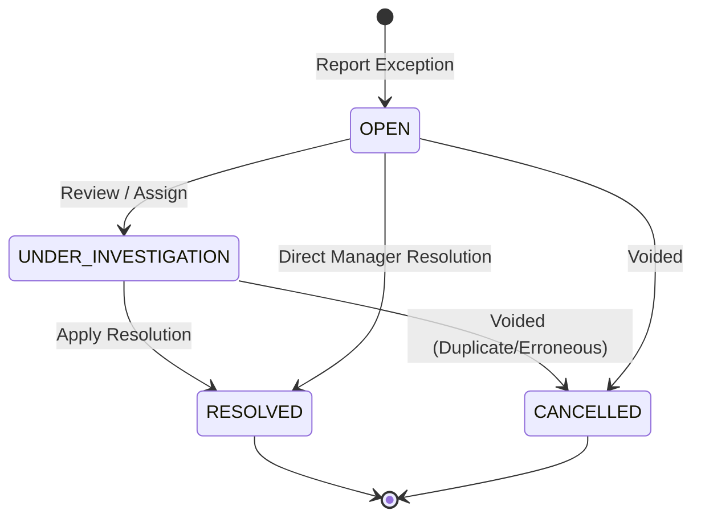

# Product Decisions and Domain Contract: US-62 — Handle Delivery Exceptions

**Task ID:** `MVP-1.3-US62-DELIVERY-EXCEPTIONS-PRODUCT-DECISIONS-001`  
**User Story:** `US-62` — Handle Delivery Exceptions  
**Phase:** `Phase 1: Current MVP Scope` (Delivery Operations)  
**Status:** `PRODUCT_DECISIONS_FROZEN` / `IMPLEMENTATION_NOT_STARTED`  
**Authoritative Scope Register:** `US-01` through `US-87` (No story count increment; 56 / 87 COMPLETE, MVP 1.3: 6 / 7 COMPLETE)  
**Date:** `2026-08-31`

---

## 1. Executive Summary & Precondition Verification

This document establishes the frozen product architecture, domain rules, PostgreSQL schema design, RBAC permission matrix, state machine transitions, and cross-module boundaries for **US-62: Handle Delivery Exceptions**.

### Precondition Baseline Check
- **Repository:** `transport-logistics-modulith`
- **Baseline Git HEAD:** `dc291982c4500b041838789efa5d3c9ad0d21b2b`
- **Application Branch:** `feat/us61-analytics-implementation` (or `feat/us62-delivery-exceptions-implementation` upon start)
- **Flyway Migrations:** `V1` through `V50` verified and active. Expected next migration: `V51__delivery_exceptions_us62.sql`.
- **Preceding Acceptance Gate:** `docs/mvp/MVP-1.3-US61-ANALYTICS-FINAL-ACCEPTANCE-001.md` confirmed **US-61 COMPLETE**.
- **Delivery Band Progress:** 6 / 7 COMPLETE (`US-56`, `US-57`, `US-58`, `US-59`, `US-60`, `US-61`).
- **Overall Roadmap Accounting:** **56 / 87 COMPLETE**.

---

## 2. Authoritative Requirement & Source Extraction

### 2.1 Primary Requirement Source
From `docs/requirements/Traspotation & logistic.docx` and `docs/mvp/MVP-1.3-DELIVERY-OPERATIONS-CONTRACT-001.md`:
- **User Story:**
  > *"As a Delivery Manager, I want wrong address, refusal, partial delivery, damage and OTP mismatch handled, so that exceptional delivery outcomes are recorded correctly."*
- **Primary Actor:** `Delivery Manager` (with operational creation by `Dispatcher` / `Driver`)
- **Priority:** High
- **Related Feature:** Delivery Edge Cases / Specialized Exceptions

### 2.2 Source Exception Candidates Classification

| Candidate Exception | Source Authority | Classification | Boundary Decision |
| :--- | :--- | :--- | :--- |
| **Customer Unavailable** | DOCX / PlantUML | `ALREADY_HANDLED_BY_US59` | Handled via US-59 `CUSTOMER_UNAVAILABLE` attempt failure. No separate US-62 exception case needed. |
| **Wrong Address** | DOCX / AC / PlantUML | `REQUIRES_SPECIALIZED_US62_WORKFLOW` | US-59 records attempt failure; US-62 provides structured address-investigation & verified destination correction before redelivery. |
| **Delivery Refusal** | DOCX / AC / PlantUML | `ALREADY_HANDLED_BY_US59` | US-59 `CUSTOMER_REFUSED` with `RETURN_TO_BASE_REQUIRED` handles operational refusal. US-62 logs refusal dispute details if contested. |
| **Partial Delivery** | DOCX / AC / PlantUML | `REQUIRES_SPECIALIZED_US62_WORKFLOW` | Narrowed operational exception fact recording missing/delivered packages/notes without full item-level WMS inventory split. |
| **Damaged Delivery / Cargo** | DOCX / AC / PlantUML | `REQUIRES_SPECIALIZED_US62_WORKFLOW` | Specialized case requiring severity, description, and photo evidence attachment using `DeliveryEvidenceStoragePort`. |
| **OTP Mismatch** | DOCX / AC / PlantUML | `REQUIRES_SPECIALIZED_US62_WORKFLOW` | Factual recording of OTP verification failure that hard-blocks normal POD finalization until resolved or manager-overridden. |

---

## 3. Critical US-59 vs US-62 Bounded Context & Lifecycle Boundary

### 3.1 Division of Responsibilities
1. **US-59 (Manage Failed Deliveries):**
   - Owns the physical delivery attempt outcome (`delivery_attempt`), failure reasons (`CUSTOMER_UNAVAILABLE`, `WRONG_ADDRESS`, `CUSTOMER_REFUSED`, `ACCESS_RESTRICTED`, `DAMAGED_CARGO`, `DOCUMENT_OR_PAYMENT_ISSUE`, `OTHER`), customer contact attempts (`delivery_contact_attempt`), and operational escalation (`delivery_escalation`).
   - Governs the operational state of `DeliveryOrder`: transitions to `FAILED_ATTEMPT`, `RETURN_TO_BASE`, or `ESCALATED`.
2. **US-62 (Handle Delivery Exceptions):**
   - Owns **specialized investigation and resolution cases** (`delivery_exception_case`) linked to a `delivery_order` (and optionally referencing the specific `delivery_attempt_id` where the exception originated).
   - Provides structured resolution metadata (e.g., damage evidence review, address re-verification, OTP mismatch override/re-issue, partial delivery clearance).
   - Does **NOT** duplicate failure attempt logging, does **NOT** schedule redeliveries directly (delegates to US-60), and does **NOT** duplicate Return-to-Base state machine (delegates to US-59).

### 3.2 Canonical Linkage Pattern
- An exception case links to `delivery_order_id` (mandatory, same-tenant) and optionally to `delivery_attempt_id` (same-tenant).
- An unsuccessful attempt (e.g., `DAMAGED_CARGO` or `WRONG_ADDRESS`) triggers the creation of a `DeliveryExceptionCase`.
- Resolving the `DeliveryExceptionCase` determines the downstream operational path:
  - If resolved with `REDELIVERY_APPROVED` $\rightarrow$ Order remains in `FAILED_ATTEMPT` / `READY_FOR_ASSIGNMENT`, unlocking US-60 redelivery slot scheduling.
  - If resolved with `RETURN_TO_BASE_APPROVED` $\rightarrow$ Triggers US-59 `RETURN_TO_BASE` transition.
  - If resolved with `ACCEPTED_WITH_ALLOWANCE` / `OVERRIDE_APPROVED` $\rightarrow$ Allows order completion or POD finalization.

---

## 4. Frozen Exception Taxonomy & Type Contracts

| Exception Type | Trigger / Source | Failed Attempt Required? | Photo Evidence Required? | Blocks POD Finalize? | Allowed Resolutions | Terminal Lifecycle Effect |
| :--- | :--- | :---: | :---: | :---: | :--- | :--- |
| **`DAMAGED_DELIVERY`** | Driver/Recipient detects physical parcel/cargo damage. | Optional (may occur at doorstep or post-acceptance dispute). | **YES** (min 1 photo) | YES (if unfinalized) | `RETURN_TO_BASE_APPROVED`, `ACCEPTED_AS_IS`, `REDELIVERY_APPROVED` | `RETURN_TO_BASE` or `DELIVERED` or `READY_FOR_ASSIGNMENT` |
| **`WRONG_ADDRESS`** | Driver cannot locate address or customer reports incorrect destination. | YES | Optional | YES | `ADDRESS_CORRECTED`, `RETURN_TO_BASE_APPROVED` | Unlocks US-60 redelivery with corrected location ID. |
| **`PARTIAL_DELIVERY`** | Recipient receives only a subset of expected packages/pieces. | Optional | Optional | NO (allows partial POD if flagged) | `PARTIAL_ACCEPTED_CLOSE`, `REMAINDER_REDELIVERY_APPROVED`, `RETURN_ALL_TO_BASE` | `DELIVERED` (noted) or `FAILED_ATTEMPT` |
| **`OTP_MISMATCH`** | Customer presents incorrect OTP or verification fails threshold. | YES | NO | **YES** (Hard block) | `OTP_OVERRIDDEN_BY_MANAGER`, `NEW_OTP_REQUESTED`, `RETURN_TO_BASE_APPROVED` | Hard-blocks completion until resolved. |
| **`RECIPIENT_REFUSAL`** | Customer rejects delivery due to price/condition/dispute. | YES | Optional | YES | `REFUSAL_CONFIRMED_RTO`, `DISPUTE_RESOLVED_REDELIVER` | `RETURN_TO_BASE` or `READY_FOR_ASSIGNMENT` |

---

## 5. Domain Model & Aggregate Design

### 5.1 New Domain Aggregate: `DeliveryExceptionCase`
```java
package com.transportlogistics.app.delivery.domain.model;

public record DeliveryExceptionCase(
    UUID id,
    DeliveryId deliveryOrderId,
    UUID deliveryAttemptId,          // Nullable
    DeliveryExceptionType exceptionType,
    DeliveryExceptionSeverity severity,
    DeliveryExceptionStatus status,
    String description,
    List<UUID> evidenceIds,          // Stored via DeliveryEvidenceStoragePort
    UUID correctedLocationId,        // For WRONG_ADDRESS
    String otpAttemptReference,      // Masked audit reference, NO raw OTP!
    DeliveryExceptionResolution resolution, // Nullable until resolved
    long version,
    OffsetDateTime reportedAt,
    String reportedBy,
    OffsetDateTime resolvedAt,
    String resolvedBy
) {}
```

### 5.2 Resolution Value Object: `DeliveryExceptionResolution`
```java
public record DeliveryExceptionResolution(
    DeliveryExceptionResolutionCode resolutionCode,
    String resolutionNotes,
    DeliveryFailureDisposition followUpDisposition,
    OffsetDateTime resolvedAt,
    String resolvedBy
) {}
```

### 5.3 Exception Lifecycle State Machine


- **`OPEN`**: Exception logged; active investigation required.
- **`UNDER_INVESTIGATION`**: Assigned to Delivery Manager; collecting evidence/address validation.
- **`RESOLVED`**: Resolution applied with mandatory resolution code, notes, and downstream disposition. Immutable once resolved.
- **`CANCELLED`**: Erroneous/duplicate report voided by Manager.

---

## 6. Detailed Policy Decisions for Complex Exception Types

### 6.1 Damaged Delivery Policy
- **Scope Limit:** Covers last-mile parcel/package damage documentation and immediate operational disposition.
- **Zero Scope Creep:** US-62 does **NOT** create insurance claims, financial compensation calculations, or surveyor workflows (those belong to Freight Insurance `US-28` / `US-53`).
- **Evidence Rule:** Minimum 1 photo evidence required. Reuses `DeliveryEvidenceStoragePort` with `evidence_type = 'PHOTO'`. Stored in dedicated `delivery_exception_evidence` table.

### 6.2 Partial Delivery Policy
- **Model Realism Check:** The MVP `delivery_order` table operates on order-level delivery contracts without an active item-level multi-SKU WMS package table in MVP 1.3.
- **Resolution Decision:** Partial delivery is recorded as an **operational exception fact** with structured notes (`deliveredItemsDescription`, `undeliveredItemsDescription`, `quantityDelivered`, `quantityUndelivered`). It does not trigger automated inventory splitting in MVP 1.3.

### 6.3 Wrong Address & Destination Correction Policy
- **Correction Authority:** Only users with `DELIVERY_EXCEPTION_RESOLVE` permission (`DELIVERY_MANAGER`, `ADMIN`) can apply a corrected destination location.
- **Master Data Invariant:** `correctedLocationId` must be a valid, active location belonging to the **same Tenant** in master data (`DeliveryLocationLookupPort`).
- **Audit Requirement:** The original `destinationLocationId` on `delivery_order` remains unchanged in history; the corrected location is recorded in `DeliveryExceptionCase` and propagated to the US-60 `DeliveryRedeliverySchedule`.

### 6.4 OTP Mismatch Policy
- **Security Rule — RAW OTP PROHIBITED:** Under no circumstances is a raw, plaintext, or hashed OTP secret stored in `DeliveryExceptionCase` or printed in logs.
- **Operational Rule:** OTP Mismatch is captured as a verification failure event (`OTP_MISMATCH`). As long as an `OTP_MISMATCH` exception remains `OPEN` on a delivery order, `ProofOfDelivery.finalizeAt()` and delivery completion are **strictly blocked**.
- **Resolution:** A Delivery Manager may resolve it with `OTP_OVERRIDDEN_BY_MANAGER` (with mandatory justification) or `NEW_OTP_REQUESTED` $\rightarrow$ triggering redelivery.

---

## 7. Multi-Tenancy, RBAC & Security Contracts

### 7.1 Multi-Tenancy Architecture
- **Tenant Context:** Derives strictly from server-side `DeliveryTenantContextPort.currentTenant()`.
- **Database Isolation:** All tables (`delivery_exception_case`, `delivery_exception_evidence`) include `tenant_id UUID NOT NULL`.
- **Composite Foreign Keys:**
  ```sql
  CONSTRAINT fk_exc_delivery_tenant 
      FOREIGN KEY (delivery_order_id, tenant_id) 
      REFERENCES delivery_order(id, tenant_id)
  ```
- **Direct ID Lookups:** Querying an exception ID belonging to Tenant B by Tenant A yields `404 Not Found` (`DELIVERY_EXCEPTION_NOT_FOUND`) without leaking resource existence.

### 7.2 RBAC Permission Matrix

| Action | Required Permission | Allowed Roles |
| :--- | :--- | :--- |
| **Report / Log Exception** | `DELIVERY_EXCEPTION_CREATE` | `ADMIN`, `DISPATCHER`, `DELIVERY_MANAGER`, `DRIVER` |
| **View Exceptions & History** | `DELIVERY_EXCEPTION_VIEW` | `ADMIN`, `DISPATCHER`, `DELIVERY_MANAGER`, `VIEWER` |
| **Investigate / Review Exception** | `DELIVERY_EXCEPTION_MANAGE` | `ADMIN`, `DISPATCHER`, `DELIVERY_MANAGER` |
| **Resolve / Apply Override** | `DELIVERY_EXCEPTION_RESOLVE` | `ADMIN`, `DELIVERY_MANAGER` |
| **Escalate Exception** | `DELIVERY_EXCEPTION_ESCALATE` | `ADMIN`, `DISPATCHER`, `DELIVERY_MANAGER` |

---

## 8. Concurrency, Uniqueness & Duplicate Prevention

1. **Optimistic Locking:**
   - `DeliveryExceptionCase` has `version BIGINT NOT NULL DEFAULT 0`.
   - Resolution commands require `expectedVersion`. Concurrent resolutions fail with `409 Conflict` (`DELIVERY_EXCEPTION_VERSION_CONFLICT`).
2. **Duplicate Active Case Invariant:**
   - A single `delivery_order` cannot have more than **one active (`OPEN` or `UNDER_INVESTIGATION`)** exception case of the **same `exception_type`**.
   - Enforced by application domain logic and a partial unique index in PostgreSQL:
     ```sql
     CREATE UNIQUE INDEX uk_active_delivery_exception_type 
     ON delivery_exception_case(tenant_id, delivery_order_id, exception_type) 
     WHERE status IN ('OPEN', 'UNDER_INVESTIGATION');
     ```

---

## 9. REST API Contract

Base Path: `/api/v1/deliveries`

### 9.1 Endpoints Specification

| Method | Path | Summary | Permission |
| :--- | :--- | :--- | :--- |
| `POST` | `/api/v1/deliveries/{id}/exceptions` | Report a new delivery exception | `DELIVERY_EXCEPTION_CREATE` |
| `GET` | `/api/v1/deliveries/{id}/exceptions` | List all exceptions for a delivery | `DELIVERY_EXCEPTION_VIEW` |
| `GET` | `/api/v1/deliveries/{id}/exceptions/{exceptionId}` | Get single exception case detail | `DELIVERY_EXCEPTION_VIEW` |
| `POST` | `/api/v1/deliveries/{id}/exceptions/{exceptionId}/investigate` | Move case to `UNDER_INVESTIGATION` | `DELIVERY_EXCEPTION_MANAGE` |
| `POST` | `/api/v1/deliveries/{id}/exceptions/{exceptionId}/resolve` | Resolve an open exception case | `DELIVERY_EXCEPTION_RESOLVE` |
| `POST` | `/api/v1/deliveries/{id}/exceptions/{exceptionId}/cancel` | Void/Cancel an erroneous exception | `DELIVERY_EXCEPTION_RESOLVE` |

### 9.2 Request Payloads
#### Create Exception Request:
```json
{
  "deliveryAttemptId": "41000000-0000-0000-0000-000000000001",
  "exceptionType": "DAMAGED_DELIVERY",
  "severity": "MAJOR",
  "description": "Outer carton torn, internal container leaking fluid.",
  "evidenceIds": ["53000000-0000-0000-0000-000000000001"],
  "otpAttemptReference": null
}
```

#### Resolve Exception Request:
```json
{
  "expectedVersion": 0,
  "resolutionCode": "RETURN_TO_BASE_APPROVED",
  "resolutionNotes": "Damage verified by supervisor; cargo unsalvageable in field. Authorizing immediate return to central hub.",
  "correctedLocationId": null,
  "followUpDisposition": "RETURN_TO_BASE_REQUIRED"
}
```

---

## 10. Database Migration Specification (`V51__delivery_exceptions_us62.sql`)

```sql
-- ============================================================================
-- Migration: V51__delivery_exceptions_us62.sql
-- Module: Delivery (MVP 1.3 - US-62 Handle Delivery Exceptions)
-- ============================================================================

-- 1. Table: delivery_exception_case
CREATE TABLE delivery_exception_case (
    id UUID PRIMARY KEY,
    tenant_id UUID NOT NULL,
    delivery_order_id UUID NOT NULL,
    delivery_attempt_id UUID,
    exception_type VARCHAR(50) NOT NULL,
    severity VARCHAR(20) NOT NULL,
    status VARCHAR(30) NOT NULL DEFAULT 'OPEN',
    description VARCHAR(1000) NOT NULL,
    corrected_location_id UUID,
    otp_attempt_reference VARCHAR(100),
    resolution_code VARCHAR(50),
    resolution_notes VARCHAR(1000),
    follow_up_disposition VARCHAR(50),
    version BIGINT NOT NULL DEFAULT 0,
    reported_at TIMESTAMPTZ NOT NULL,
    reported_by VARCHAR(128) NOT NULL,
    resolved_at TIMESTAMPTZ,
    resolved_by VARCHAR(128),
    created_at TIMESTAMPTZ NOT NULL DEFAULT CURRENT_TIMESTAMP,
    updated_at TIMESTAMPTZ NOT NULL DEFAULT CURRENT_TIMESTAMP,
    CONSTRAINT fk_exc_delivery_tenant FOREIGN KEY (delivery_order_id, tenant_id)
        REFERENCES delivery_order(id, tenant_id) ON DELETE RESTRICT,
    CONSTRAINT fk_exc_attempt FOREIGN KEY (delivery_attempt_id)
        REFERENCES delivery_attempt(id) ON DELETE SET NULL,
    CONSTRAINT chk_exc_type CHECK (exception_type IN (
        'DAMAGED_DELIVERY', 'WRONG_ADDRESS', 'PARTIAL_DELIVERY', 'OTP_MISMATCH', 'RECIPIENT_REFUSAL'
    )),
    CONSTRAINT chk_exc_severity CHECK (severity IN ('LOW', 'MEDIUM', 'HIGH', 'CRITICAL')),
    CONSTRAINT chk_exc_status CHECK (status IN ('OPEN', 'UNDER_INVESTIGATION', 'RESOLVED', 'CANCELLED')),
    CONSTRAINT chk_exc_resolution CHECK (
        (status IN ('OPEN', 'UNDER_INVESTIGATION', 'CANCELLED') AND resolution_code IS NULL AND resolved_at IS NULL) OR
        (status = 'RESOLVED' AND resolution_code IS NOT NULL AND resolved_at IS NOT NULL AND resolved_by IS NOT NULL)
    )
);

-- 2. Table: delivery_exception_evidence
CREATE TABLE delivery_exception_evidence (
    id UUID PRIMARY KEY,
    tenant_id UUID NOT NULL,
    exception_case_id UUID NOT NULL,
    storage_reference VARCHAR(255) NOT NULL,
    detected_content_type VARCHAR(50) NOT NULL,
    content_length BIGINT NOT NULL,
    sha256_checksum VARCHAR(64) NOT NULL,
    original_filename VARCHAR(255),
    created_by VARCHAR(128) NOT NULL,
    created_at TIMESTAMPTZ NOT NULL DEFAULT CURRENT_TIMESTAMP,
    CONSTRAINT fk_exc_evidence_case FOREIGN KEY (exception_case_id)
        REFERENCES delivery_exception_case(id) ON DELETE CASCADE
);

-- 3. Indexes
CREATE INDEX idx_exc_tenant_delivery ON delivery_exception_case(tenant_id, delivery_order_id);
CREATE INDEX idx_exc_tenant_status ON delivery_exception_case(tenant_id, status);
CREATE INDEX idx_exc_tenant_type ON delivery_exception_case(tenant_id, exception_type);
CREATE INDEX idx_exc_tenant_reported ON delivery_exception_case(tenant_id, reported_at DESC);
CREATE INDEX idx_exc_evidence_case ON delivery_exception_evidence(tenant_id, exception_case_id);

-- Partial Unique Index to prevent duplicate active exception of same type
CREATE UNIQUE INDEX uk_active_delivery_exception_type 
ON delivery_exception_case(tenant_id, delivery_order_id, exception_type) 
WHERE status IN ('OPEN', 'UNDER_INVESTIGATION');

-- 4. Seed US-62 Permissions
INSERT INTO app_permission (code, description, active) VALUES
    ('DELIVERY_EXCEPTION_CREATE', 'Report delivery exception cases', TRUE),
    ('DELIVERY_EXCEPTION_VIEW', 'View delivery exception cases and history', TRUE),
    ('DELIVERY_EXCEPTION_MANAGE', 'Investigate and update delivery exception cases', TRUE),
    ('DELIVERY_EXCEPTION_RESOLVE', 'Resolve or cancel delivery exception cases', TRUE),
    ('DELIVERY_EXCEPTION_ESCALATE', 'Escalate delivery exception cases', TRUE)
ON CONFLICT (code) DO UPDATE SET description = EXCLUDED.description, active = TRUE;
```

---

## 11. Cross-Module Boundaries & Scope Guardrails

- **US-78 Boundary (Manage Operational Exceptions):** US-62 is strictly bounded to the `delivery` module. It does not introduce generic cross-module incident routing, global SLA escalation engines, or cross-modulith workflow orchestrators.
- **US-69 Boundary (Customer Notifications):** US-62 emits domain events (`DeliveryExceptionReportedEvent`, `DeliveryExceptionResolvedEvent`) for decoupled consumption. No direct SMS, WhatsApp, or email notification dispatching is added in US-62.
- **US-82 Boundary (Executive BI Analytics):** US-62 stores clean transactional exception data. Analytics aggregation remains with US-61/US-82.
- **US-57/58 Boundary (Proof of Delivery):** Finalized PODs remain immutable. An open `OTP_MISMATCH` or unresolved `DAMAGED_DELIVERY` blocks POD finalization from completing.

---

## 12. Validation & Acceptance Matrix (Future Testing Scope)

| Test ID | Test Scenario | Expected Outcome |
| :--- | :--- | :--- |
| `VM62-01` | Create valid `DAMAGED_DELIVERY` exception with photo evidence | HTTP 201 Created; case stored in `OPEN` state |
| `VM62-02` | Create `DAMAGED_DELIVERY` without photo evidence | HTTP 400 Bad Request (`DELIVERY_EXCEPTION_EVIDENCE_REQUIRED`) |
| `VM62-03` | Create duplicate `OPEN` exception of same type on same delivery | HTTP 409 Conflict (`DELIVERY_EXCEPTION_DUPLICATE_ACTIVE`) |
| `VM62-04` | Tenant A attempts to link exception to Tenant B delivery order | HTTP 404 Not Found (`DELIVERY_ORDER_NOT_FOUND`) |
| `VM62-05` | Resolve `WRONG_ADDRESS` with cross-tenant location ID | HTTP 404 Not Found (`LOCATION_NOT_FOUND`) |
| `VM62-06` | Resolve exception with stale version | HTTP 409 Conflict (`DELIVERY_EXCEPTION_VERSION_CONFLICT`) |
| `VM62-07` | Finalize POD while `OTP_MISMATCH` exception is `OPEN` | Blocked with HTTP 409 (`POD_COMPLETION_BLOCKED_BY_EXCEPTION`) |
| `VM62-08` | Resolve `OTP_MISMATCH` via `OTP_OVERRIDDEN_BY_MANAGER` | Case becomes `RESOLVED`; unblocks POD finalization |
| `VM62-09` | Dispatcher without `DELIVERY_EXCEPTION_RESOLVE` attempts resolution | HTTP 403 Forbidden |
| `VM62-10` | Full history retained: exception case query shows resolution audit | All reporter and resolver audit timestamps intact |

---

## 13. Implementation Readiness & Exact Next Task

### Decision Status
- **Taxonomy:** Frozen (5 specialized types: Damage, Wrong Address, Partial, OTP Mismatch, Refusal).
- **US-59 Overlap:** Resolved (US-59 owns attempt failure & RTO/Escalated state; US-62 owns structured exception cases & resolutions).
- **Architecture & Security:** Domain Hexagonal purity, PostgreSQL composite tenant FKs, optimistic locking, RBAC matrix, and raw OTP prohibition frozen.

### Exact Next Task
`MVP-1.3-US62-DELIVERY-EXCEPTIONS-IMPLEMENTATION-001` (Implement US-62 Delivery Exception backend domain, V51 migration, application service, REST API, React UI, and test suite).
