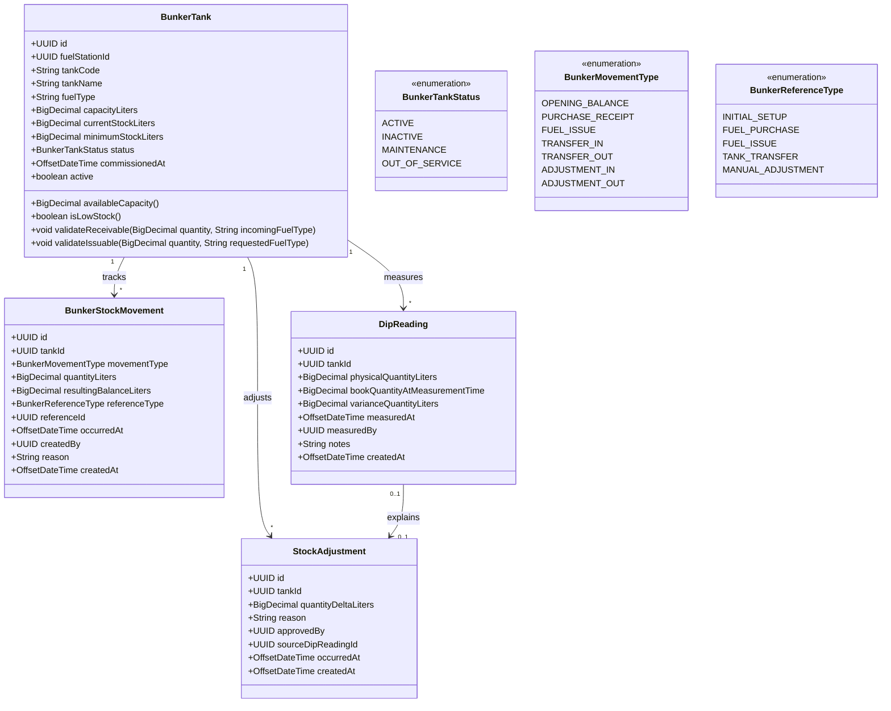
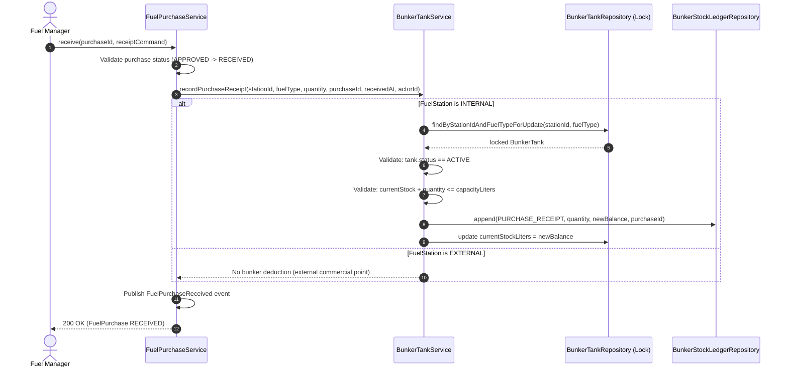
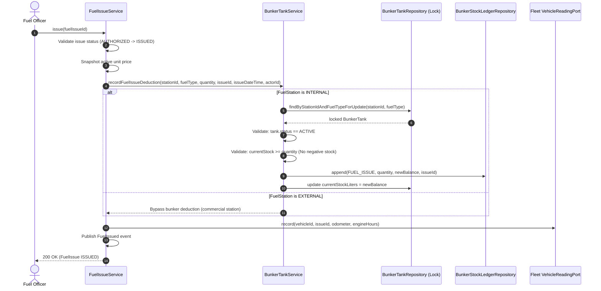

# US-36 Bunker Management Architecture & Gap Analysis

**Document Status:** Approved Architecture Specification & Gap Analysis  
**Auditor / Architect:** Senior Software Architect & Domain Analyst  
**Date:** August 18, 2026  
**Target User Story:** US-36 — Bunker Management  
**Target Module:** `com.transportlogistics.app.fuel`  
**Target Migration:** `V18__bunker_management.sql`  

---

## 1. Executive Summary

In the Transport & Logistics Management System, fuel management encompasses external commercial fueling stations as well as internal company depots and fueling points (such as the Colombo Hub Fuel Point).

Currently:
- **US-31 (Fuel Issue)** allows issuing fuel vouchers against vehicles, drivers, and trips at both `INTERNAL` and `EXTERNAL` stations.
- **US-32 (Fuel Purchases)** allows purchasing bulk fuel from vendors with invoice verification, expected price comparisons, and receipt recording at a designated destination station.
- **US-33 (Track Mileage)** tracks authoritative vehicle odometer and engine hour readings in an append-only ledger in the Fleet module.
- **US-34 (Fuel Cost Per Trip)** calculates authoritative fuel cost per trip by snapshotting unit prices onto issued vouchers and querying Fleet trip mileage.

**The Physical Inventory Gap:**  
While fuel purchases are received and fuel issues are recorded, there is currently **no physical bunker or tank inventory ledger**. When 5,000 Liters of Diesel are purchased and received at the Colombo Hub (`INTERNAL` station), no internal tank stock increases. When a driver is issued 40 Liters of Diesel at that same station, no internal tank stock decreases. Furthermore, no mechanisms exist to prevent tank overfilling, avoid negative stock overdraws from concurrent issues, log physical dip measurements, reconcile shrinkage/variance, or trigger low-stock replenishment warnings.

**US-36 Bunker Management** closes this critical loop in the physical fuel transaction chain by establishing:
1. `BunkerTank` physical storage asset definitions bound to `INTERNAL` Fuel Stations.
2. An append-only, transactionally locked `BunkerStockLedger` tracking every inbound, outbound, transfer, and adjustment movement.
3. Synchronous, transactional integration hooks into US-32 (Purchase Receipts) and US-31 (Fuel Issues).
4. Physical `DipReading` observation tracking and audited, approved `StockAdjustment` workflows.
5. Strict domain invariants: No negative stock, no capacity overfill, fuel grade compatibility, and pessimistic concurrency locking.

---

## 2. Current Repository Baseline

An audit of the active codebase reveals the following baseline components:

| Component | Current State in Repository | Relevance to US-36 Bunker Management |
|---|---|---|
| `FuelStation` | Model with `stationType` (`INTERNAL`, `EXTERNAL`), `locationId`, `vendorId`. | Binds directly to `BunkerTank` (only `INTERNAL` stations have bunker tanks). |
| `FuelStationType` | Enum: `INTERNAL`, `EXTERNAL`. | Discriminator for whether physical stock movements must be triggered. |
| `FuelPurchase` | Entity with `destinationFuelStationId`, `receivedQuantity`, `receivedAt`, `deliveryNoteNumber`. | Lifecycle transition to `RECEIVED` triggers inbound `PURCHASE_RECEIPT` movement. |
| `FuelPurchaseReceived` | Domain event published upon receipt. | Event payload carries received quantity and destination station. |
| `FuelIssue` | Entity with `stationId`, `quantity`, `fuelType`, `unitPrice`. | Lifecycle transition to `ISSUED` triggers outbound `FUEL_ISSUE` movement. |
| `FuelIssued` | Domain event published upon issuance. | Event payload carries issue quantity and station ID. |
| `FuelPrice` / `Vendor` | Vendor price catalogue with effective date ranges. | Supplies commercial valuation baseline for purchase reconciliation. |
| `VehicleReading` (Fleet) | Append-only reading ledger with pessimistic vehicle row locking. | Architectural precedent for append-only audit ledgers and concurrency controls. |
| `TripFuelCost` | Reads persisted `FuelIssue.unitPrice` and Fleet distance. | Consumes issued fuel facts without coupling to bunker stock mechanics. |

---

## 3. Business Objective

US-36 Bunker Management fulfills 14 core business capabilities for depot inventory control:

1. **Tank Registry**: Define and maintain fuel storage tanks (`BunkerTank`) at internal depot locations.
2. **Fuel Grade Isolation**: Guarantee each tank stores exactly one canonical fuel type (e.g., `DIESEL`, `PETROL_92`, `PETROL_95`).
3. **Capacity Constraints**: Track maximum safe storage capacity (`capacityLiters`) and prevent overfilling.
4. **Authoritative Book Stock**: Maintain an auditable book balance derived from an append-only stock movement ledger.
5. **Inbound Ingestion (Purchases)**: Automatically increment tank inventory upon physical receipt of approved fuel purchase orders (US-32).
6. **Outbound Ingestion (Issues)**: Automatically decrement tank inventory upon authorized fuel issue execution (US-31).
7. **Tank-to-Tank Transfers**: Support controlled, atomic transfers between tanks of identical fuel grade.
8. **Physical Dip Logging**: Capture manual dipstick / gauge observations (`DipReading`) with measurement timestamps and operator identity.
9. **Variance Computation**: Automatically compute arithmetic and percentage variance between physical dip readings and instantaneous book stock without silently altering book balances.
10. **Controlled Stock Adjustments**: Enable authorized managers to post approved inventory adjustments (`StockAdjustment`) with non-blank business reasons.
11. **Low-Stock Safety Monitoring**: Track minimum operating stock thresholds (`minimumStockLiters`) and flag reorder states (`LOW_STOCK`).
12. **End-to-End Auditability**: Ensure every Liter added, removed, or adjusted references a concrete operational origin (`referenceType`, `referenceId`, `actorId`, `occurredAt`).
13. **Concurrency & Race-Condition Safety**: Guarantee that simultaneous fuel issues cannot overdraw bunker stock below zero.
14. **Receipt Overflow Prevention**: Guarantee that purchase deliveries cannot exceed remaining tank ullage (available capacity).

---

## 4. Existing Reusable Components

The bunker management architecture reuses existing infrastructure and patterns without unnecessary duplication:

```
┌─────────────────────────────────────────────────────────────────────────┐
│ REUSABLE COMPONENTS IN FUEL MODULE                                      │
├─────────────────────────────────────────────────────────────────────────┤
│ 1. FuelStation & FuelStationRepository: Station metadata & type checks   │
│ 2. FuelPurchaseService: Receipt lifecycle hook & quantity validation     │
│ 3. FuelIssueService: Issue lifecycle hook & station resolution           │
│ 4. FuelTransaction (TransactionTemplate): Synchronous atomic boundary   │
│ 5. FuelActorPort: User extraction from Spring Security context           │
│ 6. GlobalExceptionHandler & ApiError: Consistent HTTP error payloads     │
│ 7. Pessimistic Row Locking Pattern: Serialized transactional execution   │
└─────────────────────────────────────────────────────────────────────────┘
```

---

## 5. Bounded Context Ownership

**Strict Module Ownership: `com.transportlogistics.app.fuel`**

- **Why Fuel Module Owns Bunker Management:**
  - Bunker tanks are physically and operationally part of the fuel supply chain.
  - Fuel purchases (inbound) and fuel issues (outbound) are already owned by the `fuel` module.
  - Placing bunker management in `organization` or `fleet` would violate Domain-Driven Design cohesion and introduce unnecessary cross-module transactional coupling.
  - Placing bunker management in `reporting` would violate the rule that reporting is a read-only projection consumer.
- **Cross-Module Boundaries:**
  - External modules (`trip`, `fleet`, `organization`) interact with fuel issues and purchases via existing public ports; they have **no direct knowledge** of bunker tanks or stock ledgers.

---

## 6. Proposed Domain Model



---

## 7. Stock Ledger Model (Single Source of Truth)

1. **Immutable Ledger Authority**: `BunkerStockMovement` is the authoritative, append-only history of physical inventory events.
2. **Cached Balance Projection**: `BunkerTank.currentStockLiters` is a persisted column acting as a cached read-model for performance and indexing, updated within the same transaction as the ledger movement.
3. **Invariant Consistency Formula**:
   $$\text{Current Stock} = \sum \text{Inbound Movements} - \sum \text{Outbound Movements} \pm \sum \text{Adjustments}$$
4. **Audit Immutability**: Stock movements are never updated or deleted. Corrections and reconciliations always append new `ADJUSTMENT_IN` or `ADJUSTMENT_OUT` records.

---

## 8. Purchase Receipt Integration (US-32 Hook)



- **Receipt Splitting Policy (MVP)**: A purchase receipt is allocated to the active bunker tank matching the station and fuel grade. Split receipts across multiple tanks are deferred to post-MVP.

---

## 9. Fuel Issue Integration (US-31 Hook)



- **Tank Resolution Rule (MVP)**: When `station.stationType == INTERNAL`, the backend automatically resolves the single active `BunkerTank` at that station configured for `issue.fuelType()`. If no active matching tank exists, issuance is rejected with `BUNKER_TANK_NOT_FOUND`.

---

## 10. Atomicity & Concurrency Strategy

### 10.1 Synchronous Single-Transaction Execution
All bunker stock modifications execute synchronously within the parent Spring/PostgreSQL transaction (`FuelTransaction.execute(...)` or `@Transactional`):
- If `BunkerTankService` throws `INSUFFICIENT_BUNKER_STOCK`, the `FuelIssue` remains in `AUTHORIZED` state and Fleet `VehicleReading` is not recorded.
- If `FleetVehicleReadingPort` fails (e.g. chronology conflict), the bunker stock deduction and `FuelIssue` state rollback atomically.
- If `BunkerTankService` throws `BUNKER_CAPACITY_EXCEEDED`, the `FuelPurchase` remains in `APPROVED` state.

### 10.2 Pessimistic Row Locking
Every balance-altering operation acquires a pessimistic write lock:
```java
@Query("SELECT t FROM BunkerTankEntity t WHERE t.id = :id")
@Lock(LockModeType.PESSIMISTIC_WRITE)
Optional<BunkerTankEntity> findByIdForUpdate(@Param("id") UUID id);
```
- **Lock Ordering Convention**: Source aggregate first (`FuelIssue` or `FuelPurchase`), then `BunkerTank`, then `Vehicle`. This prevents deadlocks during concurrent multi-aggregate mutations.

---

## 11. Capacity & Negative Stock Policies

### 11.1 Negative Stock Prohibition
- **Rule**: $\text{Available Stock} \ge \text{Requested Quantity}$.
- **Violation Code**: `INSUFFICIENT_BUNKER_STOCK` (HTTP 409 Conflict).
- **Rationale**: Physical tanks cannot contain negative fuel. Silent negative balances destroy inventory integrity.

### 11.2 Tank Capacity Overflow Prohibition
- **Rule**: $\text{Current Stock} + \text{Received Quantity} \le \text{Tank Capacity}$.
- **Violation Code**: `BUNKER_CAPACITY_EXCEEDED` (HTTP 400 Bad Request).
- **Rationale**: Prevents hazardous overfilling and invalid inventory accounting.

### 11.3 Fuel Type Compatibility Invariant
- **Rule**: $\text{Tank.fuelType} == \text{Transaction.fuelType}$.
- **Violation Code**: `BUNKER_FUEL_TYPE_MISMATCH` (HTTP 400 Bad Request).

---

## 12. Physical Dip Readings, Variance & Adjustments

### 12.1 Dip Reading Workflow
1. Operator takes physical measurement (e.g., dipstick calibration or manual sensor dip).
2. Submits `POST /api/v1/bunker-tanks/{id}/dip-readings` with `physicalQuantityLiters` and `measuredAt`.
3. Backend locks tank, captures instantaneous `bookQuantityAtMeasurementTime`, calculates `varianceQuantityLiters = physicalQuantity - bookQuantity`, and persists `DipReading`.
4. **Invariant**: The dip reading **never** silently alters book stock.

### 12.2 Stock Adjustment Workflow
1. Authorized inventory manager reviews dip variance.
2. Submits `POST /api/v1/bunker-tanks/{id}/adjustments` with `quantityDeltaLiters`, `reason`, and optional `sourceDipReadingId`.
3. Backend executes:
   - Locks tank.
   - Validates resulting stock will not become negative or exceed capacity.
   - Inserts `ADJUSTMENT_IN` (if $\Delta > 0$) or `ADJUSTMENT_OUT` (if $\Delta < 0$) into `BunkerStockLedger`.
   - Updates `BunkerTank.currentStockLiters`.
   - Persists `StockAdjustment` audit record.

---

## 13. Tank Transfers

- **Scope**: Moving fuel from Tank A to Tank B.
- **Invariants**:
  1. `sourceTank.fuelType == destinationTank.fuelType`.
  2. `sourceTank.id != destinationTank.id`.
  3. `sourceTank.currentStock >= transferQuantity`.
  4. `destinationTank.currentStock + transferQuantity <= destinationTank.capacity`.
  5. Both tanks must have status `ACTIVE`.
- **Ledger Execution**: Atomically appends `TRANSFER_OUT` on Tank A and `TRANSFER_IN` on Tank B sharing a common `transferId`.

---

## 14. Low Stock Monitoring

- **Status Calculation**:
  $$\text{Stock Status} = \begin{cases} \text{OUT\_OF\_SERVICE} & \text{if } \text{tank.status} \neq \text{ACTIVE} \\ \text{LOW\_STOCK} & \text{if } \text{currentStock} \le \text{minimumStock} \\ \text{NEAR\_CAPACITY} & \text{if } \text{currentStock} \ge 0.95 \times \text{capacity} \\ \text{NORMAL} & \text{otherwise} \end{cases}$$
- Read models and UI expose visual status tags and warning banners.

---

## 15. REST API Scope

Base path: `/api/v1`

| HTTP Method | Endpoint | Description | Required Permission |
|---|---|---|---|
| `GET` | `/bunker-tanks` | List all bunker tanks (filter by station, fuel type, active) | `BUNKER_VIEW` |
| `POST` | `/bunker-tanks` | Register a new bunker tank | `BUNKER_CREATE` |
| `GET` | `/bunker-tanks/{id}` | Get bunker tank details | `BUNKER_VIEW` |
| `PUT` | `/bunker-tanks/{id}` | Update tank details (name, min stock, status) | `BUNKER_UPDATE` |
| `GET` | `/bunker-tanks/{id}/balance` | Get real-time stock balance, ullage, and latest dip | `BUNKER_VIEW` |
| `GET` | `/bunker-tanks/{id}/movements` | Server-paginated stock ledger movements | `BUNKER_LEDGER_VIEW` |
| `POST` | `/bunker-tanks/{id}/opening-balance` | Initialize opening balance for new tank | `BUNKER_ADJUST` |
| `POST` | `/bunker-tanks/{id}/dip-readings` | Record physical dip observation | `BUNKER_DIP_RECORD` |
| `GET` | `/bunker-tanks/{id}/dip-readings` | List historical dip readings | `BUNKER_VIEW` |
| `POST` | `/bunker-tanks/{id}/adjustments` | Post approved stock variance adjustment | `BUNKER_ADJUST` |
| `POST` | `/bunker-transfers` | Execute inter-tank stock transfer | `BUNKER_TRANSFER` |

---

## 16. Security & RBAC Model

Granular business authorities seeded via Flyway migration:

| Authority Name | Purpose & Scope |
|---|---|
| `BUNKER_VIEW` | View bunker tank lists, details, balances, and dip readings |
| `BUNKER_CREATE` | Commission and configure new bunker storage tanks |
| `BUNKER_UPDATE` | Edit tank parameters, minimum stock thresholds, and operational status |
| `BUNKER_LEDGER_VIEW` | Audit detailed transaction history in the stock movement ledger |
| `BUNKER_DIP_RECORD` | Submit physical dipstick / measurement observations |
| `BUNKER_ADJUST` | Set opening balances and approve inventory variance adjustments |
| `BUNKER_TRANSFER` | Execute tank-to-tank fuel transfers |

---

## 17. Database Design (Flyway `V18__bunker_management.sql`)

```sql
-- 1. Bunker Tank Table
CREATE TABLE bunker_tank (
    id UUID PRIMARY KEY,
    fuel_station_id UUID NOT NULL REFERENCES fuel_station(id),
    tank_code VARCHAR(32) NOT NULL,
    tank_name VARCHAR(128) NOT NULL,
    fuel_type VARCHAR(32) NOT NULL,
    capacity_liters NUMERIC(12, 3) NOT NULL,
    current_stock_liters NUMERIC(12, 3) NOT NULL DEFAULT 0.000,
    minimum_stock_liters NUMERIC(12, 3) NOT NULL DEFAULT 0.000,
    status VARCHAR(32) NOT NULL DEFAULT 'ACTIVE',
    commissioned_at TIMESTAMPTZ NOT NULL DEFAULT CURRENT_TIMESTAMP,
    active BOOLEAN NOT NULL DEFAULT TRUE,
    created_at TIMESTAMPTZ NOT NULL DEFAULT CURRENT_TIMESTAMP,
    updated_at TIMESTAMPTZ NOT NULL DEFAULT CURRENT_TIMESTAMP,
    CONSTRAINT uq_bunker_tank_code UNIQUE (tank_code),
    CONSTRAINT chk_bunker_capacity_positive CHECK (capacity_liters > 0),
    CONSTRAINT chk_bunker_stock_non_negative CHECK (current_stock_liters >= 0),
    CONSTRAINT chk_bunker_stock_capacity CHECK (current_stock_liters <= capacity_liters),
    CONSTRAINT chk_bunker_min_stock_non_negative CHECK (minimum_stock_liters >= 0)
);

CREATE INDEX idx_bunker_tank_station ON bunker_tank(fuel_station_id);
CREATE INDEX idx_bunker_tank_fuel_type ON bunker_tank(fuel_type);

-- 2. Bunker Stock Movement Ledger Table
CREATE TABLE bunker_stock_movement (
    id UUID PRIMARY KEY,
    tank_id UUID NOT NULL REFERENCES bunker_tank(id),
    movement_type VARCHAR(32) NOT NULL,
    quantity_liters NUMERIC(12, 3) NOT NULL,
    resulting_balance_liters NUMERIC(12, 3) NOT NULL,
    reference_type VARCHAR(32) NOT NULL,
    reference_id UUID,
    occurred_at TIMESTAMPTZ NOT NULL,
    created_by UUID NOT NULL REFERENCES app_user(id),
    reason VARCHAR(500),
    created_at TIMESTAMPTZ NOT NULL DEFAULT CURRENT_TIMESTAMP,
    CONSTRAINT chk_bunker_movement_qty_positive CHECK (quantity_liters > 0),
    CONSTRAINT chk_bunker_movement_bal_non_negative CHECK (resulting_balance_liters >= 0)
);

CREATE INDEX idx_bunker_movement_tank_time ON bunker_stock_movement(tank_id, occurred_at DESC);
CREATE INDEX idx_bunker_movement_ref ON bunker_stock_movement(reference_type, reference_id);

-- Partial Unique Index for Idempotency (prevent duplicate purchase/issue stock movements)
CREATE UNIQUE INDEX uq_bunker_movement_idempotency
ON bunker_stock_movement(tank_id, movement_type, reference_type, reference_id)
WHERE reference_id IS NOT NULL;

-- 3. Physical Dip Reading Table
CREATE TABLE bunker_dip_reading (
    id UUID PRIMARY KEY,
    tank_id UUID NOT NULL REFERENCES bunker_tank(id),
    physical_quantity_liters NUMERIC(12, 3) NOT NULL,
    book_quantity_at_measurement NUMERIC(12, 3) NOT NULL,
    variance_quantity_liters NUMERIC(12, 3) NOT NULL,
    measured_at TIMESTAMPTZ NOT NULL,
    measured_by UUID NOT NULL REFERENCES app_user(id),
    notes VARCHAR(500),
    created_at TIMESTAMPTZ NOT NULL DEFAULT CURRENT_TIMESTAMP,
    CONSTRAINT chk_bunker_dip_qty_non_negative CHECK (physical_quantity_liters >= 0)
);

CREATE INDEX idx_bunker_dip_tank_time ON bunker_dip_reading(tank_id, measured_at DESC);

-- 4. Stock Adjustment Table
CREATE TABLE bunker_stock_adjustment (
    id UUID PRIMARY KEY,
    tank_id UUID NOT NULL REFERENCES bunker_tank(id),
    quantity_delta_liters NUMERIC(12, 3) NOT NULL,
    reason VARCHAR(500) NOT NULL,
    approved_by UUID NOT NULL REFERENCES app_user(id),
    source_dip_reading_id UUID REFERENCES bunker_dip_reading(id),
    occurred_at TIMESTAMPTZ NOT NULL,
    created_at TIMESTAMPTZ NOT NULL DEFAULT CURRENT_TIMESTAMP
);

CREATE INDEX idx_bunker_adjustment_tank ON bunker_stock_adjustment(tank_id, occurred_at DESC);
```

---

## 18. Idempotency Strategy

- **Purchase Receipt Ingestion**: The partial unique index `(tank_id, 'PURCHASE_RECEIPT', 'FUEL_PURCHASE', fuelPurchaseId)` prevents duplicate stock additions if a receipt command is retried.
- **Fuel Issue Ingestion**: The partial unique index `(tank_id, 'FUEL_ISSUE', 'FUEL_ISSUE', fuelIssueId)` guarantees an issue voucher cannot decrement stock multiple times.

---

## 19. Domain Events

Optional lightweight Spring Application Events for decoupled notifications / telemetry:
- `BunkerStockReceived(UUID tankId, BigDecimal quantity, BigDecimal newBalance, UUID purchaseId)`
- `BunkerStockIssued(UUID tankId, BigDecimal quantity, BigDecimal newBalance, UUID issueId)`
- `BunkerLowStockDetected(UUID tankId, BigDecimal currentStock, BigDecimal minimumStock)`
- `BunkerVarianceDetected(UUID tankId, BigDecimal physicalStock, BigDecimal bookStock, BigDecimal variance)`

---

## 20. Frontend Scope & Design

### 20.1 New Feature Directory: `frontend/src/fuel/bunkers/`
- `BunkerListPage.tsx`: Displays list of depot tanks as interactive cards with visual fill gauges, fuel badges, and low-stock alerts.
- `BunkerDetailsPage.tsx`: Header summary (capacity, stock, ullage, latest dip), tabs for **Stock Ledger** and **Dip History**.
- `BunkerLedgerTable.tsx`: Server-paginated history of all movements with filters for date range and movement type.
- `RecordDipModal.tsx`: Form for physical dip reading submission with instantaneous variance calculation preview.
- `AdjustStockModal.tsx`: Form for posting approved variance adjustments with mandatory reason field.
- `BunkerTransferModal.tsx`: Form for transferring fuel between compatible tanks.

### 20.2 UI Visual State Tokens
- `NORMAL` (Green progress fill)
- `LOW_STOCK` (Red warning badge & alert icon)
- `NEAR_CAPACITY` (Amber cautionary fill $> 95\%$)
- `OUT_OF_SERVICE` / `MAINTENANCE` (Grey disabled state)

---

## 21. Testing Strategy

### 21.1 Unit Tests (`src/test/java/.../fuel/domain/`)
- `BunkerTankPolicyTest`: Capacity overfill rejection, negative stock rejection, fuel grade mismatch rejection.
- `BunkerStockLedgerTest`: Balance calculation invariants across all movement types.

### 21.2 Service Tests (`src/test/java/.../fuel/application/service/`)
- `BunkerTankServiceTest`: Tank lifecycle, opening balance, transfer validations.
- `BunkerReceiptIntegrationTest`: Inbound purchase receipt stock increment and capacity overflow prevention.
- `BunkerIssueIntegrationTest`: Outbound fuel issue stock decrement and insufficient stock rollback.
- `DipReadingAndAdjustmentTest`: Physical dip logging, variance computation, approved adjustment ledger posting.

### 21.3 Testcontainers PostgreSQL Concurrency Tests
- `ConcurrentBunkerIssueIntegrationTest`: Executes 10 concurrent threads attempting to issue 30 Liters each from a 100 Liter tank. Asserts that exactly 3 succeed (90 L total) and 7 fail with `INSUFFICIENT_BUNKER_STOCK`, resulting in a clean final balance of 10.000 Liters and zero negative inventory.

---

## 22. End-to-End Integration Scenario Matrix

```text
========================================================================================
STEP | ACTION                                | INPUT / DATA        | EXPECTED RESULT
========================================================================================
1    | Commission Tank                       | Cap: 10,000 L DIESEL| Tank created (Stock: 0 L)
2    | Set Opening Balance                   | 2,000 L             | Ledger: OPENING_BALANCE, Stock: 2,000 L
3    | Receive Purchase PO-001 (US-32)       | 5,000 L DIESEL      | Ledger: PURCHASE_RECEIPT, Stock: 7,000 L
4    | Issue Fuel Voucher V-001 (US-31)      | 1,000 L DIESEL      | Ledger: FUEL_ISSUE, Stock: 6,000 L
5    | Issue Fuel Voucher V-002 (US-31)      | 500 L DIESEL        | Ledger: FUEL_ISSUE, Stock: 5,500 L
6    | Log Physical Dip Reading              | 5,400 L measured    | Dip created, Variance: -100 L (Book: 5,500 L)
7    | Post Approved Stock Adjustment        | -100 L (Evaporation)| Ledger: ADJUSTMENT_OUT, Stock: 5,400 L
8    | Attempt Overdraw Fuel Issue (US-31)   | 6,000 L DIESEL      | REJECTED (INSUFFICIENT_BUNKER_STOCK)
9    | Attempt Overfill Purchase (US-32)     | 6,000 L DIESEL      | REJECTED (BUNKER_CAPACITY_EXCEEDED)
========================================================================================
```

---

## 23. Gap Analysis Matrix

| Capability Area | Already Exists in Codebase | Missing Component (To Build in US-36) | Implementation Risk |
|---|---|---|---|
| **Station Metadata** | `FuelStation` (`INTERNAL` / `EXTERNAL`) | Station-to-Tank binding query | Low |
| **Purchase Receipt** | `FuelPurchaseService.receive()` | Synchronous hook to increment tank stock | Low |
| **Fuel Issue Execution**| `FuelIssueService.issue()` | Synchronous hook to decrement tank stock | Medium (Pessimistic lock) |
| **Storage Assets** | None | `BunkerTank` entity, repository, and CRUD APIs | Low |
| **Stock Ledger** | None | `BunkerStockMovement` ledger table and queries | Low |
| **Dip Measurement** | None | `DipReading` entity, variance logic, and modal | Low |
| **Stock Adjustment** | None | `StockAdjustment` entity and ledger integration | Low |
| **Frontend UI** | Fuel Issue and Purchase pages | Bunker tank cards, ledger view, and modals | Low |

---

## 24. Architecture Decisions Required

| # | Architecture Decision | Option A | Option B | Architect Recommendation | Rationale & Impact |
|---|---|---|---|---|---|
| **1** | **Tank Resolution for Fuel Issues** | Backend auto-resolves single active tank per station & fuel type | Fuel issue request payload must explicitly supply `bunkerTankId` | **Option A (Auto-resolve for MVP)** | Internal stations have one bulk tank per fuel grade. Keeps US-31 UI clean without breaking existing API contracts. |
| **2** | **Purchase Receipt Timing** | Stock increments upon `RECEIVED` state | Stock increments upon `RECONCILED` state | **Option A (`RECEIVED` state)** | Physical fuel is poured into the tank at delivery time (`RECEIVED`), prior to accounting invoice reconciliation. |
| **3** | **Current Balance Storage** | Persisted column `current_stock_liters` updated in lock-step | Dynamically calculated `SUM(movements)` on every read | **Option A (Persisted with lock)** | Required for high-performance reading and database check constraints; transactional ledger guarantees correctness. |
| **4** | **Negative Stock Policy** | Hard rejection (`INSUFFICIENT_BUNKER_STOCK`) | Allow negative stock with warning flag | **Option A (Hard Rejection)** | Physical tanks cannot be negative; maintains data integrity. |
| **5** | **Tank-to-Tank Transfers** | Included in US-36 foundation | Deferred to Phase 3 | **Option A (Include in US-36)** | Atomic transfers between tanks are common during maintenance and depot balancing. |

---

## 25. Phased Implementation Slices

### Slices Overview:
- **`TASK-36-001`**: Bunker Tank & Schema Foundation (Flyway `V18`, `BunkerTank` entity, repository, CRUD APIs, permissions).
- **`TASK-36-002`**: Stock Ledger & Purchase Receipt Integration (Inbound `PURCHASE_RECEIPT` movements in `FuelPurchaseService.receive()`).
- **`TASK-36-003`**: Fuel Issue Stock Deduction & Concurrency Hardening (Outbound `FUEL_ISSUE` movements, pessimistic locking, negative stock prevention, Testcontainers concurrency test).
- **`TASK-36-004`**: Physical Dip Readings, Variance & Adjustments (`DipReading`, `StockAdjustment`, `BunkerTransfer` services).
- **`TASK-36-005`**: Bunker Management Frontend UI (React tank cards, visual fill gauge, ledger history table, dip & adjustment modals).

---

## 26. Final Status & Recommendation

```text
US-36 CURRENT STATUS:
NOT STARTED (READY FOR IMPLEMENTATION)

US-36 ARCHITECTURE:
READY

RECOMMENDED FIRST IMPLEMENTATION SLICE:
TASK-36-001 (Bunker Tank & Schema Foundation)

REQUIRED HUMAN ARCHITECTURE DECISIONS:
5 (Evaluated with explicit recommendations)

EXPECTED NEW FLYWAY MIGRATION:
YES (V18__bunker_management.sql)

EXPECTED MODULE OWNERSHIP:
com.transportlogistics.app.fuel

EXPECTED HIGHEST IMPLEMENTATION RISK:
Pessimistic locking and deadlock avoidance across cross-aggregate Fuel Issue & Bunker mutations
```
