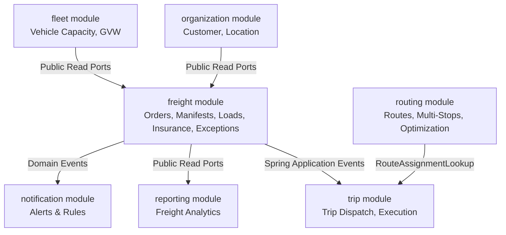

# Phase-2 Route Completion + Freight & Cargo Gap Analysis (PHASE2-GAP-001)

**Task ID:** `PHASE2-GAP-001`  
**Date:** August 24, 2026  
**Audited Baseline:** Release Candidate 1 (`RC-1` / `v1.0.0-rc.1` at commit `a80cc0f`)  
**Scope:** Phase-2 Advanced Route Capabilities (`US-20` to `US-23`) and Freight & Cargo Management (`US-24` to `US-30`)  
**Evaluator:** Senior Principal Software Architect, Domain Architect, Spring Modulith Lead, React Architect, and QA Lead  

---

## 1. Executive Summary

Phase-1 delivered a complete, hardened 39-story MVP baseline encompassing Identity, Fleet Master, Driver Compliance, Basic Routing, Trip Lifecycle Operations, Basic Fuel Management, and Notification Rules.

Phase-2 expands the platform from basic transport dispatching into **Commercial Freight Operations and Advanced Route Intelligence**. This gap analysis now reflects the implemented V1–V31 migration chain and the frozen source story map while preserving its original August 24 planning history. It defines the remaining domain boundaries, future migration ownership, API surfaces, frontend features, security policies, and implementation sequence without compromising Phase-1 integrity.

---

## 2. Authoritative User Story Scope

| Story ID | Story Title | Domain / Epic | Current Status | Phase-2 Target Objective |
|---|---|---|:---:|---|
| **US-20** | Optimize Routes | Routing | **COMPLETE** | Deterministic bounded multi-stop optimization delivered by P2-02; external live traffic feeds remain deferred. |
| **US-21** | Maintain Route History | Routing | **COMPLETE** | Immutable route revisions and retrieval delivered by P2-01. |
| **US-22** | Analyze Route Performance | Routing / Reporting | **COMPLETE** | Planned-versus-actual route performance projection delivered by P2-02. |
| **US-23** | Handle Route Disruptions | Routing / Operations | **COMPLETE** | Route disruption recording, resolution and active-disruption visibility delivered by P2-01. |
| **US-24** | Manage Freight Orders | Freight & Cargo | **COMPLETE** | Source-aligned commercial shipment request: customer, locations, requested schedule/SLA, priority, special handling, minimal shipment lines, create/list/detail/update, audit, concurrency, and RBAC. No lifecycle is defined. |
| **US-25** | Manage Cargo Manifest | Freight & Cargo | **COMPLETE** | Separate Freight Order-associated manifest aggregate, identifiable items, provider-neutral packing/classification, conditional customs/hazmat, structured completeness, explicit finalization, audit, concurrency and RBAC implemented in P2-04-R1 / V32. |
| **US-26** | Plan Loads | Freight & Cargo | **MISSING** | Weight distribution, stacking, pallet/container placement, compatibility and fragile/temperature-sensitive separation. |
| **US-27** | Validate Weight and Volume | Freight & Cargo | **MISSING** | Gross/net/cubic calculation from supplied data plus payload, volume and applicable axle-limit validation. |
| **US-28** | Manage Freight Insurance | Freight & Cargo | **MISSING** | Policy mapping, coverage/premium information, damage assessment, claim workflow and settlement history. |
| **US-29** | Generate Freight Reports | Freight / Reporting | **MISSING** | Read-only shipment, utilization, claim and compliance reports with permission and incomplete-data handling. |
| **US-30** | Handle Cargo Exceptions | Freight & Cargo | **MISSING** | Auditable damage, partial, weight-gap, hazmat, unmanifested-cargo and seal-tampering exception control. |

---

## 3. Current System vs Phase-2 Requirements Audit

### 3.1 Route Module Historical Baseline Audit (`US-20` to `US-23`)

The items below record the Phase-1 baseline gaps that motivated P2-01 and P2-02. All four story gaps are now closed; the active status table above is authoritative.

- **Current Implementation (Phase-1 Baseline):**
  - `Route` aggregate in `com.transportlogistics.app.routing.domain.model.Route` supports `id`, `code`, `name`, `originLocationId`, `destinationLocationId`, `plannedDistanceKm`, `estimatedDurationMinutes`, `active`, and `stopLocationIds` (up to 50 ordered stops).
  - Persistence: `RouteEntity` maps `route_stops` via `@OrderColumn(name = "stop_index")` backed by Flyway `V1__baseline.sql` and `V5__route_stops.sql`.
  - Ports & Inbound/Outbound: `RouteUseCase`, `RouteService`, `RouteRepository`, `RoutePersistenceAdapter`, `RouteAssignmentLookup`.
  - Frontend: `ResourceListPage.tsx` route catalog view.
  - Tests: `RouteTest`, `RouteServiceTest`, `RouteControllerTest`, `RouteJpaRepositoryTest` (22 tests passing).
- **Historical gaps subsequently closed:**
  1. *Route Optimization (`US-20`):* No waypoint re-ordering algorithm exists. Currently stops are stored in static manual entry order.
  2. *Route History (`US-21`):* Only basic `updated_at`/`updated_by` metadata is stored. Modifying a route mutates the record directly, overwriting historical geometry for completed trips.
  3. *Route Performance (`US-22`):* Trip actuals (`start_odometer`, `end_odometer`, `start_time`, `end_time`) are captured in `trip` and `runninglog`, but there is no projection comparing planned vs actual variance by route.
  4. *Route Disruptions (`US-23`):* No domain model exists for road blocks, traffic jams, weather alerts, or alternate detour routes during active trip dispatch.

### 3.2 Freight & Cargo Domain Audit (`US-24` to `US-30`)

- **Current Implementation (post P2-03-R1):**
  - Trip retains its free-form `cargoDescription: String` scalar for existing operational compatibility.
  - The `freight` module now implements the source-aligned US-24 Freight Order and minimal shipment lines.
  - Cargo Manifest is complete. Load planning, weight/volume validation, freight insurance, freight reporting, and cargo-exception implementation do not exist yet.
- **Reusable Existing Foundations:**
  - `organization` module provides `Customer`, `Location`, and `Project` aggregates.
  - `fleet` module provides `Vehicle` with `payloadCapacityKg`, `grossVehicleWeightKg`, `category`, and body type.
  - `trip` module provides operational trip assignment, driver/vehicle pairing, and status transitions.
  - `reporting` module provides typed read port projections.
  - `notification` module provides decoupled rule-based alert triggering.
- **Missing Capabilities:**
  1. *Freight Orders (`US-24`):* Completed in P2-03 with the source-aligned order aggregate, minimal shipment lines, requested schedule/SLA, priority, special instructions, validation, audit, concurrency, and create/list/detail/update operations. The reconciled source defines no order status state machine.
  2. *Cargo Manifests (`US-25`):* A separate Freight Order-associated manifest aggregate, identifiable cargo items, packing data, classification, conditional customs/hazmat information, completeness validation and finalization. No package or classification catalogue may be invented.
  3. *Load Planning (`US-26`):* Physical weight distribution, stacking, pallet/container placement, cargo compatibility and fragile/temperature-sensitive separation.
  4. *Weight and Volume Validation (`US-27`):* Gross/net/cubic derivation, data-gap handling, payload/volume/axle checks and recorded validation outcome without rearranging cargo.
  5. *Freight Insurance (`US-28`):* Policy association and coverage/premium information plus damage assessment, authorized claim workflow and settlement history.
  6. *Freight Reporting (`US-29`):* Read-only shipment, utilization, claim and compliance reports with explicit incomplete-data semantics.
  7. *Cargo Exceptions (`US-30`):* A common auditable exception lifecycle for damage, partial shipments, weight discrepancies, hazardous materials, unmanifested cargo and seal tampering.

---

## 4. Architectural & Module Ownership Decisions

### 4.1 Module Decision: Dedicated `freight` Business Module
- **Decision:** Create a new top-level Spring Modulith business module: `com.transportlogistics.app.freight`.
- **Architectural Rationale:**
  1. *Single Responsibility:* Freight represents commercial cargo demand, manifested cargo, load planning, insurance and cargo-exception control; Trip represents operational vehicle/driver physical execution. Reporting observes both through public read boundaries.
  2. *Cardinality & Consolidation:* One Trip may carry multiple Freight Orders (Less-Than-Truckload / LTL consolidation), or one large Freight Order may span multiple Trips. Embedding Freight in `trip` would create severe transactional and aggregate coupling.
  3. *Hexagonal Boundaries:* `freight` will communicate with `trip`, `fleet`, `organization`, and `routing` strictly via public read ports and Spring Application Events.
  4. *Routing Ownership:* Advanced route optimization, route revisions, and disruptions belong inside the existing `routing` module as domain extensions.

### 4.2 Cross-Module Integration Map



---

## 5. Database Gap & Flyway Migration Plan

Existing Flyway migrations are **IMMUTABLE**. Phase-2 schema additions use the actual forward sequence:

| Proposed Migration | Target Tables | Purpose |
|---|---|---|
| **V30__route_history_and_disruptions.sql** | `route_revisions`, `route_disruptions` | Immutable route revision snapshots and road/weather disruption records. |
| **V31__freight_order_foundation.sql** | `freight_order`, `freight_order_line` | Source-aligned commercial freight orders, minimal shipment lines, audit metadata, and optimistic version. |
| **Next forward migration (deferred)** | Cargo Manifest-owned tables | Assigned by P2-04 after inspecting the then-current migration chain. |
| **Later forward migrations (deferred)** | Load planning, optional validation results, insurance/claims/settlements, reporting projections if required, and cargo exceptions | Assigned only by their owning frozen later slices. No freight-charge migration is planned in US-24–US-30. |

---

## 6. API Surface Plan

All endpoints follow AGENTS.md REST guidelines (`/api/v1` base path, typed DTOs, explicit command endpoints):

### 6.1 Route Intelligence Endpoints (`routing` module)
- `POST /api/v1/routes/{id}/optimize` — Calculate optimized waypoint sequence.
- `GET /api/v1/routes/{id}/revisions` — Retrieve route change history and snapshots.
- `POST /api/v1/routes/{id}/disruptions` — Record road/weather disruption and suggest detours.
- `GET /api/v1/routes/disruptions/active` — View active disruptions across route network.

### 6.2 Freight & Cargo Endpoints (`freight` module)
- `GET /api/v1/freight/orders` — Paginated list/search filtered by source-supported order attributes.
- `POST /api/v1/freight/orders` — Create a freight order with minimal shipment lines.
- `GET /api/v1/freight/orders/{id}` — Get source-aligned freight order details.
- `PATCH /api/v1/freight/orders/{id}` — Update an order using its optimistic version.
- `POST /api/v1/freight/manifests` — Create a Cargo Manifest from a saved Freight Order.
- `GET /api/v1/freight/manifests` — Paginated manifest list.
- `GET /api/v1/freight/manifests/{id}` — Retrieve manifest and cargo-item details.
- `PATCH /api/v1/freight/manifests/{id}` — Update an unfinalized manifest using optimistic concurrency.
- `POST /api/v1/freight/manifests/{id}/items` — Add an identifiable cargo item.
- `PATCH /api/v1/freight/manifests/{id}/items/{itemId}` — Update an unfinalized cargo item.
- `POST /api/v1/freight/manifests/{id}/finalize` — Finalize manifest prior to dispatch.
- US-26 owns load-plan create/list/detail/update and physical placement/compatibility validation endpoints.
- US-27 owns an explicit load-plan weight/volume validation command and validation-result read endpoint.
- US-28 owns insurance policy association and explicit claim assessment/status/settlement command endpoints.
- US-29 owns read-only freight report query/filter/export endpoints under the reporting boundary.
- US-30 owns cargo-exception list/create/detail and explicit hold/escalate/reject/release/resolve endpoints where supported by its final contract.

There is no freight-charge endpoint in the frozen US-24 through US-30 API plan.

---

## 7. Frontend Architecture Plan

Feature-first organization matching AGENTS.md:

```text
frontend/src/
  features/
    freight/
      orders/           # FreightOrderListPage, FreightOrderEditorPage, useFreightOrders
      manifests/        # ManifestListPage, ManifestDetailsDrawer, useManifests
      loadPlanning/     # US-26 placement and US-27 weight/volume validation results
      insurance/        # US-28 policies, claims, assessment and settlement
      reports/          # US-29 shipment, utilization, claim and compliance reports
      exceptions/       # US-30 exception intake, restrictions, actions and history
    routing/
      optimization/     # RouteOptimizerModal, WaypointSequencer
      disruptions/      # RouteDisruptionBanner, DisruptionEditorModal
```

- **Forms:** React Hook Form + Zod schemas for all freight and cargo forms.
- **Tables:** Standardized Ant Design `Table` with responsive filter toolbars and tag visualizers.
- **Server State:** TanStack Query feature hooks with dedicated query keys (`['freight-orders']`, `['cargo-manifests']`, `['route-disruptions']`).

---

## 8. Security & RBAC Policy Matrix

| Permission Code | Description | Default Roles |
|---|---|---|
| `FREIGHT_ORDER_VIEW` | View freight orders and minimal shipment lines | Existing role-permission assignment only; no P2-03 role is created |
| `FREIGHT_ORDER_MANAGE` | Create and edit freight orders | Existing role-permission assignment only; no P2-03 role is created |
| `CARGO_MANIFEST_VIEW` | View cargo manifests | Existing role-permission assignment only |
| `CARGO_MANIFEST_MANAGE`| Create and edit unfinalized cargo manifests | Existing role-permission assignment only |
| `CARGO_MANIFEST_FINALIZE`| Finalize validated cargo manifests | Existing role-permission assignment only |
| `LOAD_PLAN_MANAGE` | Manage US-26 load plans and controlled US-27 validation | Existing role-permission assignment only; exact grants require the owning implementation contract |
| `CARGO_INSURANCE_MANAGE`| Manage US-28 insurance policies and claims | Existing role-permission assignment only; exact action splits require the US-28 contract |
| `FREIGHT_REPORT_VIEW` | View source-defined freight reports | Existing role-permission assignment only |
| `CARGO_EXCEPTION_VIEW` | View cargo exceptions and retained resolution history | Existing role-permission assignment only |
| `CARGO_EXCEPTION_MANAGE` | Record, restrict and resolve cargo exceptions | Existing role-permission assignment only; exact action splits require the US-30 contract |
| `ROUTE_OPTIMIZE` | Execute route optimization and sequencing | Admin, Route Planner, Dispatcher |
| `ROUTE_DISRUPTION_MANAGE`| Log route disruptions and apply detour plans | Admin, Dispatcher, Safety Officer |

---

## 9. Risk Assessment Matrix

| Risk ID | Area | Severity | Description | Mitigation |
|---|---|:---:|---|---|
| **P2-R01** | Architecture Coupling | P1 | Risk of tight coupling between `trip` and `freight`. | Enforce Modulith boundaries; use public read ports and events exclusively. |
| **P2-R02** | Overload Safety | P1 | Inaccurate cargo weight calculations causing vehicle axle overload. | Enforce strict vehicle payload and GVW mathematical checks in domain service. |
| **P2-R03** | Cargo Source Data | P1 | Missing or invalid manifest measurements/classification could be incorrectly represented as compliant. | Reject finalization/validation where mandatory data is missing and surface structured reasons. |
| **P2-R04** | Route Optimization API | P2 | Unbounded TSP algorithm execution causing high latency. | Implement deterministic bounded heuristic solver with maximum waypoint bounds. |
| **P2-R05** | Historical Route Drift | P2 | Route edits corrupting completed trip audit geometry. | Create immutable `route_revisions` snapshots on every route modification. |

---

## 10. Phased Implementation Roadmap

1. **Slice P2-01 (Route Intelligence Foundation):** Route revisions snapshotting (`US-21`) and route disruption domain/events (`US-23`).
2. **Slice P2-02 (Route Optimization):** Multi-stop waypoint sequencing heuristic (`US-20`) and route performance analytics (`US-22`).
3. **Slice P2-03 (Freight Order Management):** `freight` Modulith module foundation, source-aligned `FreightOrder` aggregate, minimal shipment lines, `V31` migration, and create/list/detail/update REST APIs (`US-24`). **COMPLETE.**
4. **Slice P2-04-R1 (Cargo Manifest) — COMPLETE:** Frozen `CargoManifest` aggregate, cargo items, classification/customs/hazmat validation and finalization in V32 (`US-25`).
5. **Slice P2-05-R1 (Load Planning):** Physical distribution, placement, stacking, compatibility and special-cargo separation (`US-26`).
6. **Slice P2-05-R2 (Weight/Volume Validation):** Gross/net/cubic, payload, volume and applicable axle-limit validation (`US-27`).
7. **Slice P2-06-R1 (Freight Insurance):** Policies, claims, damage assessment and settlements (`US-28`).
8. **Slice P2-07-R1 (Freight Reporting):** Read-only shipment, utilization, claim and compliance reporting (`US-29`).
9. **Slice P2-08-R1 (Cargo Exceptions):** Auditable exception restrictions, corrective actions and resolution history (`US-30`).

---

## 11. P2-03-R1 Source Reconciliation

The original August 24 planning analysis treated a Freight Order lifecycle (`DRAFT -> CONFIRMED -> ASSIGNED -> IN_TRANSIT -> DELIVERED -> CANCELLED`), confirmation/cancellation endpoints, tracking state, and manifest-grade cargo detail as US-24 requirements. The reconciled source contract, `US24-FREIGHT-ORDER-CONTRACT-001`, overrides those assumptions. They were removed from the active P2-03 scope without erasing this historical note. US-24 now ends at validated create/list/detail/update of the saved commercial shipment request; US-25 owns its separate manifest representation.

`PHASE2-SCOPE-RECON-001` resolved the warning on August 25, 2026 using the authoritative Transportation & Logistics source story text, diagrams, acceptance criteria and traceability register. The frozen mapping is **US-29 — Generate Freight Reports** and **US-30 — Handle Cargo Exceptions**. The same source corrects US-26 to **Plan Loads** and US-27 to **Validate Weight and Volume**. Freight charges are assigned to **US-47 — Manage Transport Billing**, outside US-24 through US-30, and are removed from the active Phase-2 plan.

Historical note: the August 24 plan inferred **Calculate Freight Charges** at US-29 and placed reporting at US-30. P2-03-R1 preserved that mismatch as a warning. This reconciliation corrects the active scope, records US-47 as the charge owner, and does not erase why the prior rows and proposed charge endpoint existed.
