# Transport & Logistics Management System
## UML Diagrams — US-11 to US-20
This document consolidates the requested UML views for User Stories **US-11 through US-20**. Each story includes a **Use Case Diagram**, **Activity Diagram**, and **Sequence Diagram** in PlantUML.
> Scope note: The diagrams preserve the terminology and boundaries used in the supplied Transportation & Logistics requirements and the previously developed US-11–US-20 diagrams.

---
# US-11 — Assign Route
**Actor(s):** Dispatcher / Transport Coordinator
## Use Case Diagram — PlantUML
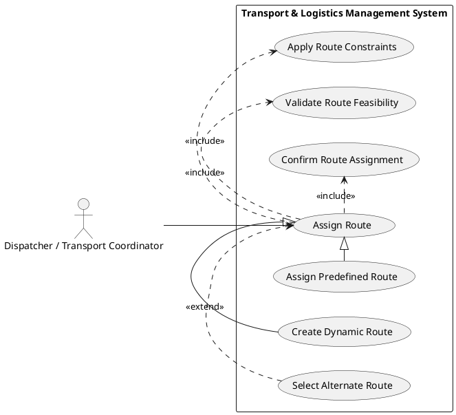
```plantuml
@startuml
left to right direction
actor "Dispatcher / Transport Coordinator" as DISP
rectangle "Transport & Logistics Management System" {
 usecase "Assign Route" as U0
 usecase "Assign Predefined Route" as U1
 usecase "Create Dynamic Route" as U2
 usecase "Apply Route Constraints" as U3
 usecase "Validate Route Feasibility" as U4
 usecase "Select Alternate Route" as U5
 usecase "Confirm Route Assignment" as U6
}
DISP --> U0
U1 -|> U0
U2 -|> U0
U0 .> U3 : <<include>>
U0 .> U4 : <<include>>
U0 .> U6 : <<include>>
U5 .> U0 : <<extend>>
@enduml
```
## Activity Diagram — PlantUML
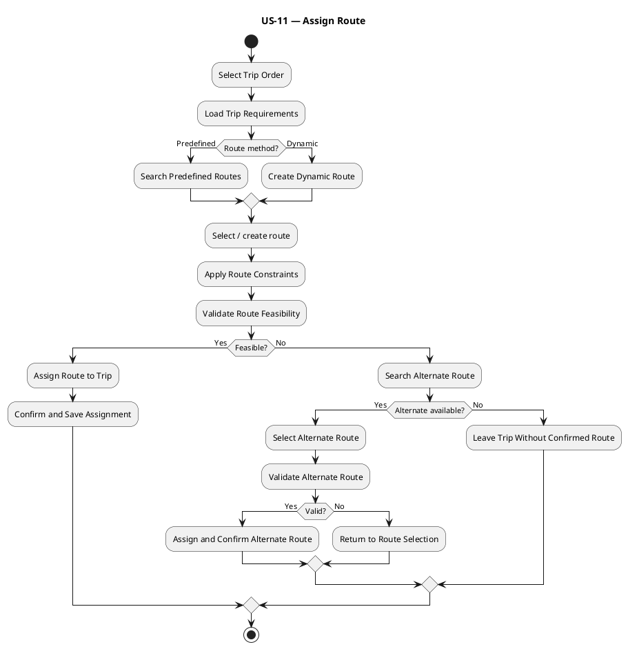
```plantuml
@startuml
title US-11 — Assign Route
start
:Select Trip Order;
:Load Trip Requirements;
if (Route method?) then (Predefined)
 :Search Predefined Routes;
else (Dynamic)
 :Create Dynamic Route;
endif
:Select / create route;
:Apply Route Constraints;
:Validate Route Feasibility;
if (Feasible?) then (Yes)
 :Assign Route to Trip;
 :Confirm and Save Assignment;
else (No)
 :Search Alternate Route;
 if (Alternate available?) then (Yes)
  :Select Alternate Route;
  :Validate Alternate Route;
  if (Valid?) then (Yes)
   :Assign and Confirm Alternate Route;
  else (No)
   :Return to Route Selection;
  endif
 else (No)
  :Leave Trip Without Confirmed Route;
 endif
endif
stop
@enduml
```
## Sequence Diagram — PlantUML
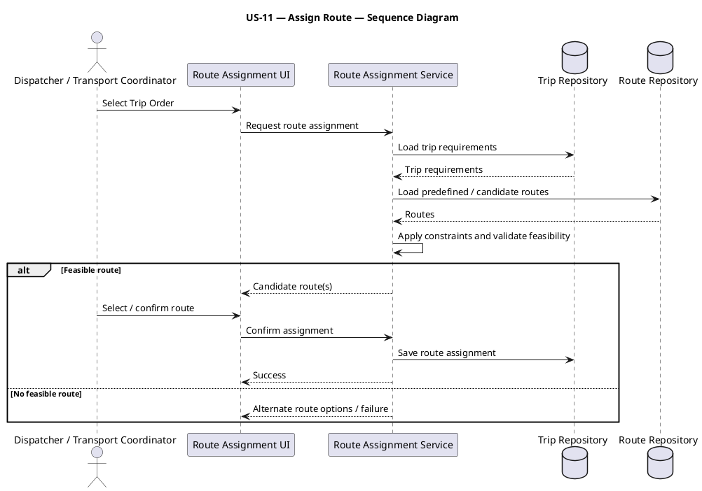
```plantuml
@startuml
title US-11 — Assign Route — Sequence Diagram
actor "Dispatcher / Transport Coordinator" as D
participant "Route Assignment UI" as UI
participant "Route Assignment Service" as AS
database "Trip Repository" as TR
database "Route Repository" as RR
D -> UI: Select Trip Order
UI -> AS: Request route assignment
AS -> TR: Load trip requirements
TR --> AS: Trip requirements
AS -> RR: Load predefined / candidate routes
RR --> AS: Routes
AS -> AS: Apply constraints and validate feasibility
alt Feasible route
 AS --> UI: Candidate route(s)
 D -> UI: Select / confirm route
 UI -> AS: Confirm assignment
 AS -> TR: Save route assignment
 AS --> UI: Success
else No feasible route
 AS --> UI: Alternate route options / failure
end
@enduml
```

---
# US-12 — Start and End Trip
**Actor(s):** Dispatcher / Transport Coordinator; Driver
## Use Case Diagram — PlantUML
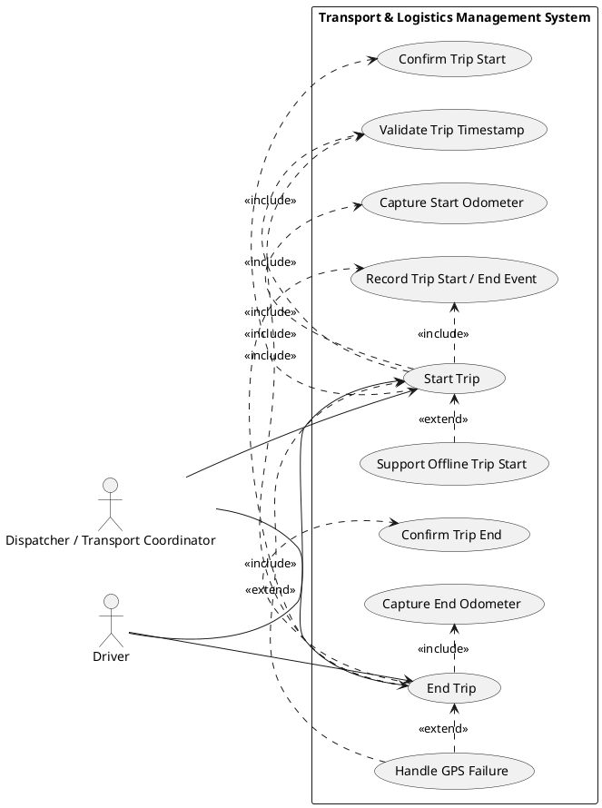
```plantuml
@startuml
left to right direction
actor "Dispatcher / Transport Coordinator" as DISP
actor Driver as DR
rectangle "Transport & Logistics Management System" {
 usecase "Start Trip" as U1
 usecase "End Trip" as U2
 usecase "Confirm Trip Start" as U3
 usecase "Confirm Trip End" as U4
 usecase "Validate Trip Timestamp" as U5
 usecase "Capture Start Odometer" as U6
 usecase "Capture End Odometer" as U7
 usecase "Support Offline Trip Start" as U8
 usecase "Handle GPS Failure" as U9
 usecase "Record Trip Start / End Event" as U10
}
DISP --> U1
DISP --> U2
DR --> U1
DR --> U2
U1 .> U3 : <<include>>
U1 .> U5 : <<include>>
U1 .> U6 : <<include>>
U1 .> U10 : <<include>>
U2 .> U4 : <<include>>
U2 .> U5 : <<include>>
U2 .> U7 : <<include>>
U2 .> U10 : <<include>>
U8 .> U1 : <<extend>>
U9 .> U1 : <<extend>>
U9 .> U2 : <<extend>>
@enduml
```
## Activity Diagram — PlantUML
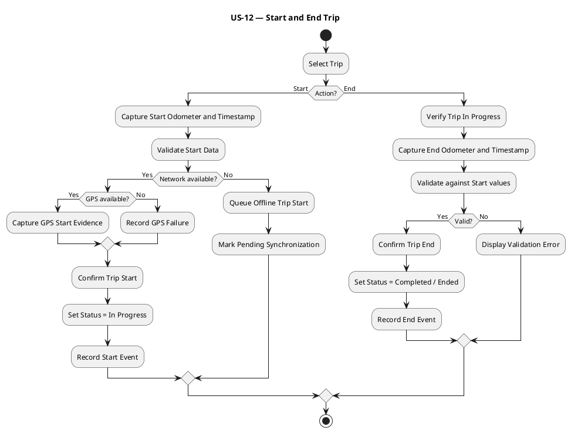
```plantuml
@startuml
title US-12 — Start and End Trip
start
:Select Trip;
if (Action?) then (Start)
 :Capture Start Odometer and Timestamp;
 :Validate Start Data;
 if (Network available?) then (Yes)
  if (GPS available?) then (Yes)
   :Capture GPS Start Evidence;
  else (No)
   :Record GPS Failure;
  endif
  :Confirm Trip Start;
  :Set Status = In Progress;
  :Record Start Event;
 else (No)
  :Queue Offline Trip Start;
  :Mark Pending Synchronization;
 endif
else (End)
 :Verify Trip In Progress;
 :Capture End Odometer and Timestamp;
 :Validate against Start values;
 if (Valid?) then (Yes)
  :Confirm Trip End;
  :Set Status = Completed / Ended;
  :Record End Event;
 else (No)
  :Display Validation Error;
 endif
endif
stop
@enduml
```
## Sequence Diagram — PlantUML
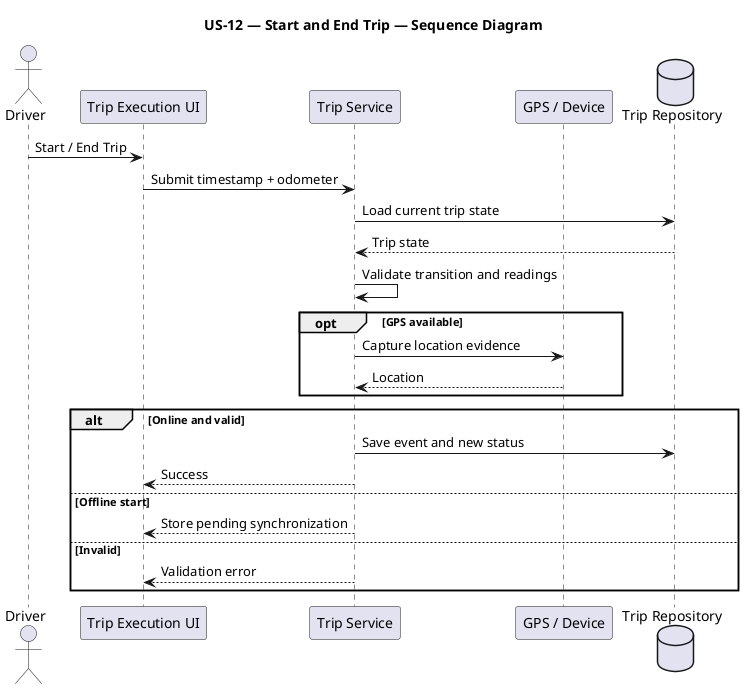
```plantuml
@startuml
title US-12 — Start and End Trip — Sequence Diagram
actor Driver as DR
participant "Trip Execution UI" as UI
participant "Trip Service" as TS
participant "GPS / Device" as GPS
database "Trip Repository" as TR
DR -> UI: Start / End Trip
UI -> TS: Submit timestamp + odometer
TS -> TR: Load current trip state
TR --> TS: Trip state
TS -> TS: Validate transition and readings
opt GPS available
 TS -> GPS: Capture location evidence
 GPS --> TS: Location
end
alt Online and valid
 TS -> TR: Save event and new status
 TS --> UI: Success
else Offline start
 TS --> UI: Store pending synchronization
else Invalid
 TS --> UI: Validation error
end
@enduml
```

---
# US-13 — Maintain Trip Log
**Actor(s):** Dispatcher / Transport Coordinator; Driver
## Use Case Diagram — PlantUML
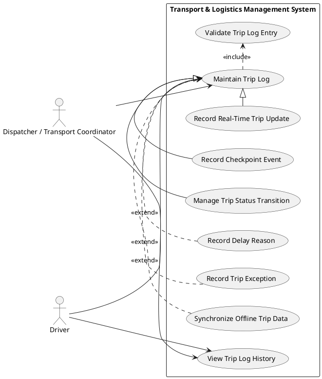
```plantuml
@startuml
left to right direction
actor "Dispatcher / Transport Coordinator" as DISP
actor Driver as DR
rectangle "Transport & Logistics Management System" {
 usecase "Maintain Trip Log" as U0
 usecase "Record Real-Time Trip Update" as U1
 usecase "Record Checkpoint Event" as U2
 usecase "Manage Trip Status Transition" as U3
 usecase "Validate Trip Log Entry" as U4
 usecase "Record Delay Reason" as U5
 usecase "Record Trip Exception" as U6
 usecase "Synchronize Offline Trip Data" as U7
 usecase "View Trip Log History" as U8
}
DISP --> U0
DISP --> U8
DR --> U0
DR --> U8
U1 -|> U0
U2 -|> U0
U3 -|> U0
U0 .> U4 : <<include>>
U5 .> U0 : <<extend>>
U6 .> U0 : <<extend>>
U7 .> U0 : <<extend>>
@enduml
```
## Activity Diagram — PlantUML
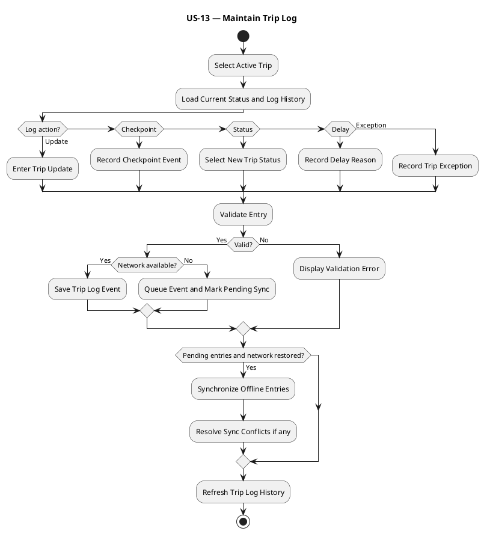
```plantuml
@startuml
title US-13 — Maintain Trip Log
start
:Select Active Trip;
:Load Current Status and Log History;
if (Log action?) then (Update)
 :Enter Trip Update;
elseif (Checkpoint)
 :Record Checkpoint Event;
elseif (Status)
 :Select New Trip Status;
elseif (Delay)
 :Record Delay Reason;
else (Exception)
 :Record Trip Exception;
endif
:Validate Entry;
if (Valid?) then (Yes)
 if (Network available?) then (Yes)
  :Save Trip Log Event;
 else (No)
  :Queue Event and Mark Pending Sync;
 endif
else (No)
 :Display Validation Error;
endif
if (Pending entries and network restored?) then (Yes)
 :Synchronize Offline Entries;
 :Resolve Sync Conflicts if any;
endif
:Refresh Trip Log History;
stop
@enduml
```
## Sequence Diagram — PlantUML
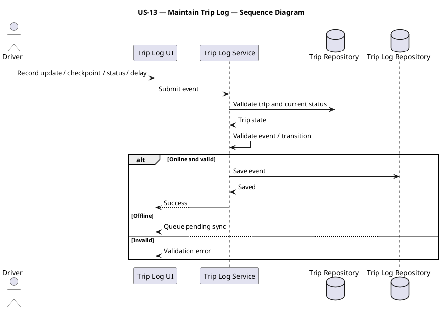
```plantuml
@startuml
title US-13 — Maintain Trip Log — Sequence Diagram
actor Driver as DR
participant "Trip Log UI" as UI
participant "Trip Log Service" as LS
database "Trip Repository" as TR
database "Trip Log Repository" as LR
DR -> UI: Record update / checkpoint / status / delay
UI -> LS: Submit event
LS -> TR: Validate trip and current status
TR --> LS: Trip state
LS -> LS: Validate event / transition
alt Online and valid
 LS -> LR: Save event
 LR --> LS: Saved
 LS --> UI: Success
else Offline
 LS --> UI: Queue pending sync
else Invalid
 LS --> UI: Validation error
end
@enduml
```

---
# US-14 — Complete Trip
**Actor(s):** Dispatcher / Transport Coordinator; Driver; Customer / Recipient
## Use Case Diagram — PlantUML
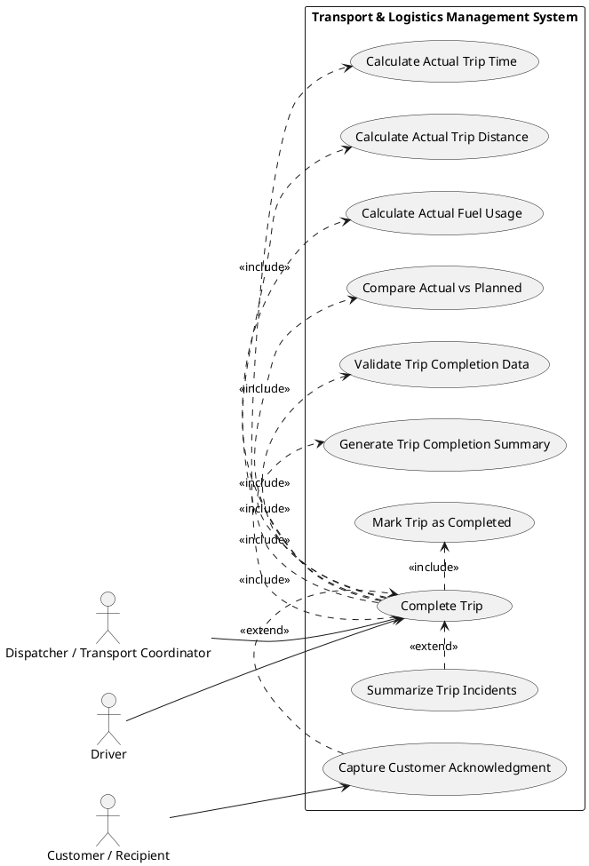
```plantuml
@startuml
left to right direction
actor "Dispatcher / Transport Coordinator" as DISP
actor Driver as DR
actor "Customer / Recipient" as CUST
rectangle "Transport & Logistics Management System" {
 usecase "Complete Trip" as U0
 usecase "Calculate Actual Trip Time" as U1
 usecase "Calculate Actual Trip Distance" as U2
 usecase "Calculate Actual Fuel Usage" as U3
 usecase "Compare Actual vs Planned" as U4
 usecase "Summarize Trip Incidents" as U5
 usecase "Capture Customer Acknowledgment" as U6
 usecase "Validate Trip Completion Data" as U7
 usecase "Generate Trip Completion Summary" as U8
 usecase "Mark Trip as Completed" as U9
}
DISP --> U0
DR --> U0
CUST --> U6
U0 .> U1 : <<include>>
U0 .> U2 : <<include>>
U0 .> U3 : <<include>>
U0 .> U4 : <<include>>
U0 .> U7 : <<include>>
U0 .> U8 : <<include>>
U0 .> U9 : <<include>>
U5 .> U0 : <<extend>>
U6 .> U0 : <<extend>>
@enduml
```
## Activity Diagram — PlantUML
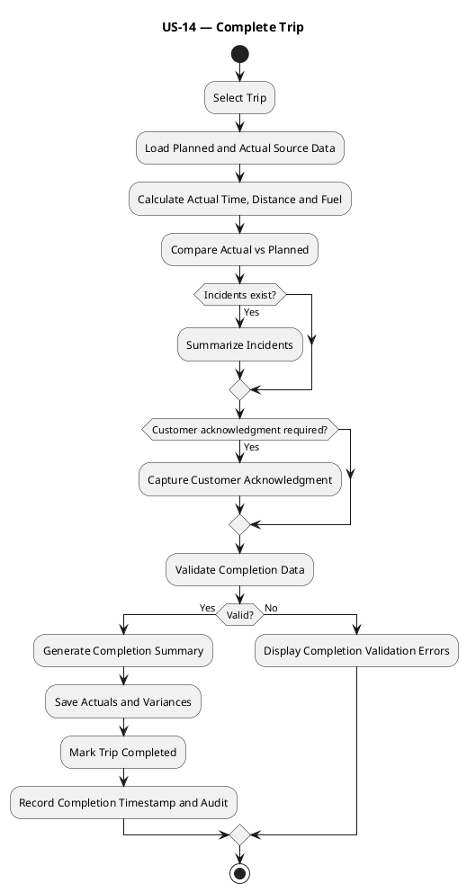
```plantuml
@startuml
title US-14 — Complete Trip
start
:Select Trip;
:Load Planned and Actual Source Data;
:Calculate Actual Time, Distance and Fuel;
:Compare Actual vs Planned;
if (Incidents exist?) then (Yes)
 :Summarize Incidents;
endif
if (Customer acknowledgment required?) then (Yes)
 :Capture Customer Acknowledgment;
endif
:Validate Completion Data;
if (Valid?) then (Yes)
 :Generate Completion Summary;
 :Save Actuals and Variances;
 :Mark Trip Completed;
 :Record Completion Timestamp and Audit;
else (No)
 :Display Completion Validation Errors;
endif
stop
@enduml
```
## Sequence Diagram — PlantUML
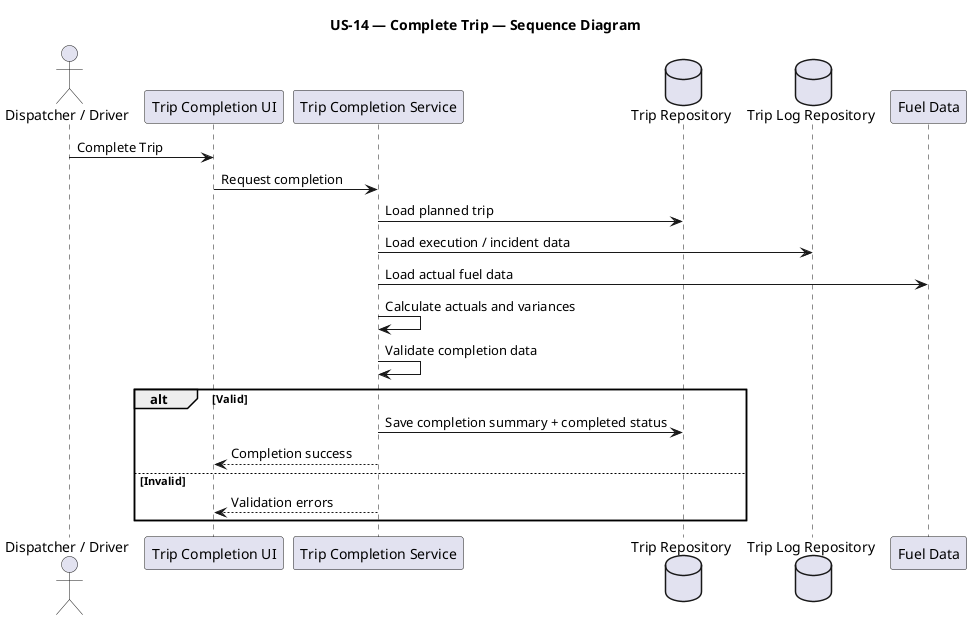
```plantuml
@startuml
title US-14 — Complete Trip — Sequence Diagram
actor "Dispatcher / Driver" as A
participant "Trip Completion UI" as UI
participant "Trip Completion Service" as CS
database "Trip Repository" as TR
database "Trip Log Repository" as LR
participant "Fuel Data" as F
A -> UI: Complete Trip
UI -> CS: Request completion
CS -> TR: Load planned trip
CS -> LR: Load execution / incident data
CS -> F: Load actual fuel data
CS -> CS: Calculate actuals and variances
CS -> CS: Validate completion data
alt Valid
 CS -> TR: Save completion summary + completed status
 CS --> UI: Completion success
else Invalid
 CS --> UI: Validation errors
end
@enduml
```

---
# US-15 — Handle Trip Exceptions
**Actor(s):** Dispatcher / Transport Coordinator; Driver
## Use Case Diagram — PlantUML
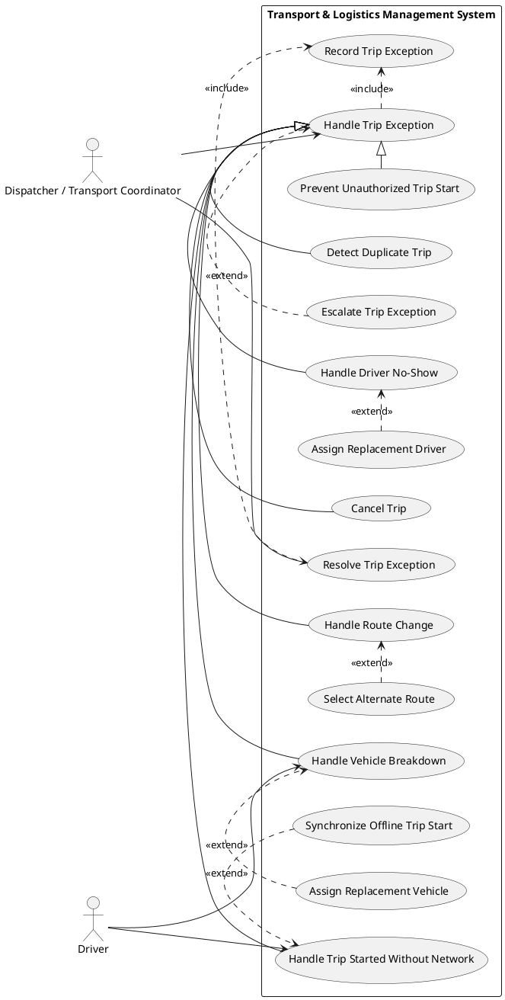
```plantuml
@startuml
left to right direction
actor "Dispatcher / Transport Coordinator" as DISP
actor Driver as DR
rectangle "Transport & Logistics Management System" {
 usecase "Handle Trip Exception" as U0
 usecase "Cancel Trip" as U1
 usecase "Handle Driver No-Show" as U2
 usecase "Handle Vehicle Breakdown" as U3
 usecase "Handle Route Change" as U4
 usecase "Prevent Unauthorized Trip Start" as U5
 usecase "Detect Duplicate Trip" as U6
 usecase "Handle Trip Started Without Network" as U7
 usecase "Assign Replacement Driver" as U8
 usecase "Assign Replacement Vehicle" as U9
 usecase "Select Alternate Route" as U10
 usecase "Synchronize Offline Trip Start" as U11
 usecase "Escalate Trip Exception" as U12
 usecase "Record Trip Exception" as U13
 usecase "Resolve Trip Exception" as U14
}
DISP --> U0
DISP --> U14
DR --> U3
DR --> U7
U1 -|> U0
U2 -|> U0
U3 -|> U0
U4 -|> U0
U5 -|> U0
U6 -|> U0
U7 -|> U0
U0 .> U13 : <<include>>
U8 .> U2 : <<extend>>
U9 .> U3 : <<extend>>
U10 .> U4 : <<extend>>
U11 .> U7 : <<extend>>
U12 .> U0 : <<extend>>
U14 .> U13 : <<include>>
@enduml
```
## Activity Diagram — PlantUML
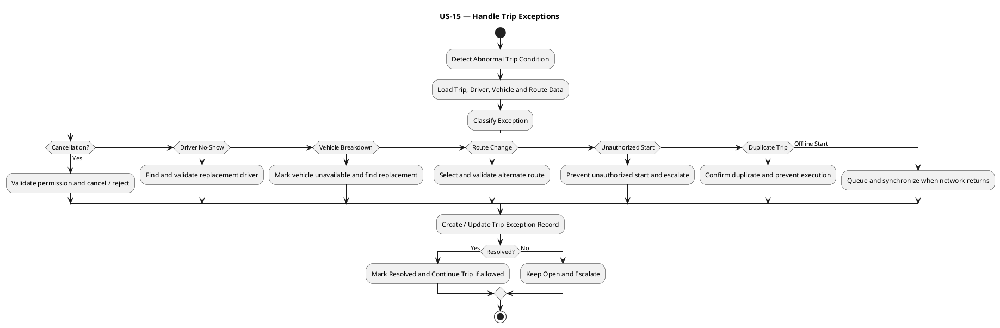
```plantuml
@startuml
title US-15 — Handle Trip Exceptions
start
:Detect Abnormal Trip Condition;
:Load Trip, Driver, Vehicle and Route Data;
:Classify Exception;
if (Cancellation?) then (Yes)
 :Validate permission and cancel / reject;
elseif (Driver No-Show)
 :Find and validate replacement driver;
elseif (Vehicle Breakdown)
 :Mark vehicle unavailable and find replacement;
elseif (Route Change)
 :Select and validate alternate route;
elseif (Unauthorized Start)
 :Prevent unauthorized start and escalate;
elseif (Duplicate Trip)
 :Confirm duplicate and prevent execution;
else (Offline Start)
 :Queue and synchronize when network returns;
endif
:Create / Update Trip Exception Record;
if (Resolved?) then (Yes)
 :Mark Resolved and Continue Trip if allowed;
else (No)
 :Keep Open and Escalate;
endif
stop
@enduml
```
## Sequence Diagram — PlantUML
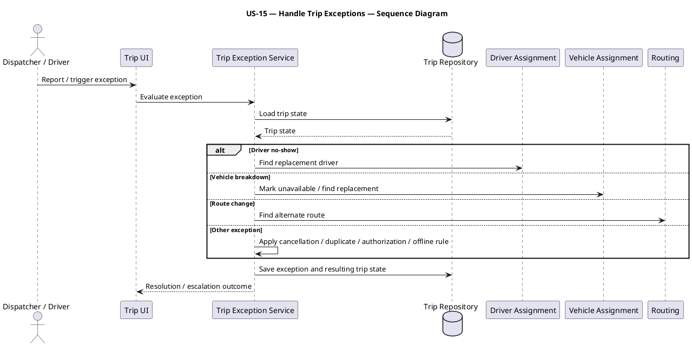
```plantuml
@startuml
title US-15 — Handle Trip Exceptions — Sequence Diagram
actor "Dispatcher / Driver" as A
participant "Trip UI" as UI
participant "Trip Exception Service" as ES
database "Trip Repository" as TR
participant "Driver Assignment" as DA
participant "Vehicle Assignment" as VA
participant "Routing" as RT
A -> UI: Report / trigger exception
UI -> ES: Evaluate exception
ES -> TR: Load trip state
TR --> ES: Trip state
alt Driver no-show
 ES -> DA: Find replacement driver
else Vehicle breakdown
 ES -> VA: Mark unavailable / find replacement
else Route change
 ES -> RT: Find alternate route
else Other exception
 ES -> ES: Apply cancellation / duplicate / authorization / offline rule
end
ES -> TR: Save exception and resulting trip state
ES --> UI: Resolution / escalation outcome
@enduml
```

---
# US-16 — Authorize Trip
**Actor(s):** Trip Approver; Dispatcher / Transport Coordinator
## Use Case Diagram — PlantUML
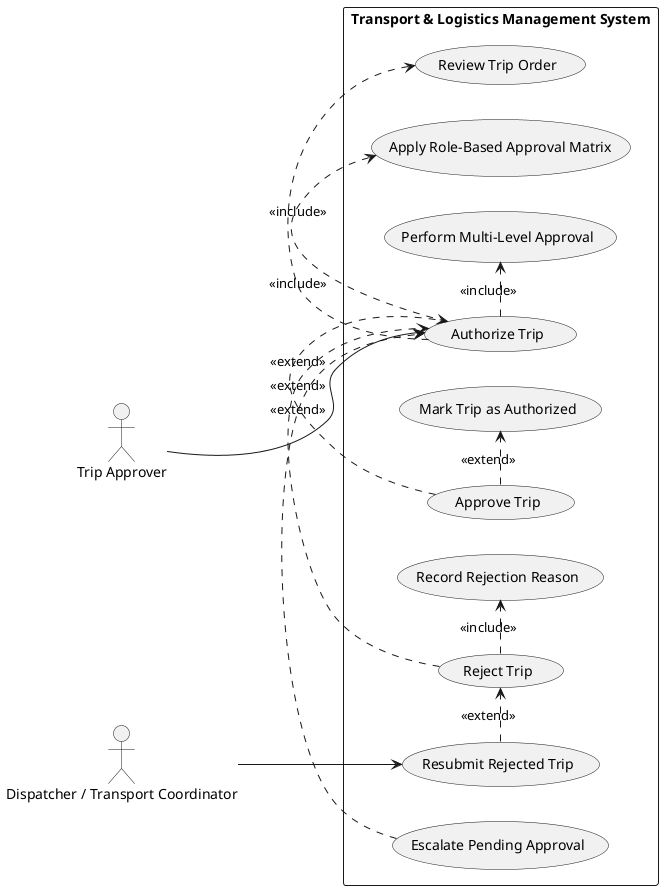
```plantuml
@startuml
left to right direction
actor "Trip Approver" as AP
actor "Dispatcher / Transport Coordinator" as DISP
rectangle "Transport & Logistics Management System" {
 usecase "Authorize Trip" as U0
 usecase "Review Trip Order" as U1
 usecase "Apply Role-Based Approval Matrix" as U2
 usecase "Perform Multi-Level Approval" as U3
 usecase "Approve Trip" as U4
 usecase "Reject Trip" as U5
 usecase "Record Rejection Reason" as U6
 usecase "Resubmit Rejected Trip" as U7
 usecase "Escalate Pending Approval" as U8
 usecase "Mark Trip as Authorized" as U9
}
AP --> U0
DISP --> U7
U0 .> U1 : <<include>>
U0 .> U2 : <<include>>
U0 .> U3 : <<include>>
U4 .> U0 : <<extend>>
U5 .> U0 : <<extend>>
U5 .> U6 : <<include>>
U7 .> U5 : <<extend>>
U8 .> U0 : <<extend>>
U4 .> U9 : <<extend>>
@enduml
```
## Activity Diagram — PlantUML
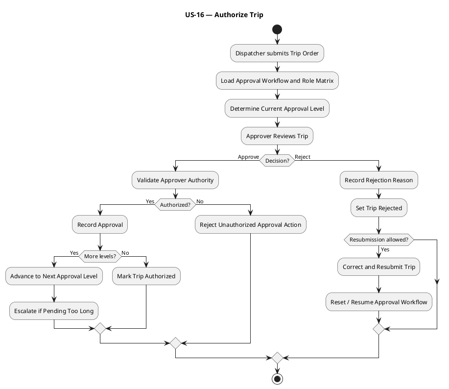
```plantuml
@startuml
title US-16 — Authorize Trip
start
:Dispatcher submits Trip Order;
:Load Approval Workflow and Role Matrix;
:Determine Current Approval Level;
:Approver Reviews Trip;
if (Decision?) then (Approve)
 :Validate Approver Authority;
 if (Authorized?) then (Yes)
  :Record Approval;
  if (More levels?) then (Yes)
   :Advance to Next Approval Level;
   :Escalate if Pending Too Long;
  else (No)
   :Mark Trip Authorized;
  endif
 else (No)
  :Reject Unauthorized Approval Action;
 endif
else (Reject)
 :Record Rejection Reason;
 :Set Trip Rejected;
 if (Resubmission allowed?) then (Yes)
  :Correct and Resubmit Trip;
  :Reset / Resume Approval Workflow;
 endif
endif
stop
@enduml
```
## Sequence Diagram — PlantUML
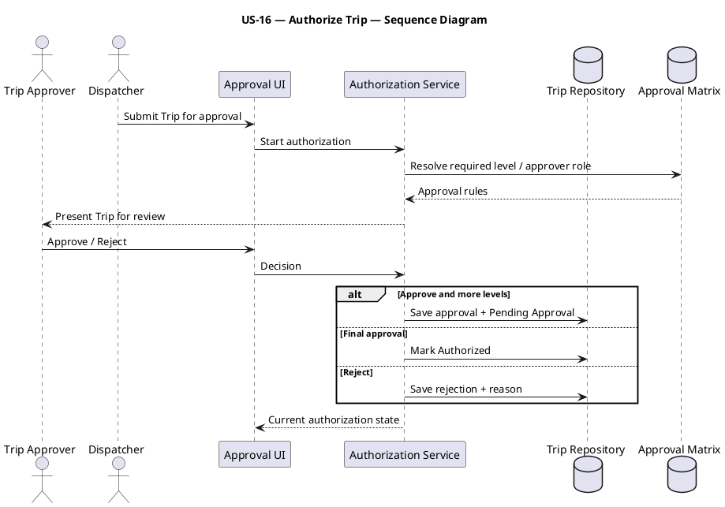
```plantuml
@startuml
title US-16 — Authorize Trip — Sequence Diagram
actor "Trip Approver" as AP
actor "Dispatcher" as D
participant "Approval UI" as UI
participant "Authorization Service" as AS
database "Trip Repository" as TR
database "Approval Matrix" as AM
D -> UI: Submit Trip for approval
UI -> AS: Start authorization
AS -> AM: Resolve required level / approver role
AM --> AS: Approval rules
AS --> AP: Present Trip for review
AP -> UI: Approve / Reject
UI -> AS: Decision
alt Approve and more levels
 AS -> TR: Save approval + Pending Approval
else Final approval
 AS -> TR: Mark Authorized
else Reject
 AS -> TR: Save rejection + reason
end
AS --> UI: Current authorization state
@enduml
```

---
# US-17 — Define Routes
**Actor(s):** Route Planner
## Use Case Diagram — PlantUML
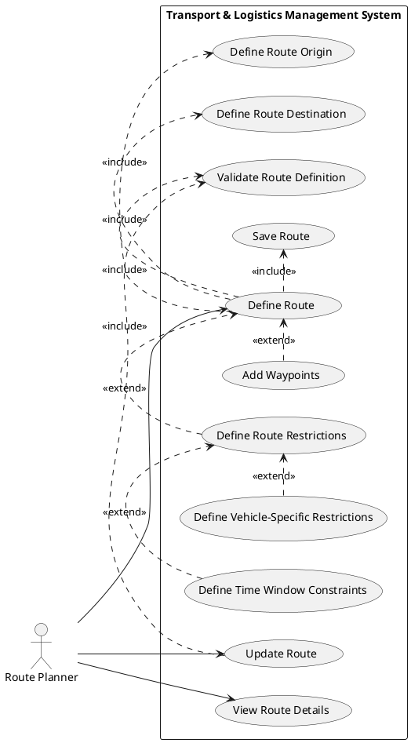
```plantuml
@startuml
left to right direction
actor "Route Planner" as RP
rectangle "Transport & Logistics Management System" {
 usecase "Define Route" as U0
 usecase "Define Route Origin" as U1
 usecase "Define Route Destination" as U2
 usecase "Add Waypoints" as U3
 usecase "Define Route Restrictions" as U4
 usecase "Define Vehicle-Specific Restrictions" as U5
 usecase "Define Time Window Constraints" as U6
 usecase "Validate Route Definition" as U7
 usecase "Save Route" as U8
 usecase "Update Route" as U9
 usecase "View Route Details" as U10
}
RP --> U0
RP --> U9
RP --> U10
U0 .> U1 : <<include>>
U0 .> U2 : <<include>>
U0 .> U7 : <<include>>
U0 .> U8 : <<include>>
U3 .> U0 : <<extend>>
U4 .> U0 : <<extend>>
U5 .> U4 : <<extend>>
U6 .> U4 : <<extend>>
U9 .> U7 : <<include>>
@enduml
```
## Activity Diagram — PlantUML
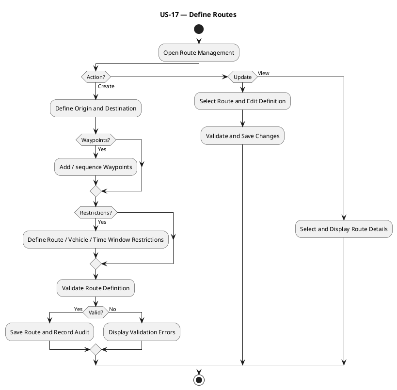
```plantuml
@startuml
title US-17 — Define Routes
start
:Open Route Management;
if (Action?) then (Create)
 :Define Origin and Destination;
 if (Waypoints?) then (Yes)
  :Add / sequence Waypoints;
 endif
 if (Restrictions?) then (Yes)
  :Define Route / Vehicle / Time Window Restrictions;
 endif
 :Validate Route Definition;
 if (Valid?) then (Yes)
  :Save Route and Record Audit;
 else (No)
  :Display Validation Errors;
 endif
elseif (Update)
 :Select Route and Edit Definition;
 :Validate and Save Changes;
else (View)
 :Select and Display Route Details;
endif
stop
@enduml
```
## Sequence Diagram — PlantUML
```plantuml
@startuml
title US-17 — Define Routes — Sequence Diagram
actor "Route Planner" as RP
participant "Route UI" as UI
participant "Route Service" as RS
database "Route Repository" as RR
RP -> UI: Create / update route
UI -> RS: Submit origin, destination, waypoints, restrictions
RS -> RS: Validate route definition
alt Valid
 RS -> RR: Save route
 RR --> RS: Saved route
 RS --> UI: Success
else Invalid
 RS --> UI: Validation errors
end
UI --> RP: Display result
@enduml
```

---
# US-18 — Calculate Distance and ETA
**Actor(s):** Route Planner
## Use Case Diagram — PlantUML
```plantuml
@startuml
left to right direction
actor "Route Planner" as RP
rectangle "Transport & Logistics Management System" {
 usecase "Calculate Distance and ETA" as U0
 usecase "Validate Route Input" as U1
 usecase "Calculate Static Distance" as U2
 usecase "Calculate Static ETA" as U3
 usecase "Adjust ETA Using Traffic" as U4
 usecase "Adjust ETA Using Historical Data" as U5
 usecase "Adjust ETA Using Seasonal Patterns" as U6
 usecase "Display Distance and ETA" as U7
}
RP --> U0
U0 .> U1 : <<include>>
U0 .> U2 : <<include>>
U0 .> U3 : <<include>>
U0 .> U7 : <<include>>
U4 .> U0 : <<extend>>
U5 .> U0 : <<extend>>
U6 .> U0 : <<extend>>
@enduml
```
## Activity Diagram — PlantUML
```plantuml
@startuml
title US-18 — Calculate Distance and ETA
start
:Select Existing Route;
:Validate Route Input;
if (Valid?) then (Yes)
 :Load Static Distance Matrix;
 if (Static data available?) then (Yes)
  :Calculate Static Distance and ETA;
  if (Traffic available?) then (Yes)
   :Apply Traffic Adjustment;
  endif
  if (Historical data available?) then (Yes)
   :Apply Historical Adjustment;
  endif
  if (Seasonal adjustment applicable?) then (Yes)
   :Apply Seasonal Adjustment;
  endif
  :Calculate Final ETA;
  :Preserve Estimate Source / Type;
  :Display Distance and ETA;
 else (No)
  :Report Source Unavailable;
 endif
else (No)
 :Display Invalid Route Error;
endif
stop
@enduml
```
## Sequence Diagram — PlantUML
```plantuml
@startuml
title US-18 — Calculate Distance and ETA — Sequence Diagram
actor "Route Planner" as RP
participant "Route UI" as UI
participant "Distance/ETA Service" as ES
database "Route Repository" as RR
participant "Static Matrix" as SM
participant "Traffic / History / Season Data" as ADJ
RP -> UI: Calculate distance and ETA
UI -> ES: Route ID
ES -> RR: Load route
RR --> ES: Route definition
ES -> SM: Request base distance / ETA
SM --> ES: Static estimate
opt Adjustment data available
 ES -> ADJ: Request adjustments
 ADJ --> ES: Traffic / historical / seasonal factors
end
ES -> ES: Calculate final ETA + source labels
ES --> UI: Distance, static ETA, adjusted ETA
@enduml
```

---
# US-19 — Plan Multi-Stop Routes
**Actor(s):** Route Planner
## Use Case Diagram — PlantUML
```plantuml
@startuml
left to right direction
actor "Route Planner" as RP
rectangle "Transport & Logistics Management System" {
 usecase "Plan Multi-Stop Route" as U0
 usecase "Add Multiple Stops" as U1
 usecase "Sequence Stops" as U2
 usecase "Pair Pickup and Drop Stops" as U3
 usecase "Balance Stop Time Windows" as U4
 usecase "Validate Stop Sequence" as U5
 usecase "Reorder Stops" as U6
 usecase "Save Multi-Stop Route Plan" as U7
}
RP --> U0
U0 .> U1 : <<include>>
U0 .> U2 : <<include>>
U0 .> U3 : <<include>>
U0 .> U4 : <<include>>
U0 .> U5 : <<include>>
U0 .> U7 : <<include>>
U6 .> U0 : <<extend>>
@enduml
```
## Activity Diagram — PlantUML
```plantuml
@startuml
title US-19 — Plan Multi-Stop Routes
start
:Add Required Stops;
if (At least two stops?) then (Yes)
 if (Pickup / Drop relationships?) then (Yes)
  :Pair Pickup and Drop Stops;
 endif
 if (Time Windows?) then (Yes)
  :Load Stop Time Windows;
 endif
 :Generate Initial Stop Sequence;
 :Validate Pickup / Drop Ordering;
 if (Valid?) then (Yes)
  :Balance and Validate Time Windows;
 else (No)
  :Reorder Stops and Revalidate;
 endif
 if (Final sequence feasible?) then (Yes)
  :Save Multi-Stop Route Plan;
 else (No)
  :Display No Feasible Stop Sequence;
 endif
else (No)
 :Display Insufficient Stops Error;
endif
stop
@enduml
```
## Sequence Diagram — PlantUML
```plantuml
@startuml
title US-19 — Plan Multi-Stop Routes — Sequence Diagram
actor "Route Planner" as RP
participant "Multi-Stop UI" as UI
participant "Multi-Stop Planning Service" as PS
database "Route Repository" as RR
RP -> UI: Add stops / pickup-drop pairs / time windows
UI -> PS: Plan multi-stop route
PS -> PS: Generate initial sequence
PS -> PS: Validate pickup-before-drop
PS -> PS: Balance time windows
alt Feasible
 PS -> RR: Save stop sequence and constraints
 PS --> UI: Feasible route plan
else Infeasible
 PS --> UI: Conflicts + reorder required
end
@enduml
```

---
# US-20 — Optimize Routes
**Actor(s):** Route Planner
## Use Case Diagram — PlantUML
```plantuml
@startuml
left to right direction
actor "Route Planner" as RP
rectangle "Transport & Logistics Management System" {
 usecase "Optimize Route" as U0
 usecase "Apply AI-Based Route Optimization" as U1
 usecase "Optimize Cost vs Time" as U2
 usecase "Optimize Fuel Efficiency" as U3
 usecase "Apply Vehicle Capacity Constraints" as U4
 usecase "Enforce Driver-Hours Compliance" as U5
 usecase "Validate Optimized Route" as U6
 usecase "Compare Optimization Result" as U7
 usecase "Accept Optimized Route" as U8
}
RP --> U0
RP --> U7
RP --> U8
U1 -|> U0
U2 -|> U0
U3 -|> U0
U0 .> U4 : <<include>>
U0 .> U5 : <<include>>
U0 .> U6 : <<include>>
U7 .> U6 : <<include>>
U8 .> U6 : <<include>>
@enduml
```
## Activity Diagram — PlantUML
```plantuml
@startuml
title US-20 — Optimize Routes
start
:Select Existing Route / Multi-Stop Plan;
:Load Route, Stops and Constraints;
:Select Optimization Objective;
if (Objective?) then (AI-Based)
 :Run AI-Based Optimization;
elseif (Cost vs Time)
 :Optimize Cost vs Time;
else (Fuel Efficiency)
 :Optimize Fuel Efficiency;
endif
:Apply Vehicle Capacity Constraints;
:Enforce Driver-Hours Compliance;
if (Constraints satisfied?) then (Yes)
 :Generate and Validate Optimized Candidate;
 if (Valid?) then (Yes)
  :Compare with Current Route;
  if (Accepted?) then (Yes)
   :Save Optimized Route and Audit;
  else (No)
   :Keep Existing Route;
  endif
 else (No)
  :Reject Invalid Result;
 endif
else (No)
 :Reject Non-Compliant Candidate;
 :Adjust / Re-run if possible;
endif
stop
@enduml
```
## Sequence Diagram — PlantUML
```plantuml
@startuml
title US-20 — Optimize Routes — Sequence Diagram
actor "Route Planner" as RP
participant "Optimization UI" as UI
participant "Route Optimization Service" as OS
database "Route Repository" as RR
participant "Optimization Engine" as OE
participant "Capacity / Driver-Hours Rules" as RULES
RP -> UI: Select route + optimization objective
UI -> OS: Optimize route
OS -> RR: Load route and stops
RR --> OS: Route data
OS -> OE: Generate optimized candidate
OE --> OS: Candidate route
OS -> RULES: Validate capacity + driver-hours
RULES --> OS: Compliance result
alt Valid
 OS --> UI: Comparison result
 RP -> UI: Accept optimized route
 UI -> OS: Confirm
 OS -> RR: Save optimized route
 OS --> UI: Success
else Invalid / non-compliant
 OS --> UI: Reject candidate + conflicts
end
@enduml
```

---
## Coverage Summary
| User Story | Title | Use Case | Activity | Sequence |
|---|---|---:|---:|---:|
| US-11 | Assign Route | Yes | Yes | Yes |
| US-12 | Start and End Trip | Yes | Yes | Yes |
| US-13 | Maintain Trip Log | Yes | Yes | Yes |
| US-14 | Complete Trip | Yes | Yes | Yes |
| US-15 | Handle Trip Exceptions | Yes | Yes | Yes |
| US-16 | Authorize Trip | Yes | Yes | Yes |
| US-17 | Define Routes | Yes | Yes | Yes |
| US-18 | Calculate Distance and ETA | Yes | Yes | Yes |
| US-19 | Plan Multi-Stop Routes | Yes | Yes | Yes |
| US-20 | Optimize Routes | Yes | Yes | Yes |
