# Transport & Logistics Management System

## UML Diagrams — US-31 to US-40

This document consolidates the requested UML views for **US-31 through US-40**. Each story includes a **Use Case Diagram**, **Activity Diagram**, and **Sequence Diagram** in PlantUML.

> Scope: US-31–US-38 cover Fuel Management. US-39–US-40 begin Driver Management. The diagrams preserve the established user-story boundaries and source terminology.

---

# US-31 — Issue Fuel

**Primary Actor:** Fuel Manager  
**Goal:** Authorize fuel issues using limits, vouchers, station validation, and trip linkage so fuel is released only for valid operational use.

## Use Case Diagram — PlantUML

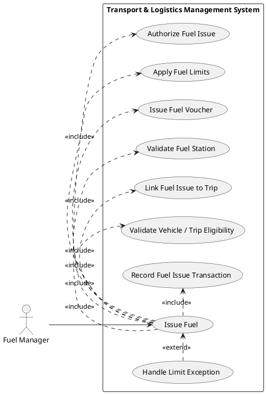

## Activity Diagram — PlantUML

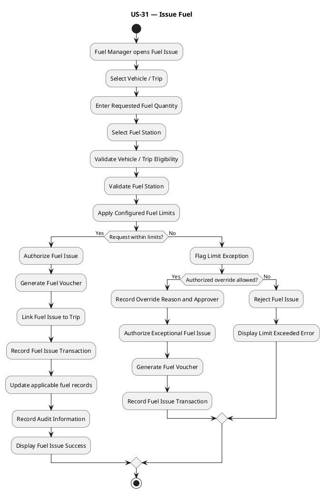

## Sequence Diagram — PlantUML

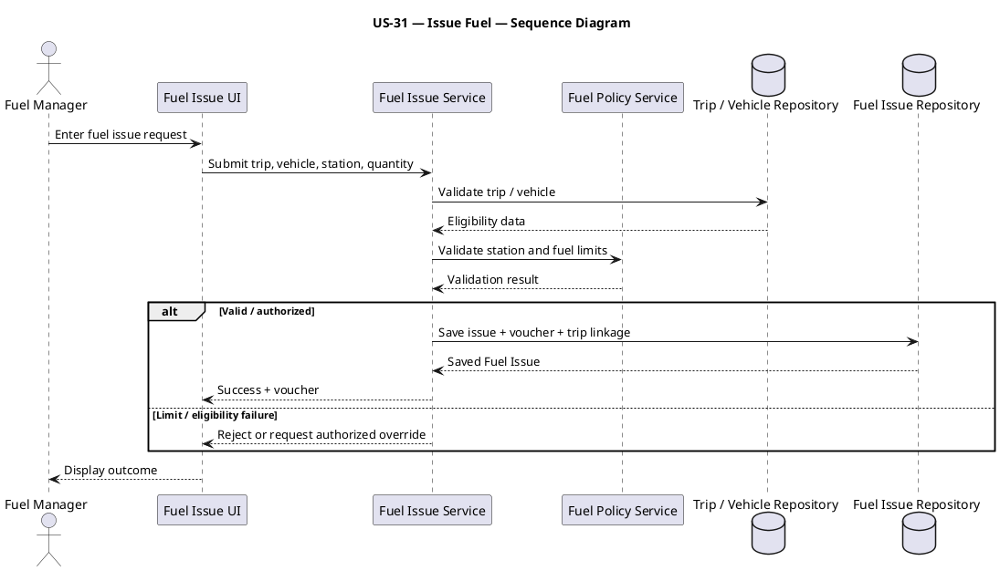

---

# US-32 — Manage Fuel Purchases

**Primary Actor:** Fuel Manager  
**Goal:** Maintain fuel vendors, price information, purchases, reconciliation, and tax so fuel procurement is accurately controlled.

## Use Case Diagram — PlantUML

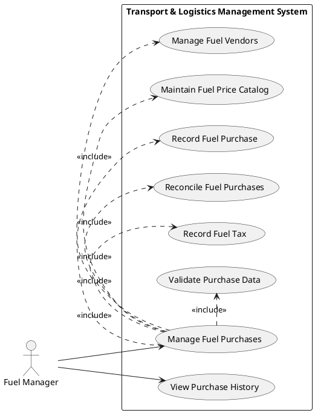

## Activity Diagram — PlantUML

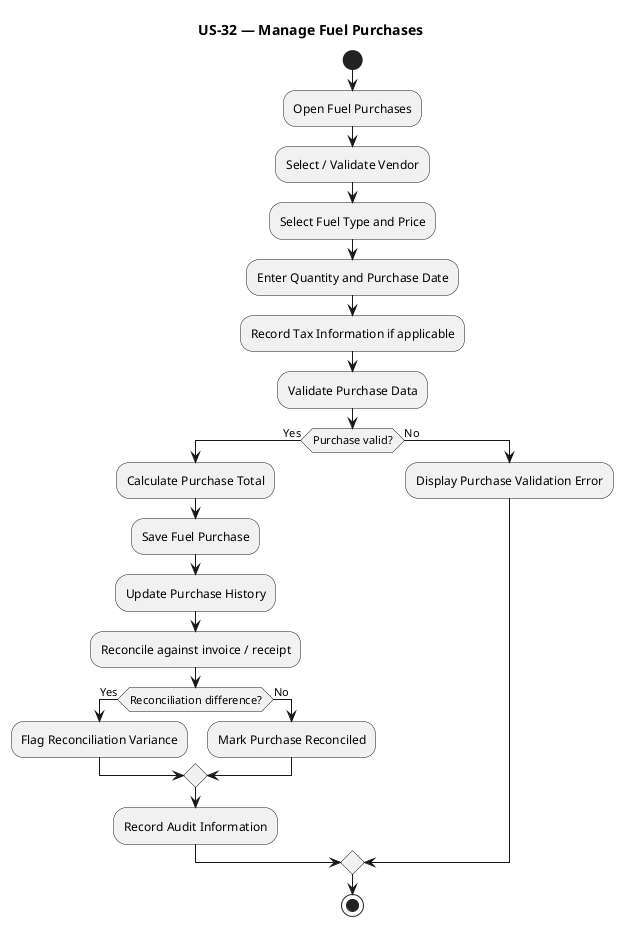

## Sequence Diagram — PlantUML

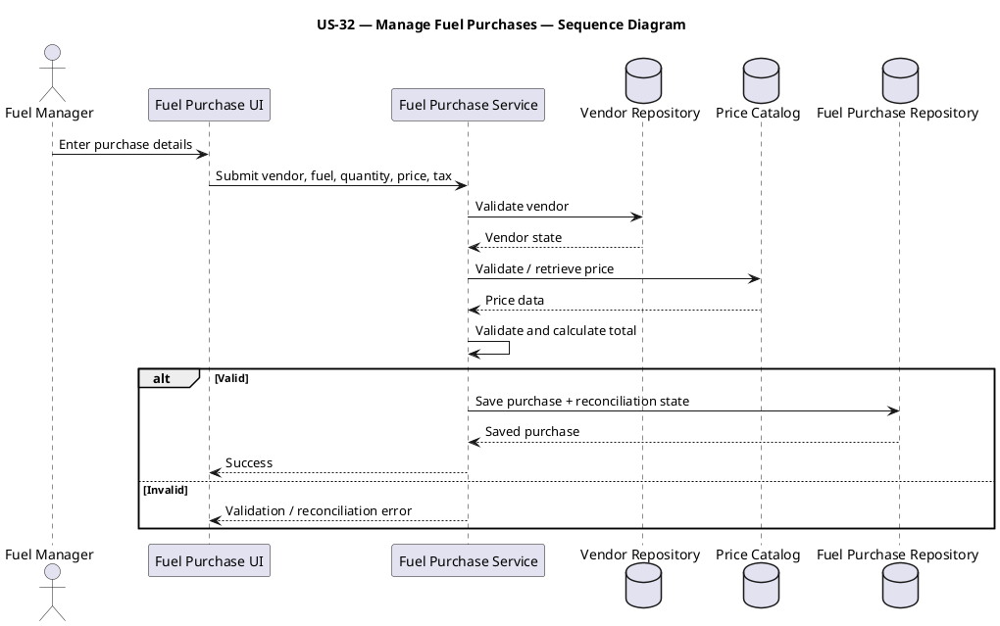

---

# US-33 — Track Mileage

**Primary Actor:** Fuel Manager  
**Goal:** Capture odometer values, calculate mileage, and detect tampering or abnormal results so consumption information remains trustworthy.

## Use Case Diagram — PlantUML

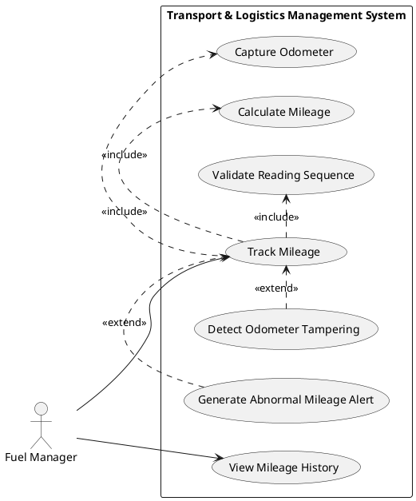

## Activity Diagram — PlantUML

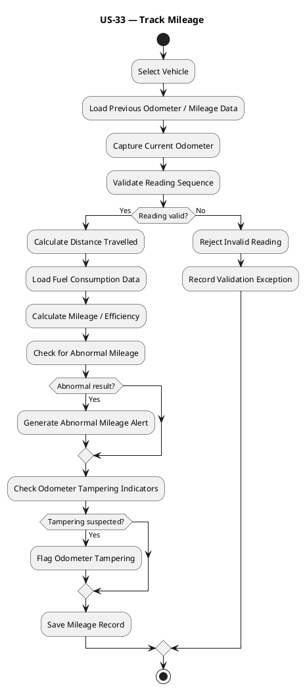

## Sequence Diagram — PlantUML

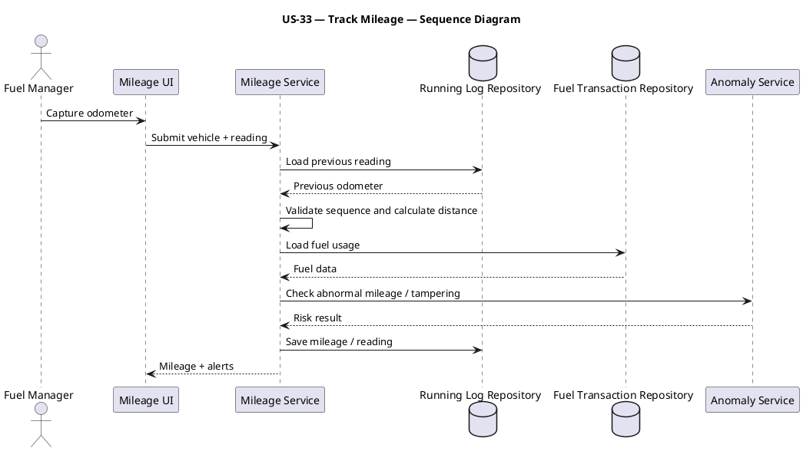

---

# US-34 — Allocate Fuel Cost

**Primary Actor:** Fuel Manager  
**Goal:** Allocate fuel cost to trips or shared activity and calculate variance so transport costing remains accurate.

## Use Case Diagram — PlantUML

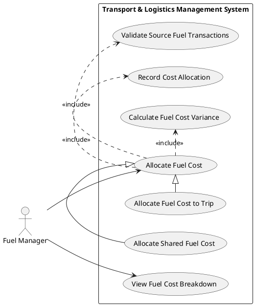

## Activity Diagram — PlantUML

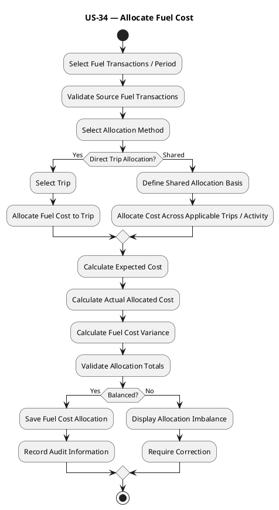

## Sequence Diagram — PlantUML

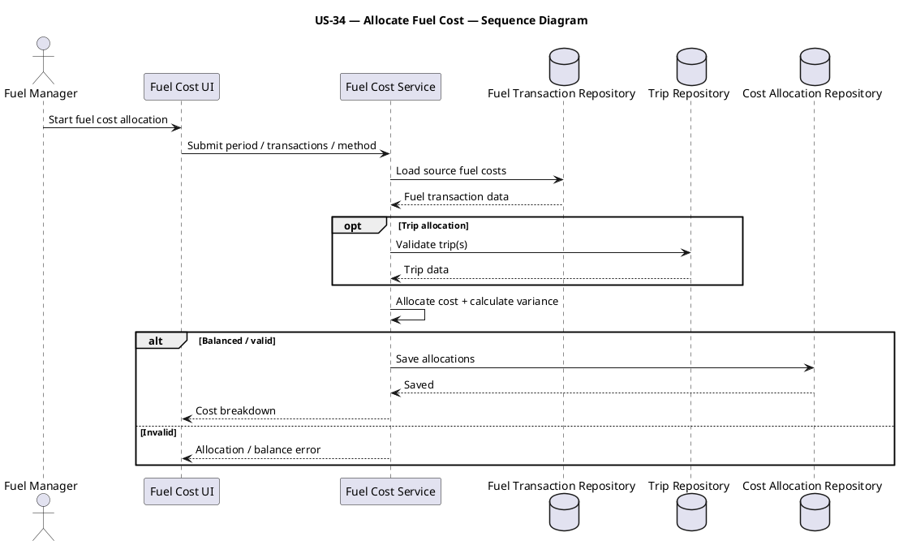

---

# US-35 — Manage Fuel Cards

**Primary Actor:** Fuel Manager  
**Goal:** Manage fuel-card issuance, transaction imports, restrictions, and fraud detection so card misuse can be controlled.

## Use Case Diagram — PlantUML

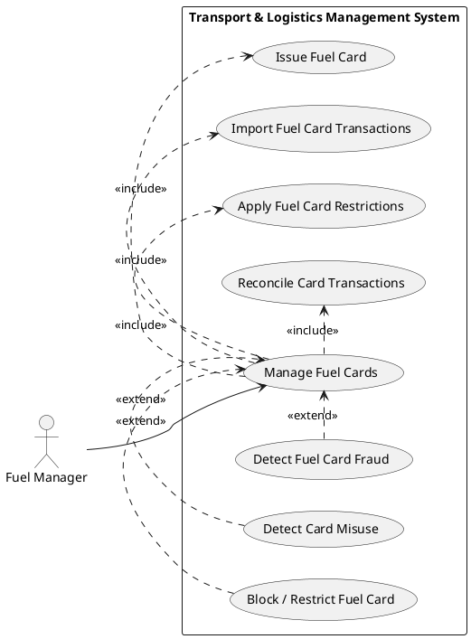

## Activity Diagram — PlantUML

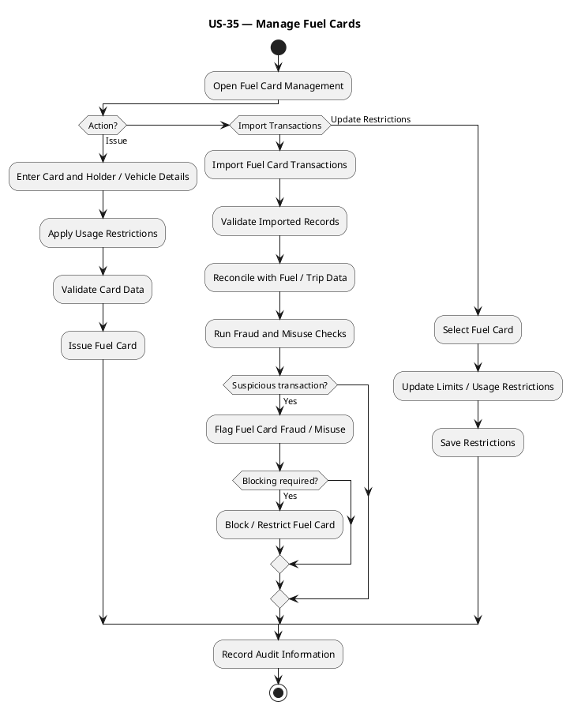

## Sequence Diagram — PlantUML

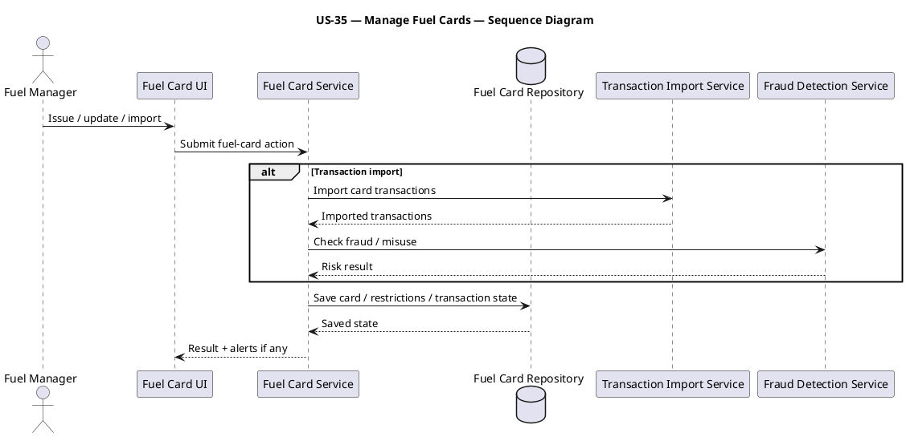

---

# US-36 — Manage Fuel Bunkers

**Primary Actor:** Fuel Manager  
**Goal:** Manage tanks, stock movements, dip readings, and reorder levels so physical fuel inventory remains reliable.

## Use Case Diagram — PlantUML

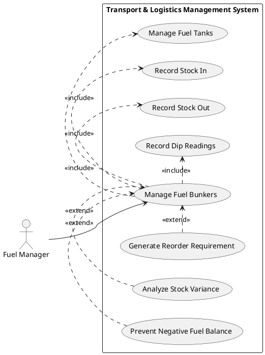

## Activity Diagram — PlantUML

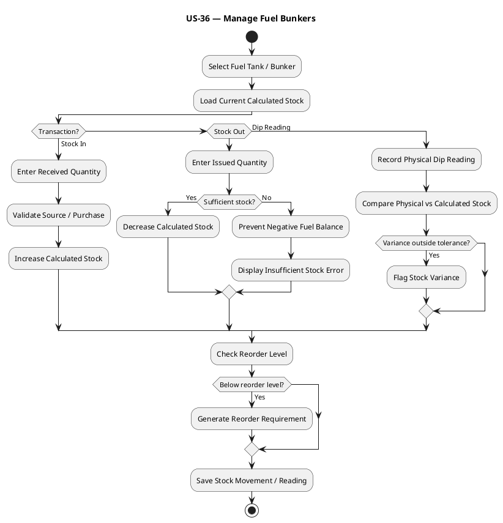

## Sequence Diagram — PlantUML

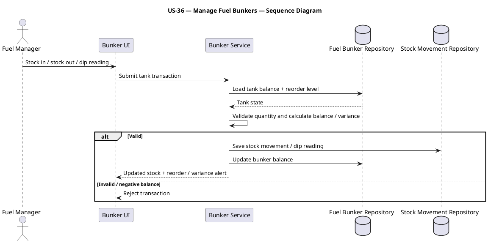

---

# US-37 — Analyze Fuel Performance

**Primary Actor:** Fuel Manager  
**Goal:** Analyze vehicle and driver efficiency, anomalies, and leakage indicators so fuel waste can be identified.

## Use Case Diagram — PlantUML

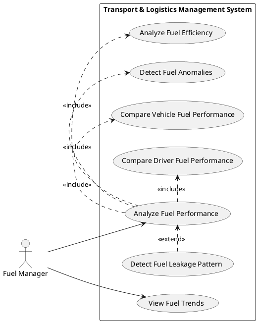

## Activity Diagram — PlantUML

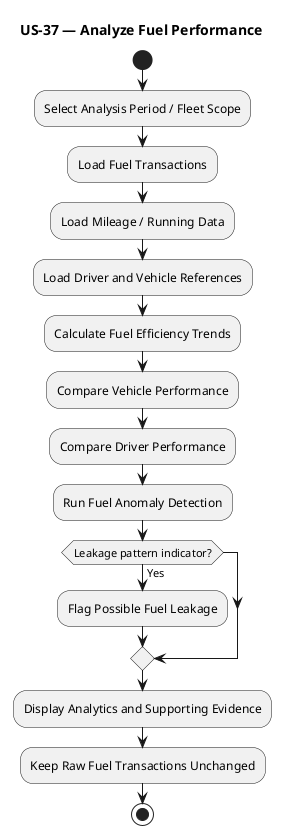

## Sequence Diagram — PlantUML

```plantuml
@startuml
title US-37 — Analyze Fuel Performance — Sequence Diagram
actor "Fuel Manager" as FM
participant "Fuel Analytics UI" as UI
participant "Fuel Analytics Service" as AS
database "Fuel Transaction Repository" as FR
database "Running / Mileage Repository" as RR
database "Driver / Vehicle Repository" as DVR
FM -> UI: Request fuel analysis
UI -> AS: Submit period and scope
AS -> FR: Load fuel transactions
AS -> RR: Load distance / mileage
AS -> DVR: Load driver / vehicle dimensions
FR --> AS: Fuel data
RR --> AS: Running data
DVR --> AS: Reference data
AS -> AS: Calculate trends, comparisons, anomalies
AS --> UI: Analytics + anomaly / leakage indicators
@enduml
```

---

# US-38 — Handle Fuel Exceptions

**Primary Actor:** Fuel Manager  
**Goal:** Control theft, incorrect readings, price changes, emergency refueling, card misuse, and negative balances so exceptional events do not corrupt inventory or cost records.

## Use Case Diagram — PlantUML

```plantuml
@startuml
left to right direction
actor "Fuel Manager" as FM
rectangle "Transport & Logistics Management System" {
 usecase "Handle Fuel Exception" as U0
 usecase "Handle Fuel Theft" as U1
 usecase "Handle Incorrect Meter Reading" as U2
 usecase "Handle Sudden Fuel Price Change" as U3
 usecase "Process Emergency Refuel" as U4
 usecase "Handle Fuel Card Misuse" as U5
 usecase "Prevent Negative Fuel Balance" as U6
 usecase "Investigate Fuel Exception" as U7
 usecase "Correct / Reconcile Fuel Record" as U8
 usecase "Escalate Fuel Exception" as U9
}
FM --> U0
U1 -|> U0
U2 -|> U0
U3 -|> U0
U4 -|> U0
U5 -|> U0
U6 -|> U0
U0 .> U7 : <<include>>
U8 .> U0 : <<extend>>
U9 .> U0 : <<extend>>
@enduml
```

## Activity Diagram — PlantUML

```plantuml
@startuml
title US-38 — Handle Fuel Exceptions
start
:Detect / Report Fuel Exception;
:Load Related Fuel, Vehicle, Card and Stock Data;
:Classify Exception;
if (Exception Type?) then (Theft)
 :Record Suspected Theft Evidence;
elseif (Incorrect Reading)
 :Validate Source Reading;
 :Prepare Authorized Correction;
elseif (Price Change)
 :Record New Price Effective Period;
 :Preserve Historical Prices;
elseif (Emergency Refuel)
 :Record Emergency Refuel and Reason;
elseif (Card Misuse)
 :Flag Fuel Card Misuse;
 :Restrict / Block Card if required;
else (Negative Balance)
 :Block Invalid Stock Transaction;
endif
:Investigate Fuel Exception;
if (Corrective action valid?) then (Yes)
 :Correct / Reconcile Applicable Records;
 :Record Audit Information;
 :Mark Exception Resolved;
else (No)
 :Escalate Fuel Exception;
 :Keep Exception Open;
endif
stop
@enduml
```

## Sequence Diagram — PlantUML

```plantuml
@startuml
title US-38 — Handle Fuel Exceptions — Sequence Diagram
actor "Fuel Manager" as FM
participant "Fuel Exception UI" as UI
participant "Fuel Exception Service" as ES
database "Fuel Repository" as FR
database "Fuel Card / Bunker Repository" as BR
participant "Exception / Audit Service" as EA
FM -> UI: Report / review fuel exception
UI -> ES: Submit exception
ES -> FR: Load fuel transaction / price data
ES -> BR: Load card / stock data
FR --> ES: Fuel data
BR --> ES: Supporting data
ES -> ES: Classify and validate corrective action
alt Resolvable
 ES -> FR: Apply authorized correction / reconciliation
 ES -> EA: Record resolution + audit
 ES --> UI: Resolved
else Requires escalation
 ES -> EA: Create / escalate exception
 ES --> UI: Exception remains open
end
@enduml
```

---

# US-39 — Manage Driver Profiles

**Primary Actor:** Driver Manager  
**Goal:** Maintain driver contact, address, identification, and employment information so complete driver profiles are available.

## Use Case Diagram — PlantUML

```plantuml
@startuml
left to right direction
actor "Driver Manager" as DM
rectangle "Transport & Logistics Management System" {
 usecase "Manage Driver Profiles" as U0
 usecase "Create Driver Profile" as U1
 usecase "View Driver Profile" as U2
 usecase "Update Contact Details" as U3
 usecase "Update Address" as U4
 usecase "Manage Driver IDs" as U5
 usecase "Manage Employment Details" as U6
 usecase "Validate Driver Identity" as U7
 usecase "Detect Duplicate Active Driver" as U8
}
DM --> U0
DM --> U2
U0 .> U1 : <<include>>
U0 .> U3 : <<include>>
U0 .> U4 : <<include>>
U0 .> U5 : <<include>>
U0 .> U6 : <<include>>
U0 .> U7 : <<include>>
U8 .> U0 : <<extend>>
@enduml
```

## Activity Diagram — PlantUML

```plantuml
@startuml
title US-39 — Manage Driver Profiles
start
:Driver Manager opens Driver Profiles;
if (Action?) then (Create)
 :Enter Contact Details;
 :Enter Address;
 :Enter Driver Identification Details;
 :Enter Employment Details;
 :Validate Mandatory Fields;
 :Validate Driver Identity;
 :Check Duplicate Active Driver;
 if (Valid and unique?) then (Yes)
  :Save Driver Profile;
  :Record Audit Information;
 else (No)
  :Display Validation / Duplicate Error;
 endif
elseif (Update)
 :Select Driver;
 :Edit Allowed Profile Details;
 :Validate Changes;
 :Save Updated Profile and Change History;
else (View)
 :Search and Display Driver Profile;
endif
stop
@enduml
```

## Sequence Diagram — PlantUML

```plantuml
@startuml
title US-39 — Manage Driver Profiles — Sequence Diagram
actor "Driver Manager" as DM
participant "Driver Profile UI" as UI
participant "Driver Profile Service" as DS
participant "Identity Validation Service" as IV
database "Driver Repository" as DR
DM -> UI: Create / update driver profile
UI -> DS: Submit contact, address, IDs, employment
DS -> IV: Validate identity / duplicate risk
IV --> DS: Validation result
alt Valid
 DS -> DR: Save driver profile
 DR --> DS: Saved driver
 DS --> UI: Success
else Invalid / duplicate
 DS --> UI: Validation error
end
UI --> DM: Display outcome
@enduml
```

---

# US-40 — Manage Driver Licensing

**Primary Actor:** Driver Manager / Safety Officer  
**Goal:** Maintain license class, expiry, suspensions, and regional endorsements so only legally qualified drivers are eligible for assignment.

## Use Case Diagram — PlantUML

```plantuml
@startuml
left to right direction
actor "Driver Manager / Safety Officer" as DM
rectangle "Transport & Logistics Management System" {
 usecase "Manage Driver Licensing" as U0
 usecase "Maintain License Details" as U1
 usecase "Validate License Class" as U2
 usecase "Generate License Expiry Alert" as U3
 usecase "Record License Suspension" as U4
 usecase "Manage Regional Endorsements" as U5
 usecase "Validate Driver Assignment Eligibility" as U6
 usecase "Renew Driver License" as U7
}
DM --> U0
U0 .> U1 : <<include>>
U0 .> U2 : <<include>>
U0 .> U5 : <<include>>
U0 .> U6 : <<include>>
U3 .> U0 : <<extend>>
U4 .> U0 : <<extend>>
U7 .> U0 : <<extend>>
@enduml
```

## Activity Diagram — PlantUML

```plantuml
@startuml
title US-40 — Manage Driver Licensing
start
:Select Driver;
:Load Current License Details;
if (Action?) then (Create / Update)
 :Enter License Number, Class and Expiry;
 :Enter Regional Endorsements;
 :Validate License Class;
 :Validate Expiry and Endorsements;
 if (License valid?) then (Yes)
  :Save License Details;
 else (No)
  :Display License Validation Error;
 endif
elseif (Suspend)
 :Record Suspension Details;
 :Set License Status = Suspended;
 :Update Driver Assignment Eligibility;
elseif (Renew)
 :Record Renewal Details;
 :Validate New Expiry and Class;
 :Save Renewed License;
endif
:Check License Expiry Threshold;
if (Approaching expiry?) then (Yes)
 :Generate License Expiry Alert;
endif
:Recalculate Driver License Eligibility;
:Record Audit Information;
stop
@enduml
```

## Sequence Diagram — PlantUML

```plantuml
@startuml
title US-40 — Manage Driver Licensing — Sequence Diagram
actor "Driver Manager / Safety Officer" as DM
participant "Driver Licensing UI" as UI
participant "Driver License Service" as LS
database "Driver Repository" as DR
database "License Repository" as LR
participant "Alert / Eligibility Service" as AE
DM -> UI: Create / update / suspend / renew license
UI -> LS: Submit license action
LS -> DR: Validate driver
DR --> LS: Driver state
LS -> LS: Validate class, expiry, endorsements
alt Valid
 LS -> LR: Save license state
 LR --> LS: Saved license
 LS -> AE: Recalculate eligibility / expiry alert
 AE --> LS: Eligibility result
 LS --> UI: Success + eligibility
else Invalid
 LS --> UI: Validation error
end
@enduml
```

---

## Coverage Summary

| User Story | Title | Use Case | Activity | Sequence |
|---|---|---:|---:|---:|
| US-31 | Issue Fuel | Yes | Yes | Yes |
| US-32 | Manage Fuel Purchases | Yes | Yes | Yes |
| US-33 | Track Mileage | Yes | Yes | Yes |
| US-34 | Allocate Fuel Cost | Yes | Yes | Yes |
| US-35 | Manage Fuel Cards | Yes | Yes | Yes |
| US-36 | Manage Fuel Bunkers | Yes | Yes | Yes |
| US-37 | Analyze Fuel Performance | Yes | Yes | Yes |
| US-38 | Handle Fuel Exceptions | Yes | Yes | Yes |
| US-39 | Manage Driver Profiles | Yes | Yes | Yes |
| US-40 | Manage Driver Licensing | Yes | Yes | Yes |

## Source Basis

The document is grounded in the supplied Transport & Logistics requirements. Fuel Issue, Fuel Purchases, Mileage, Fuel Costing, Fuel Cards, Fuel Bunkers, Fuel Analytics, and Fuel Edge Cases remain separate business stories. Driver Profile and Driver Licensing are also kept distinct so licensing eligibility can be consumed by later assignment workflows without turning the driver master record into a small administrative hydra.
