# Transport & Logistics Management System

## UML Diagrams — US-41 to US-50

This document consolidates UML diagrams for **US-41 through US-50** based on the supplied Transport & Logistics requirements. Each story includes a **Use Case Diagram**, **Activity Diagram**, and **Sequence Diagram** in PlantUML.

> Scope: US-41–US-45 continue Driver Management, US-46–US-47 cover payroll/billing links, and US-48–US-50 begin GPS & Real-Time Tracking.

---

# US-41 — Assess Driver Performance

**Primary Actor:** Driver Manager  
**Goal:** Combine safety, fuel, on-time, and trip-rating metrics so driver performance can be evaluated consistently.

## Use Case Diagram — PlantUML

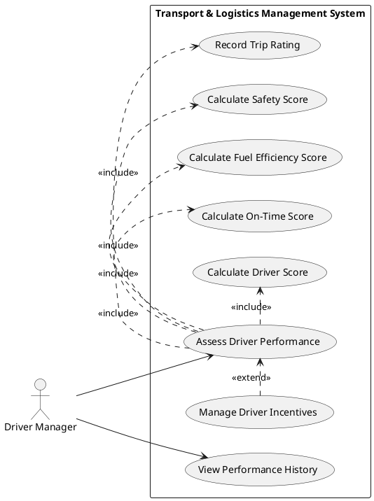

## Activity Diagram — PlantUML

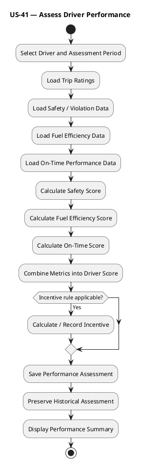

## Sequence Diagram — PlantUML

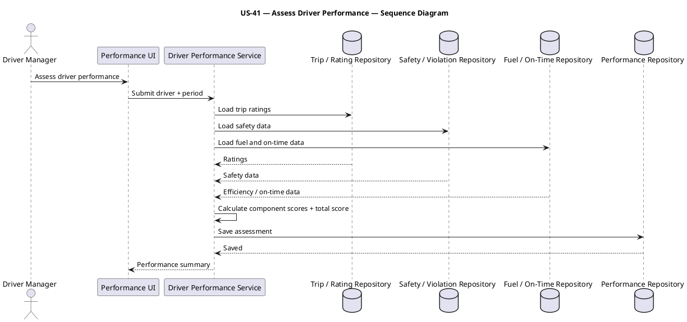

---

# US-42 — Manage Violations

**Primary Actor:** Driver Manager  
**Goal:** Record violations, fines, payments, repeat-offender flags, and disciplinary actions so driver misconduct remains traceable.

## Use Case Diagram — PlantUML

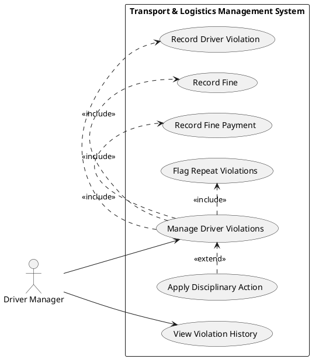

## Activity Diagram — PlantUML

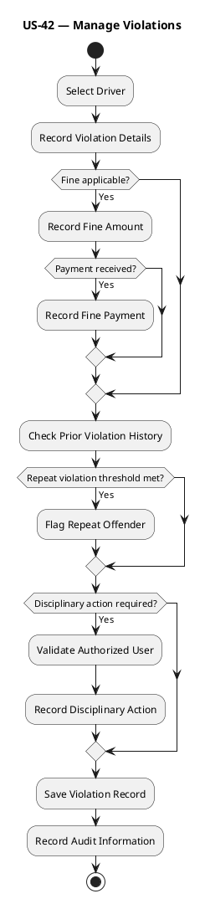

## Sequence Diagram — PlantUML

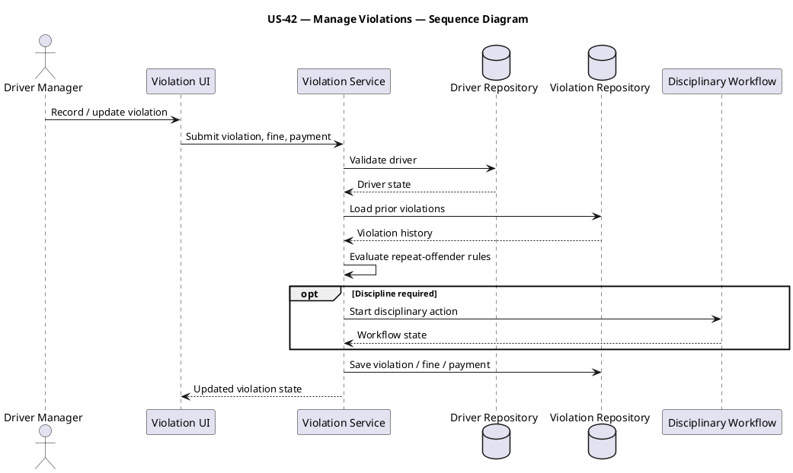

---

# US-43 — Manage Driver Medical Fitness

**Primary Actor:** Safety Officer  
**Goal:** Track periodic medical checks, certificate expiry, restrictions, and vision results so medically unfit drivers are identified.

## Use Case Diagram — PlantUML

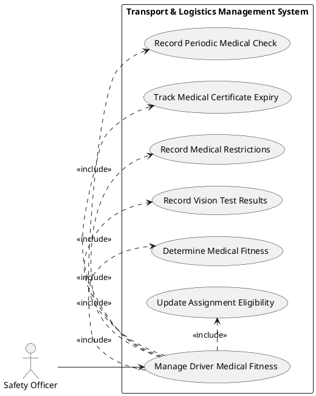

## Activity Diagram — PlantUML

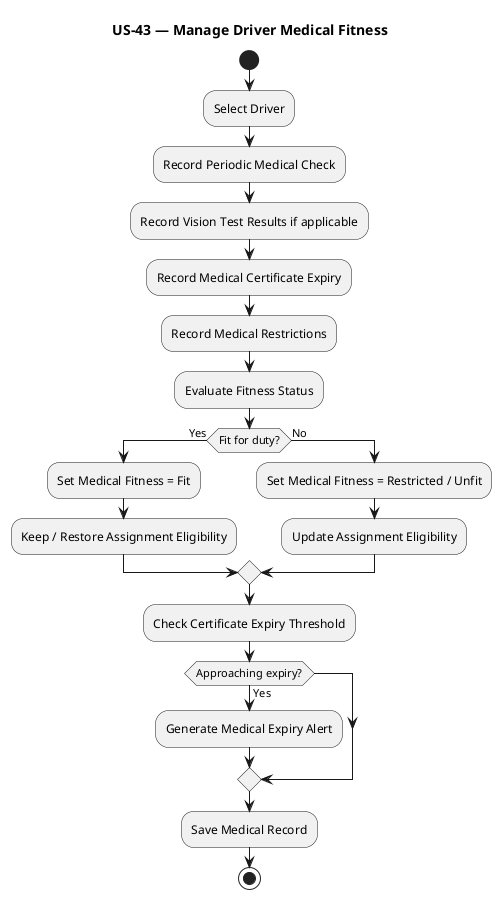

## Sequence Diagram — PlantUML

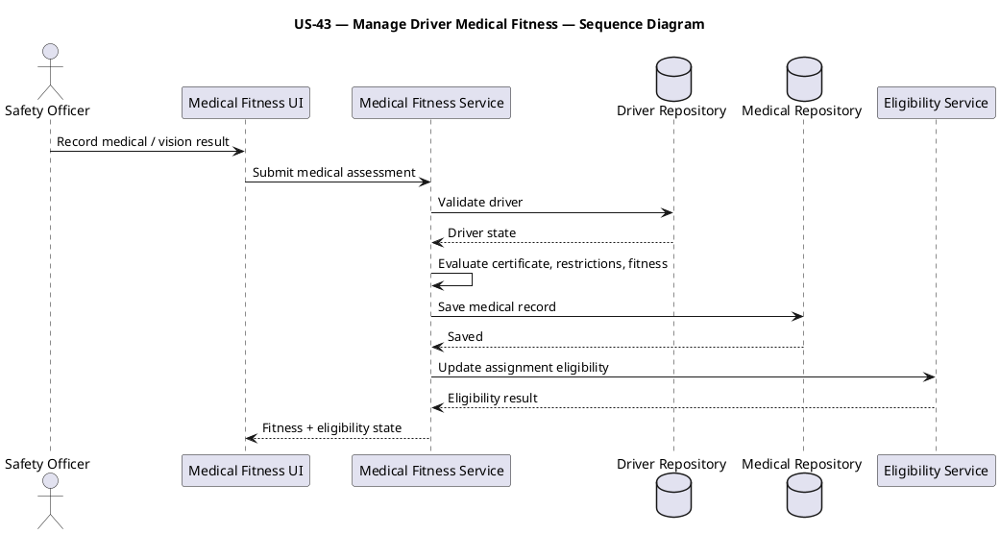

---

# US-44 — Manage Drug Tests

**Primary Actor:** Safety Officer  
**Goal:** Manage random and scheduled drug tests, failures, and return-to-duty status so testing requirements can be enforced.

## Use Case Diagram — PlantUML

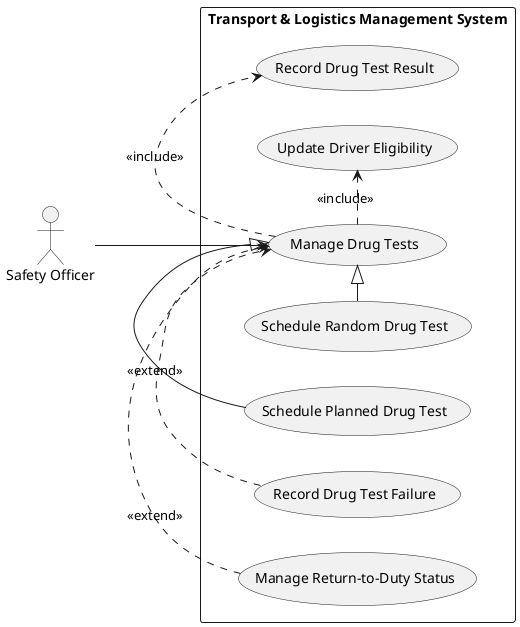

## Activity Diagram — PlantUML

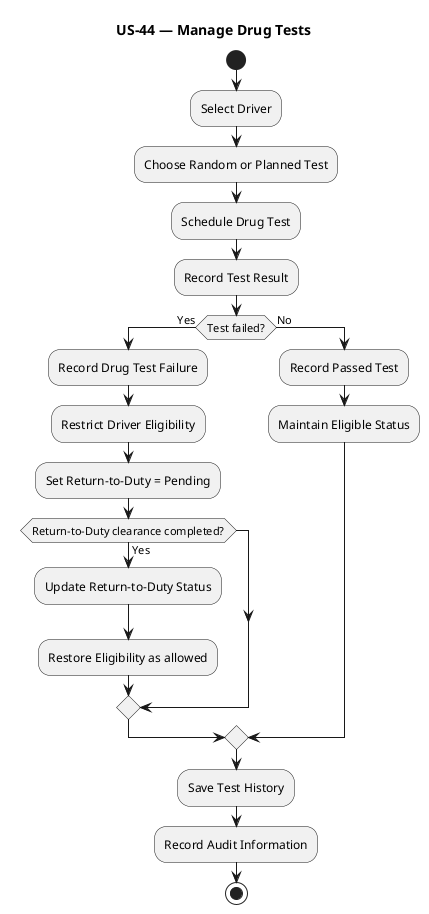

## Sequence Diagram — PlantUML

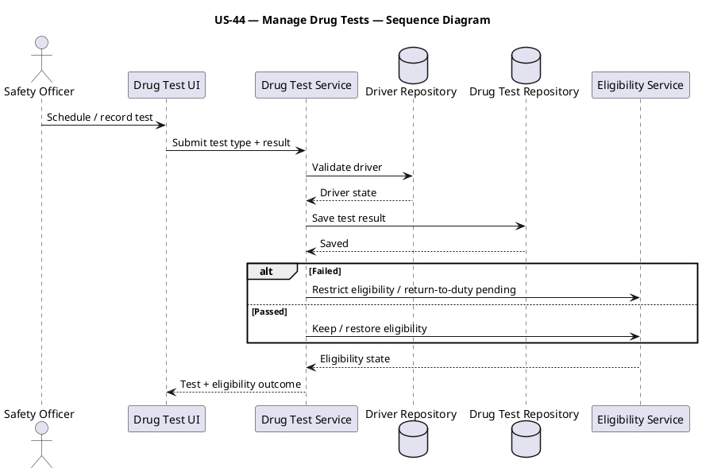

---

# US-45 — Handle Driver Exceptions

**Primary Actor:** Driver Manager  
**Goal:** Handle suspension, medical emergency, unavailability, behavioral issues, expired endorsements, and identity mismatch so invalid drivers are not assigned.

## Use Case Diagram — PlantUML

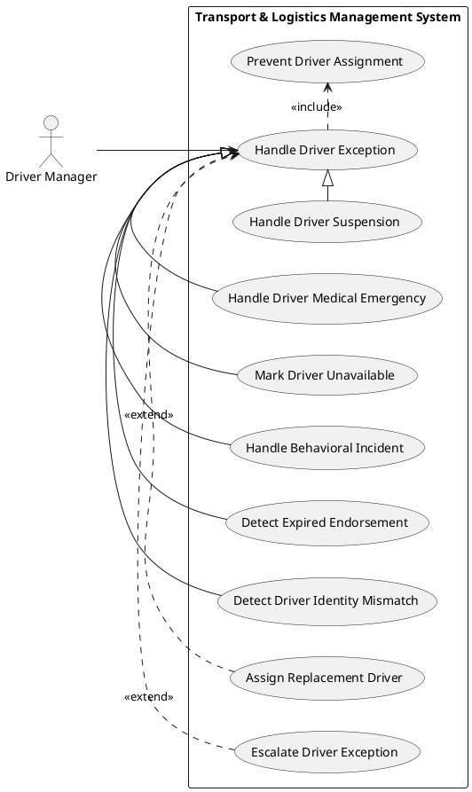

## Activity Diagram — PlantUML

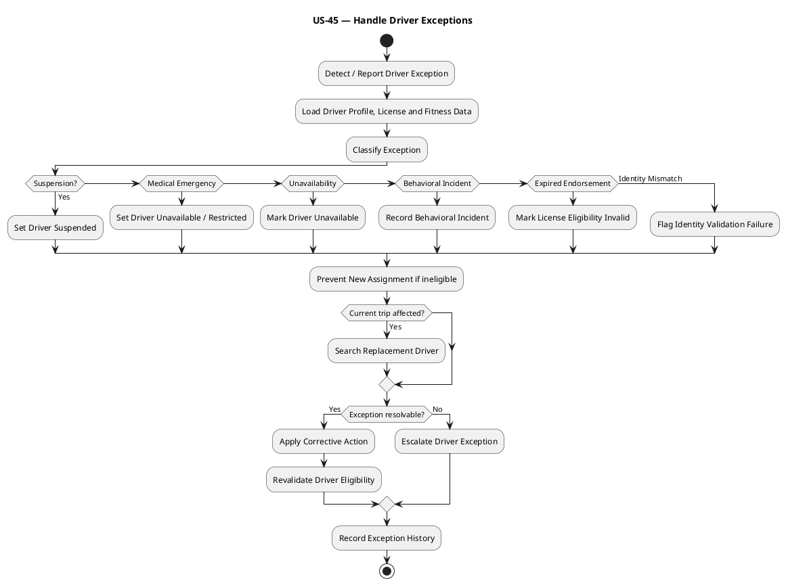

## Sequence Diagram — PlantUML

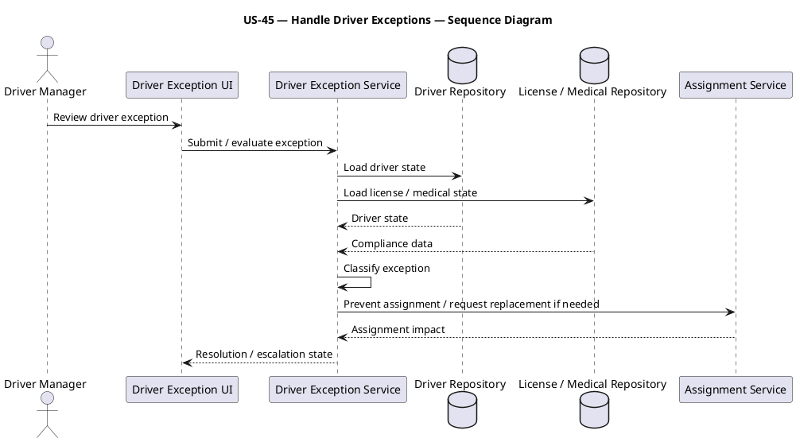

---

# US-46 — Process Driver Payroll Link

**Primary Actor:** Finance Officer  
**Goal:** Link trip earnings, allowances, overtime, and deductions to drivers so payroll-related settlement is accurate.

## Use Case Diagram — PlantUML

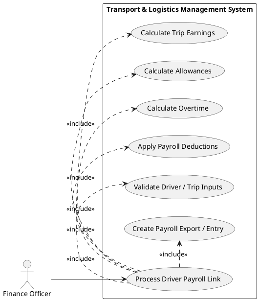

## Activity Diagram — PlantUML

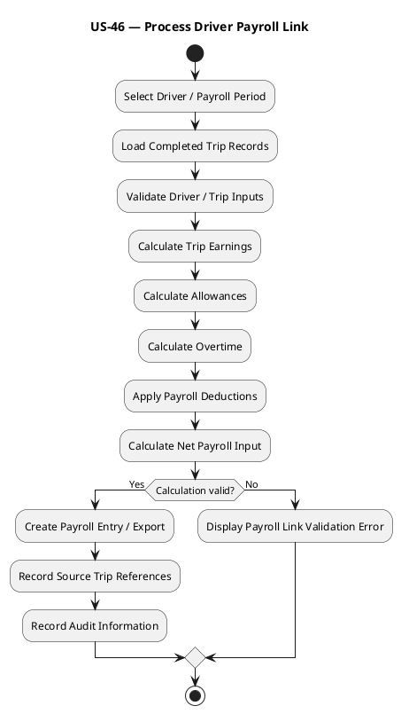

## Sequence Diagram — PlantUML

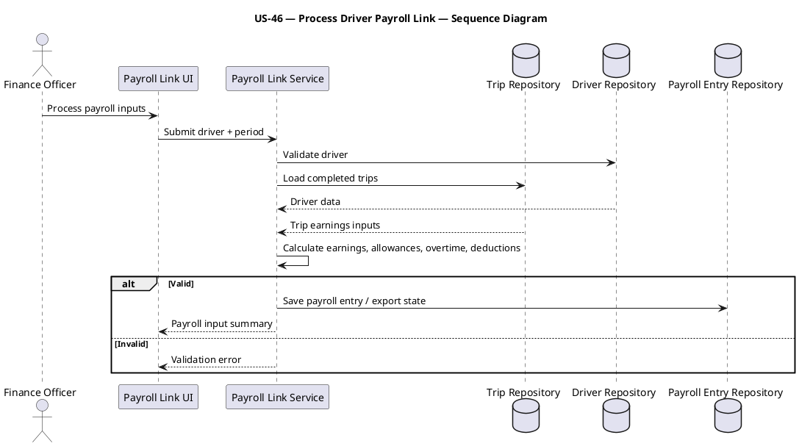

---

# US-47 — Manage Transport Billing

**Primary Actor:** Billing Officer  
**Goal:** Calculate trip and freight billing with surcharges, penalties, and cost-center allocation so transport activities are financially accounted for.

## Use Case Diagram — PlantUML

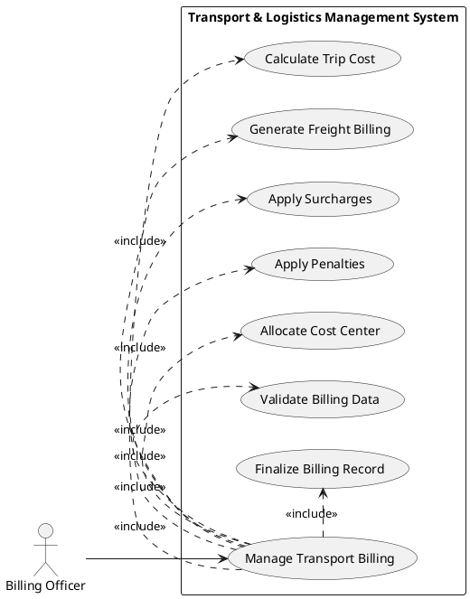

## Activity Diagram — PlantUML

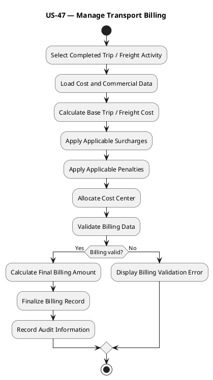

## Sequence Diagram — PlantUML

```plantuml
@startuml
title US-47 — Manage Transport Billing — Sequence Diagram
actor "Billing Officer" as BO
participant "Billing UI" as UI
participant "Billing Service" as BS
database "Trip / Freight Repository" as TR
database "Cost / Charge Repository" as CR
database "Billing Repository" as BR
BO -> UI: Generate / finalize billing
UI -> BS: Submit trip / freight reference
BS -> TR: Load operational data
BS -> CR: Load cost, surcharge, penalty rules
TR --> BS: Operational data
CR --> BS: Charge data
BS -> BS: Calculate billing + cost center
alt Valid
 BS -> BR: Save finalized billing
 BR --> BS: Saved
 BS --> UI: Billing summary
else Invalid
 BS --> UI: Validation error
end
@enduml
```

---

# US-48 — Track Vehicles Live

**Primary Actor:** Tracking / Control Room Operator  
**Goal:** View live location, status, last known location, connectivity, and GPS accuracy so fleet movement can be monitored.

## Use Case Diagram — PlantUML

```plantuml
@startuml
left to right direction
actor "Tracking / Control Room Operator" as TO
rectangle "Transport & Logistics Management System" {
 usecase "Track Vehicles Live" as U0
 usecase "View Vehicle on Map" as U1
 usecase "Track Vehicle Status" as U2
 usecase "Detect Connectivity Loss" as U3
 usecase "Display Last Known Location" as U4
 usecase "Display GPS Accuracy" as U5
 usecase "Show Data Freshness / Timestamp" as U6
}
TO --> U0
U0 .> U1 : <<include>>
U0 .> U2 : <<include>>
U0 .> U5 : <<include>>
U0 .> U6 : <<include>>
U3 .> U0 : <<extend>>
U4 .> U0 : <<extend>>
@enduml
```

## Activity Diagram — PlantUML

```plantuml
@startuml
title US-48 — Track Vehicles Live
start
:Open Live Tracking;
:Select Fleet / Vehicle;
:Load Latest Tracking Data;
if (Fresh GPS data available?) then (Yes)
 :Display Current Location on Map;
 :Display Vehicle Status;
 :Display GPS Accuracy;
 :Display Source Timestamp;
else (No)
 :Detect Connectivity Loss / Stale Data;
 :Display Last Known Location;
 :Display Last Known Timestamp;
endif
:Refresh Tracking View;
stop
@enduml
```

## Sequence Diagram — PlantUML

```plantuml
@startuml
title US-48 — Track Vehicles Live — Sequence Diagram
actor "Tracking / Control Room Operator" as TO
participant "Live Tracking UI" as UI
participant "Tracking Service" as TS
database "Tracking Device Repository" as DR
database "Position Event Repository" as PR
TO -> UI: View live vehicle
UI -> TS: Request current tracking state
TS -> DR: Load device status / last seen
TS -> PR: Load latest position
DR --> TS: Device state
PR --> TS: Latest position
alt Fresh telemetry
 TS --> UI: Current location + status + accuracy + timestamp
else Stale / disconnected
 TS --> UI: Connectivity loss + last known location + timestamp
end
@enduml
```

---

# US-49 — Manage Geofences

**Primary Actor:** Tracking / Control Room Operator  
**Goal:** Create depot, customer, and unauthorized-zone geofences with entry and exit detection so controlled boundary movement is visible.

## Use Case Diagram — PlantUML

```plantuml
@startuml
left to right direction
actor "Tracking / Control Room Operator" as TO
rectangle "Transport & Logistics Management System" {
 usecase "Manage Geofences" as U0
 usecase "Create Geofence" as U1
 usecase "Define Depot Geofence" as U2
 usecase "Define Customer Geofence" as U3
 usecase "Detect Geofence Entry" as U4
 usecase "Detect Geofence Exit" as U5
 usecase "Detect Unauthorized Zone Entry" as U6
 usecase "Generate Entry / Exit Alert" as U7
}
TO --> U0
U0 .> U1 : <<include>>
U2 -|> U1
U3 -|> U1
U0 .> U4 : <<include>>
U0 .> U5 : <<include>>
U6 .> U0 : <<extend>>
U7 .> U0 : <<extend>>
@enduml
```

## Activity Diagram — PlantUML

```plantuml
@startuml
title US-49 — Manage Geofences
start
:Open Geofence Management;
if (Action?) then (Create / Update)
 :Enter Geofence Name and Type;
 :Define Geofence Geometry;
 :Validate Geofence Definition;
 if (Valid?) then (Yes)
  :Save Geofence;
 else (No)
  :Display Geometry Validation Error;
 endif
else (Monitor)
 :Receive Vehicle Position Event;
 :Check Position Against Active Geofences;
 if (Entry detected?) then (Yes)
  :Record Geofence Entry;
  :Generate Entry Alert if configured;
 elseif (Exit detected?)
  :Record Geofence Exit;
  :Generate Exit Alert if configured;
 endif
 if (Unauthorized zone entered?) then (Yes)
  :Generate Unauthorized Zone Alert;
 endif
endif
stop
@enduml
```

## Sequence Diagram — PlantUML

```plantuml
@startuml
title US-49 — Manage Geofences — Sequence Diagram
actor "Tracking / Control Room Operator" as TO
participant "Geofence UI" as UI
participant "Geofence Service" as GS
database "Geofence Repository" as GR
participant "Position Stream" as PS
participant "Alert Service" as AS
TO -> UI: Create / monitor geofence
UI -> GS: Submit geometry / configuration
GS -> GS: Validate geometry
GS -> GR: Save geofence
GR --> GS: Saved
PS -> GS: New vehicle position
GS -> GR: Load relevant geofences
GR --> GS: Geofence definitions
GS -> GS: Evaluate entry / exit / unauthorized zone
opt Event detected
 GS -> AS: Create configured alert
end
GS --> UI: Updated geofence event state
@enduml
```

---

# US-50 — Monitor Speed

**Primary Actor:** Tracking / Control Room Operator  
**Goal:** Monitor speed thresholds and road-specific rules with repeat-violation tracking so unsafe driving can be detected.

## Use Case Diagram — PlantUML

```plantuml
@startuml
left to right direction
actor "Tracking / Control Room Operator" as TO
rectangle "Transport & Logistics Management System" {
 usecase "Monitor Speed" as U0
 usecase "Configure Speed Threshold" as U1
 usecase "Apply Road-Specific Speed Rules" as U2
 usecase "Evaluate Vehicle Speed" as U3
 usecase "Generate Over-Speed Notification" as U4
 usecase "Track Repeat Speed Violations" as U5
 usecase "Record Speed Violation Event" as U6
}
TO --> U0
U0 .> U1 : <<include>>
U0 .> U2 : <<include>>
U0 .> U3 : <<include>>
U0 .> U6 : <<include>>
U4 .> U0 : <<extend>>
U5 .> U0 : <<extend>>
@enduml
```

## Activity Diagram — PlantUML

```plantuml
@startuml
title US-50 — Monitor Speed
start
:Load Configured Speed Thresholds;
:Receive Vehicle Speed / Position Event;
:Determine Applicable Road-Specific Rule;
:Compare Actual Speed with Applicable Limit;
if (Over-speed detected?) then (Yes)
 :Record Speed Violation Event;
 :Generate Over-Speed Notification;
 :Check Prior Speed Violations;
 if (Repeat violation threshold met?) then (Yes)
  :Flag Repeat Speed Violation;
 endif
else (No)
 :Record / Maintain Normal Speed State;
endif
:Update Tracking Alert View;
stop
@enduml
```

## Sequence Diagram — PlantUML

```plantuml
@startuml
title US-50 — Monitor Speed — Sequence Diagram
actor "Tracking / Control Room Operator" as TO
participant "Speed Monitoring UI" as UI
participant "Speed Monitoring Service" as SS
participant "Position Stream" as PS
database "Speed Rule Repository" as RR
database "Tracking Alert Repository" as AR
PS -> SS: Vehicle speed + position
SS -> RR: Load configured / road-specific limit
RR --> SS: Applicable speed rule
SS -> SS: Compare actual speed vs limit
alt Over-speed
 SS -> AR: Save violation event / alert
 SS --> UI: Over-speed notification
else Within limit
 SS --> UI: Normal speed state
end
TO -> UI: Review speed alerts / repeat violations
@enduml
```

---

## Coverage Summary

| User Story | Title | Use Case | Activity | Sequence |
|---|---|---:|---:|---:|
| US-41 | Assess Driver Performance | Yes | Yes | Yes |
| US-42 | Manage Violations | Yes | Yes | Yes |
| US-43 | Manage Driver Medical Fitness | Yes | Yes | Yes |
| US-44 | Manage Drug Tests | Yes | Yes | Yes |
| US-45 | Handle Driver Exceptions | Yes | Yes | Yes |
| US-46 | Process Driver Payroll Link | Yes | Yes | Yes |
| US-47 | Manage Transport Billing | Yes | Yes | Yes |
| US-48 | Track Vehicles Live | Yes | Yes | Yes |
| US-49 | Manage Geofences | Yes | Yes | Yes |
| US-50 | Monitor Speed | Yes | Yes | Yes |

## Source Basis

The story boundaries follow the supplied requirements model: Driver Performance, Violations, Medical Fitness, Drug Tests, and Driver Edge Cases are kept separate; Payroll Link and Transport Billing remain distinct financial processes; and GPS live tracking, geofencing, and speed monitoring are modeled as separate tracking capabilities rather than one enormous map-shaped use case.
