# Transport & Logistics Management System

## UML Diagrams — US-51 to US-60

This document consolidates UML diagrams for **US-51 through US-60** based on the supplied Transport & Logistics requirements. Each story includes a **Use Case Diagram**, **Activity Diagram**, and **Sequence Diagram** in PlantUML.

> Scope: US-51–US-55 complete the GPS & Real-Time Tracking set covered by this range. US-56–US-60 cover Delivery Orders, Proof of Delivery, offline signature/photo capture, failed deliveries, and re-delivery scheduling.

---

# US-51 — Monitor Idle Time

**Primary Actor:** Tracking / Control Room Operator  
**Goal:** Measure idle duration and compare engine-on time with movement so avoidable fuel waste can be identified.

## Use Case Diagram — PlantUML

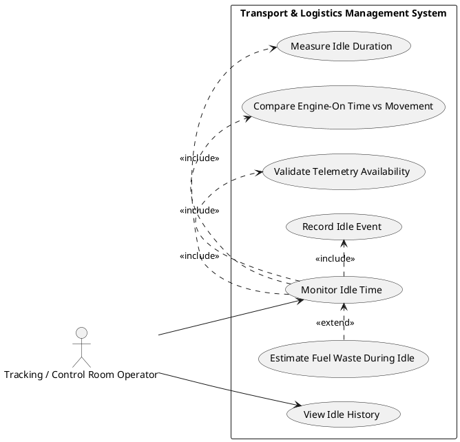

## Activity Diagram — PlantUML

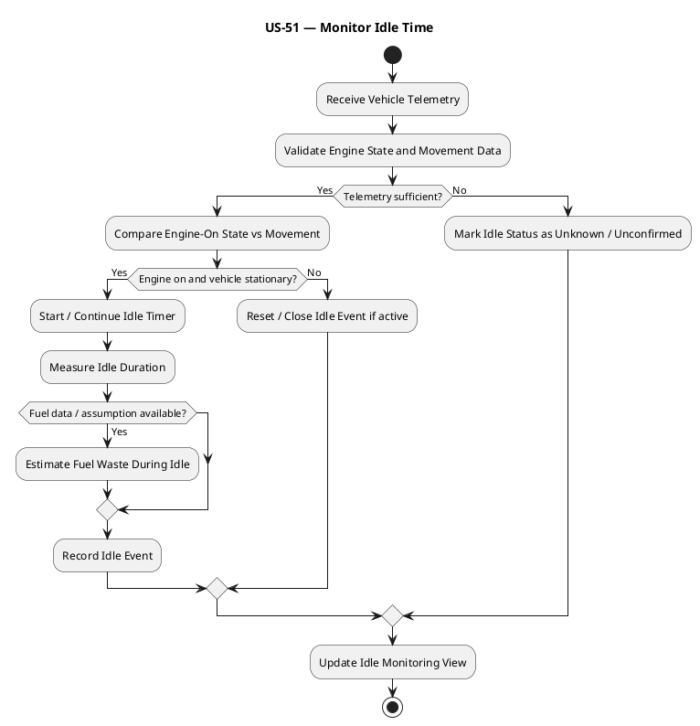

## Sequence Diagram — PlantUML

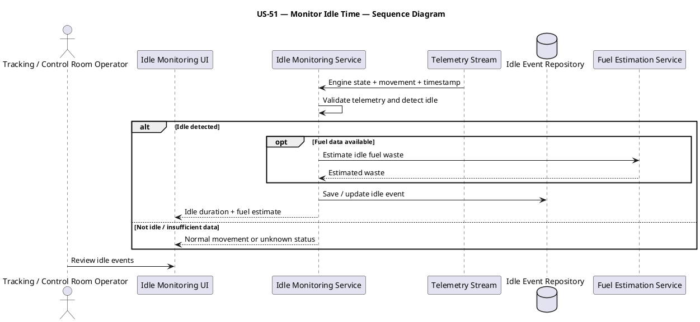

---

# US-52 — Monitor Route Deviations

**Primary Actor:** Tracking / Control Room Operator  
**Goal:** Compare planned and actual routes, calculate deviation severity, and support approval so significant route deviations are controlled.

## Use Case Diagram — PlantUML

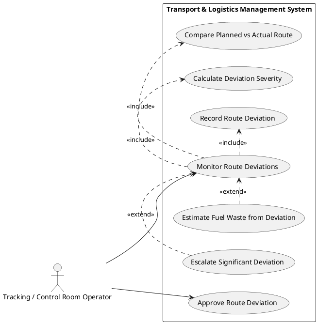

## Activity Diagram — PlantUML

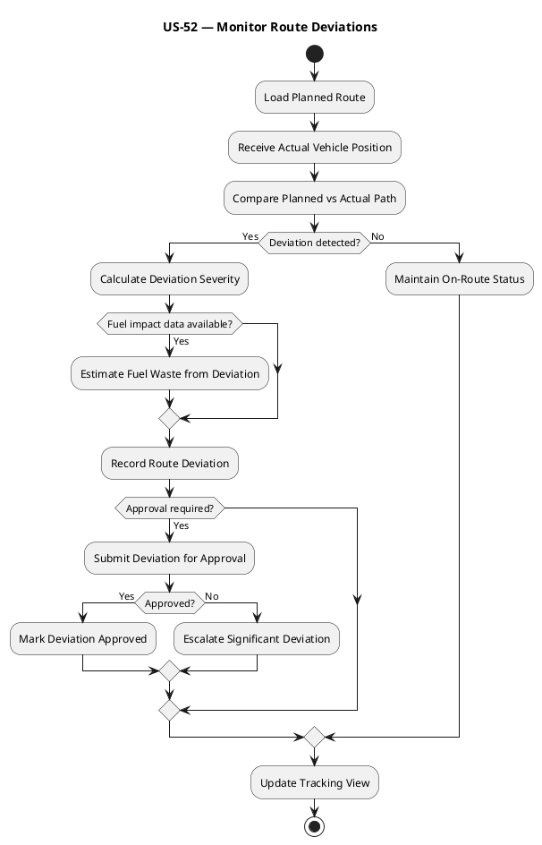

## Sequence Diagram — PlantUML

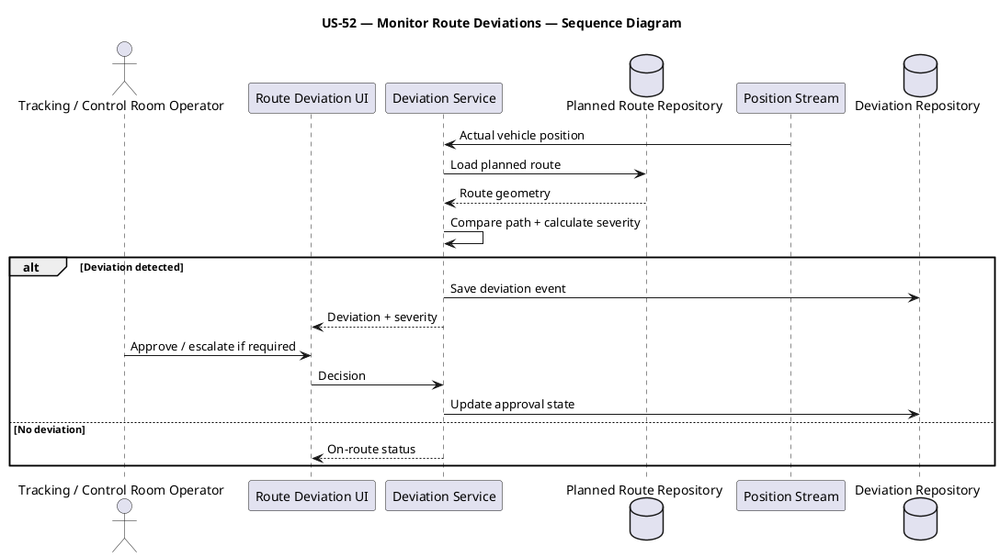

---

# US-53 — Replay Journeys

**Primary Actor:** Tracking / Control Room Operator  
**Goal:** Replay historical journeys, analyze stops, and investigate incidents so past vehicle behavior can be reconstructed.

## Use Case Diagram — PlantUML

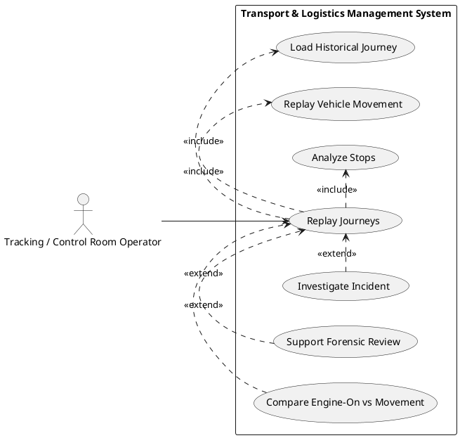

## Activity Diagram — PlantUML

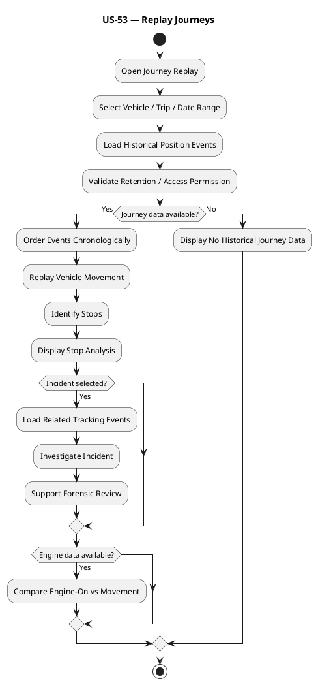

## Sequence Diagram — PlantUML

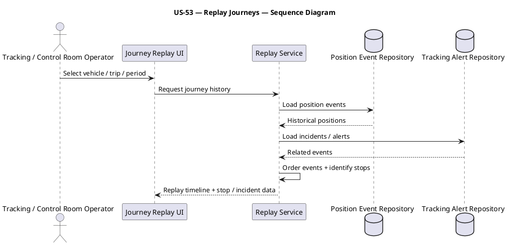

---

# US-54 — View Tracking Dashboard

**Primary Actor:** Tracking / Control Room Operator  
**Goal:** View fleet status, exceptions, heat maps, idle monitoring, and alerts in one operational dashboard so current fleet risk is visible.

## Use Case Diagram — PlantUML

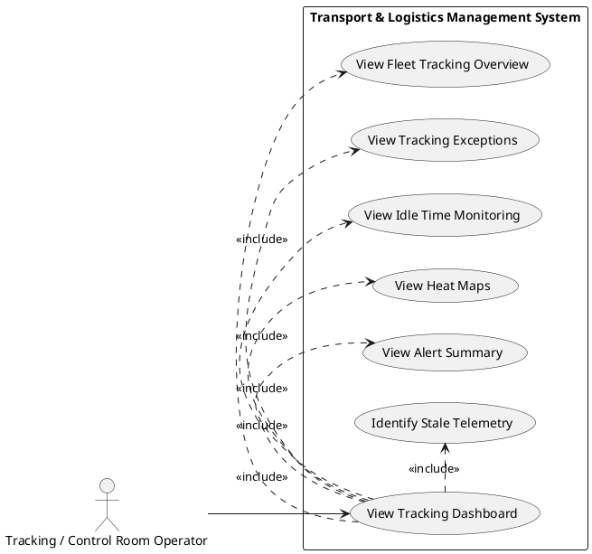

## Activity Diagram — PlantUML

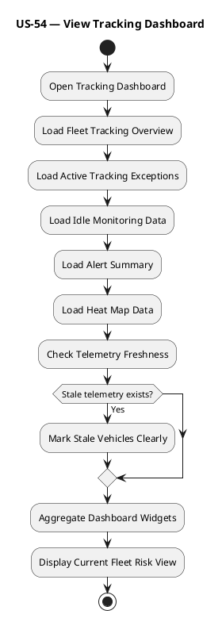

## Sequence Diagram — PlantUML

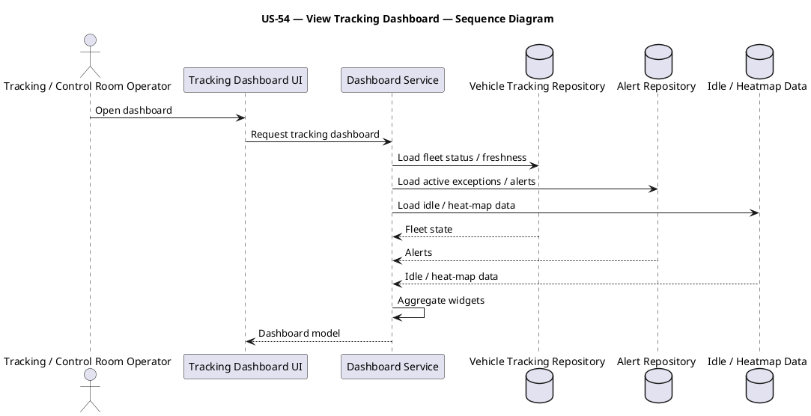

---

# US-55 — Handle GPS Edge Cases

**Primary Actor:** Tracking / Control Room Operator  
**Goal:** Identify signal loss, tampering, spoofing, remote-area loss, battery drain, and delayed packets so unreliable GPS data is recognized.

## Use Case Diagram — PlantUML

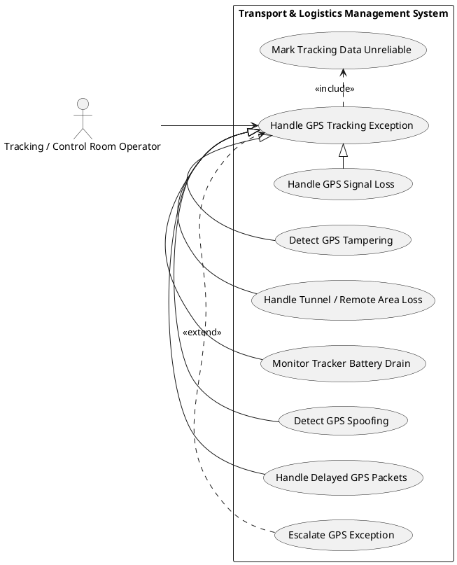

## Activity Diagram — PlantUML

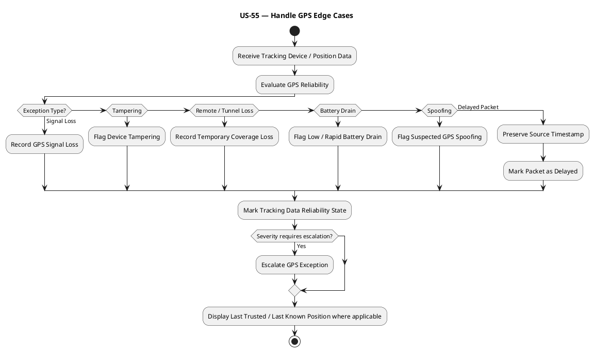

## Sequence Diagram — PlantUML

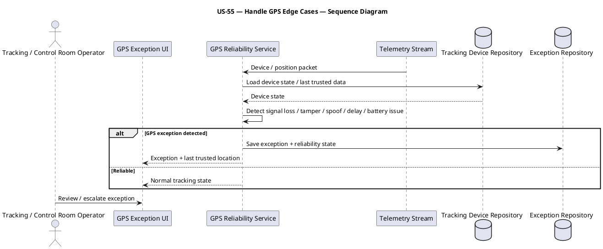

---

# US-56 — Manage Delivery Orders

**Primary Actor:** Delivery Manager  
**Goal:** Create and maintain delivery orders with priority, service type, delivery windows, and instructions so delivery requirements are clear.

## Use Case Diagram — PlantUML

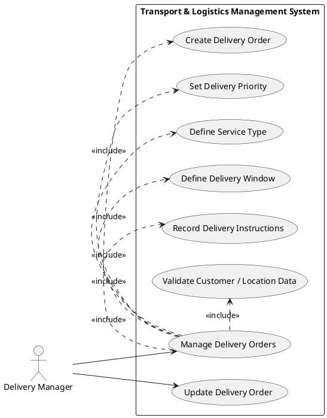

## Activity Diagram — PlantUML

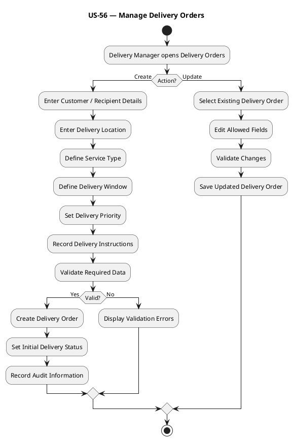

## Sequence Diagram — PlantUML

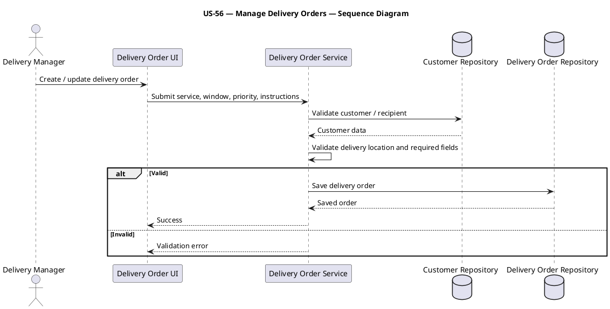

---

# US-57 — Capture Proof of Delivery

**Primary Actor:** Rider / Courier  
**Goal:** Capture configured signature, photo, barcode, timestamp, and geo-tag evidence so delivery completion can be proven.

## Use Case Diagram — PlantUML

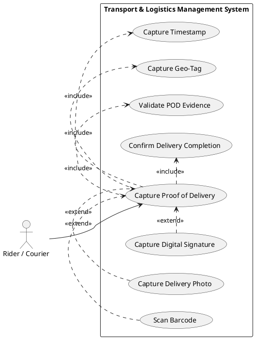

## Activity Diagram — PlantUML

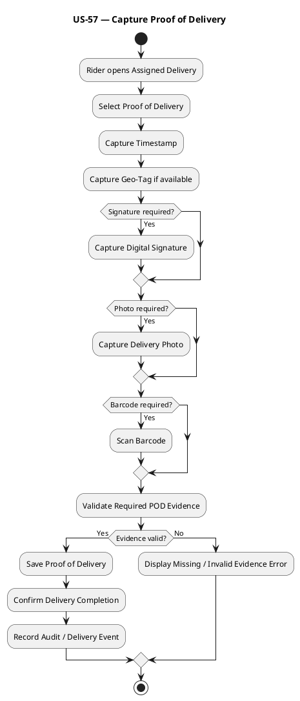

## Sequence Diagram — PlantUML

```plantuml
@startuml
title US-57 — Capture Proof of Delivery — Sequence Diagram
actor "Rider / Courier" as RIDER
participant "Delivery Mobile UI" as UI
participant "POD Service" as PS
participant "Device Evidence Capture" as DEV
database "Delivery Repository" as DR
database "POD Repository" as PR
RIDER -> UI: Capture proof of delivery
UI -> DEV: Capture configured evidence
DEV --> UI: Signature / photo / barcode / geo data
UI -> PS: Submit POD evidence
PS -> DR: Validate delivery state
DR --> PS: Delivery data
PS -> PS: Validate required evidence
alt Valid
 PS -> PR: Save POD
 PS -> DR: Mark delivery completed
 PS --> UI: Completion success
else Invalid
 PS --> UI: Evidence validation error
end
@enduml
```

---

# US-58 — Capture Signature and Photo Offline

**Primary Actor:** Rider / Courier  
**Goal:** Capture signatures and photos offline with quality, retake, consent, and later synchronization so proof can be collected without connectivity.

## Use Case Diagram — PlantUML

```plantuml
@startuml
left to right direction
actor "Rider / Courier" as RIDER
rectangle "Transport & Logistics Management System" {
 usecase "Capture Signature and Photo Offline" as U0
 usecase "Capture Signature Offline" as U1
 usecase "Capture Photo Offline" as U2
 usecase "Validate Image Quality" as U3
 usecase "Request Photo Retake" as U4
 usecase "Record Customer Consent" as U5
 usecase "Queue Offline POD Evidence" as U6
 usecase "Synchronize POD Evidence" as U7
}
RIDER --> U0
U0 .> U1 : <<include>>
U0 .> U2 : <<include>>
U0 .> U3 : <<include>>
U0 .> U5 : <<include>>
U0 .> U6 : <<include>>
U4 .> U0 : <<extend>>
U7 .> U0 : <<extend>>
@enduml
```

## Activity Diagram — PlantUML

```plantuml
@startuml
title US-58 — Capture Signature and Photo Offline
start
:Open Delivery in Offline Mode;
:Capture Customer Signature;
:Capture Delivery Photo;
:Record Customer Consent if required;
:Validate Image Quality;
if (Photo quality acceptable?) then (Yes)
 :Store Signature / Photo Securely Offline;
 :Queue POD Evidence for Synchronization;
else (No)
 :Request Photo Retake;
 :Capture Replacement Photo;
endif
if (Network restored?) then (Yes)
 :Synchronize POD Evidence;
 if (Sync successful?) then (Yes)
  :Mark Evidence Synchronized;
 else (No)
  :Keep Evidence Queued for Retry;
 endif
endif
stop
@enduml
```

## Sequence Diagram — PlantUML

```plantuml
@startuml
title US-58 — Capture Signature and Photo Offline — Sequence Diagram
actor "Rider / Courier" as RIDER
participant "Offline Delivery UI" as UI
participant "Offline Evidence Store" as OS
participant "POD Sync Service" as SS
database "POD Repository" as PR
RIDER -> UI: Capture signature / photo
UI -> UI: Validate photo quality / consent
alt Quality valid
 UI -> OS: Store encrypted offline evidence
 OS --> UI: Queued
else Retake required
 UI --> RIDER: Request photo retake
end
opt Network restored
 OS -> SS: Send queued evidence
 SS -> PR: Save synchronized POD evidence
 PR --> SS: Saved
 SS -> OS: Mark synchronized
end
@enduml
```

---

# US-59 — Manage Failed Deliveries

**Primary Actor:** Delivery Manager  
**Goal:** Track failure reason, escalation, contact attempts, and return-to-origin decisions so unsuccessful deliveries have controlled outcomes.

## Use Case Diagram — PlantUML

```plantuml
@startuml
left to right direction
actor "Delivery Manager" as DM
rectangle "Transport & Logistics Management System" {
 usecase "Manage Failed Deliveries" as U0
 usecase "Record Failure Reason" as U1
 usecase "Record Customer Contact Attempts" as U2
 usecase "Escalate Failed Delivery" as U3
 usecase "Initiate Return to Origin" as U4
 usecase "Determine Re-Delivery Eligibility" as U5
 usecase "Update Delivery Attempt Status" as U6
}
DM --> U0
U0 .> U1 : <<include>>
U0 .> U2 : <<include>>
U0 .> U5 : <<include>>
U0 .> U6 : <<include>>
U3 .> U0 : <<extend>>
U4 .> U0 : <<extend>>
@enduml
```

## Activity Diagram — PlantUML

```plantuml
@startuml
title US-59 — Manage Failed Deliveries
start
:Receive Failed Delivery Attempt;
:Load Delivery Order;
:Record Failure Reason;
:Record Customer Contact Attempts;
:Update Delivery Attempt Status;
:Determine Re-Delivery Eligibility;
if (Re-delivery allowed?) then (Yes)
 :Mark Delivery for Re-Scheduling;
else (No)
 if (Return to Origin required?) then (Yes)
  :Initiate Return to Origin;
 else (No)
  :Escalate Failed Delivery;
 endif
endif
:Record Failure History;
stop
@enduml
```

## Sequence Diagram — PlantUML

```plantuml
@startuml
title US-59 — Manage Failed Deliveries — Sequence Diagram
actor "Delivery Manager" as DM
participant "Failed Delivery UI" as UI
participant "Failed Delivery Service" as FS
database "Delivery Repository" as DR
database "Delivery Attempt Repository" as AR
participant "Exception / Escalation Service" as ES
DM -> UI: Review failed delivery
UI -> FS: Submit reason + contact attempts
FS -> DR: Load delivery order
DR --> FS: Delivery state
FS -> AR: Save failed attempt
FS -> FS: Determine re-delivery / RTO eligibility
alt Re-delivery allowed
 FS -> DR: Mark for re-scheduling
else RTO / escalation
 FS -> ES: Create RTO / escalation action
end
FS --> UI: Failed delivery outcome
@enduml
```

---

# US-60 — Schedule Re-Delivery

**Primary Actor:** Delivery Manager  
**Goal:** Use customer preference and slot availability for automatic or agent-assisted rescheduling so another delivery attempt can be planned.

## Use Case Diagram — PlantUML

```plantuml
@startuml
left to right direction
actor "Delivery Manager" as DM
rectangle "Transport & Logistics Management System" {
 usecase "Schedule Re-Delivery" as U0
 usecase "Record Customer Preference" as U1
 usecase "Check Delivery Slot Availability" as U2
 usecase "Auto-Reschedule Delivery" as U3
 usecase "Agent-Reschedule Delivery" as U4
 usecase "Validate Slot Capacity" as U5
 usecase "Confirm Re-Delivery Schedule" as U6
}
DM --> U0
U0 .> U1 : <<include>>
U0 .> U2 : <<include>>
U0 .> U5 : <<include>>
U0 .> U6 : <<include>>
U3 -|> U0
U4 -|> U0
@enduml
```

## Activity Diagram — PlantUML

```plantuml
@startuml
title US-60 — Schedule Re-Delivery
start
:Select Failed Delivery Eligible for Re-Delivery;
:Load Customer Preference;
:Load Available Delivery Slots;
:Check Slot Capacity;
if (Scheduling Method?) then (Automatic)
 :Generate Automatic Reschedule Suggestions;
 :Select Best Feasible Slot;
else (Agent Assisted)
 :Delivery Manager selects Available Slot;
endif
:Validate Selected Slot Capacity and Cutoff;
if (Slot valid?) then (Yes)
 :Update Delivery Schedule;
 :Confirm Re-Delivery Schedule;
 :Record Scheduling Method and History;
else (No)
 :Reject Selected Slot;
 :Return to Slot Selection;
endif
stop
@enduml
```

## Sequence Diagram — PlantUML

```plantuml
@startuml
title US-60 — Schedule Re-Delivery — Sequence Diagram
actor "Delivery Manager" as DM
participant "Re-Delivery UI" as UI
participant "Re-Delivery Service" as RS
database "Delivery Repository" as DR
database "Delivery Slot Repository" as SR
database "Customer Preference Repository" as CR
DM -> UI: Schedule re-delivery
UI -> RS: Submit failed delivery
RS -> DR: Validate re-delivery eligibility
RS -> CR: Load customer preference
RS -> SR: Load available slots / capacity
DR --> RS: Delivery state
CR --> RS: Preferences
SR --> RS: Slot availability
alt Feasible slot
 RS --> UI: Automatic suggestions / available slots
 DM -> UI: Select / confirm slot
 UI -> RS: Confirm schedule
 RS -> DR: Update delivery schedule
 RS -> SR: Reserve slot capacity
 RS --> UI: Re-delivery scheduled
else No feasible slot
 RS --> UI: No available slot / corrective action
end
@enduml
```

---

## Coverage Summary

| User Story | Title | Use Case | Activity | Sequence |
|---|---|---:|---:|---:|
| US-51 | Monitor Idle Time | Yes | Yes | Yes |
| US-52 | Monitor Route Deviations | Yes | Yes | Yes |
| US-53 | Replay Journeys | Yes | Yes | Yes |
| US-54 | View Tracking Dashboard | Yes | Yes | Yes |
| US-55 | Handle GPS Edge Cases | Yes | Yes | Yes |
| US-56 | Manage Delivery Orders | Yes | Yes | Yes |
| US-57 | Capture Proof of Delivery | Yes | Yes | Yes |
| US-58 | Capture Signature and Photo Offline | Yes | Yes | Yes |
| US-59 | Manage Failed Deliveries | Yes | Yes | Yes |
| US-60 | Schedule Re-Delivery | Yes | Yes | Yes |

## Source Basis

The diagrams preserve the supplied story boundaries and terminology. Idle monitoring is kept separate from live tracking; route deviation monitoring is distinct from route planning; journey replay is historical rather than live; and the Delivery Management stories separate order definition, POD capture, offline evidence handling, failure handling, and re-delivery scheduling so one workflow does not become an administrative octopus.
