# Transport & Logistics Management System

## UML Diagrams — US-61 to US-70

This document consolidates UML diagrams for **US-61 through US-70** based on the supplied Transport & Logistics requirements. Each story includes a **Use Case Diagram**, **Activity Diagram**, and **Sequence Diagram** in PlantUML.

> Scope: US-61–US-62 complete Delivery Management in this range. US-63–US-68 cover Last-Mile Delivery zones, slots, riders, batching, ETA, and exceptions. US-69–US-70 cover customer notifications and customer self-service.

---

# US-61 — Analyze Delivery Performance

**Primary Actor:** Delivery Manager  
**Goal:** Analyze delivery success, delays, attempts, and regional performance so delivery operations can be improved.

## Use Case Diagram — PlantUML

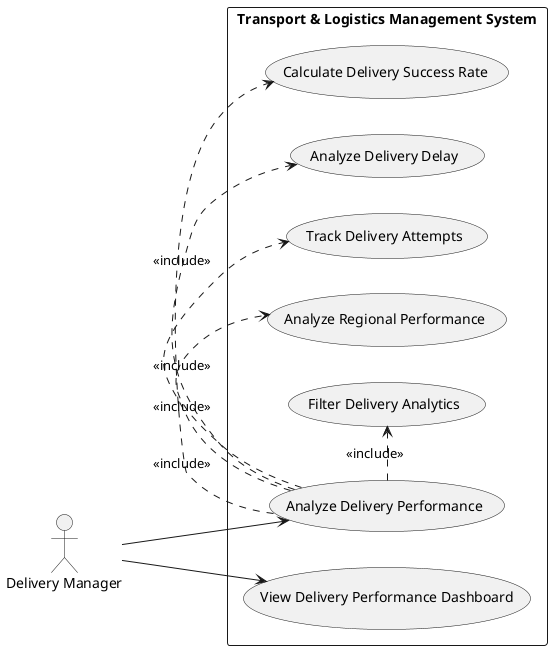

## Activity Diagram — PlantUML

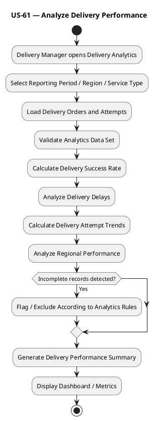

## Sequence Diagram — PlantUML

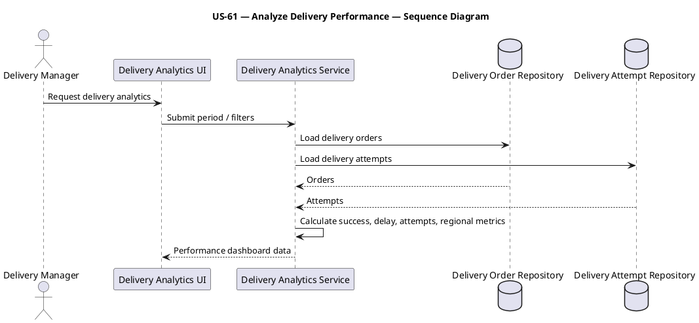

---

# US-62 — Handle Delivery Exceptions

**Primary Actor:** Delivery Manager  
**Goal:** Handle customer unavailability, wrong address, refusal, partial delivery, damage, and OTP mismatch so exceptional delivery outcomes are recorded correctly.

## Use Case Diagram — PlantUML

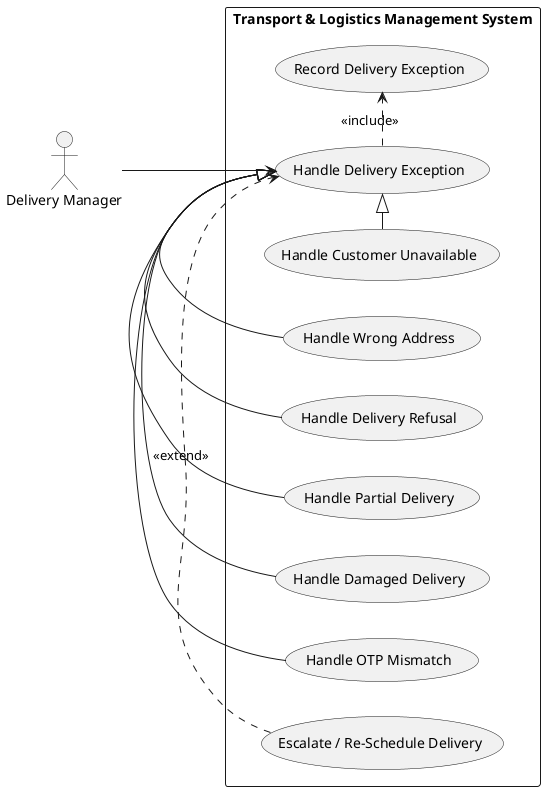

## Activity Diagram — PlantUML

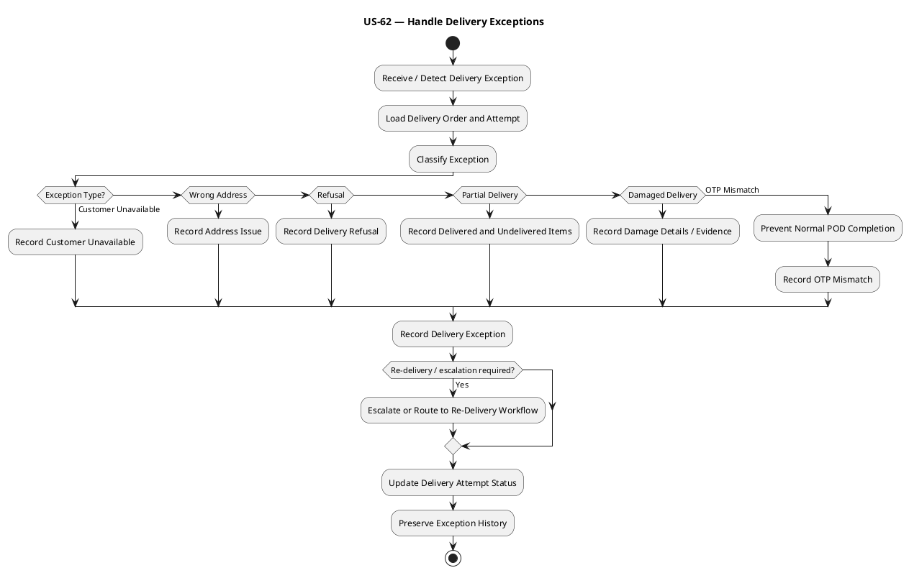

## Sequence Diagram — PlantUML

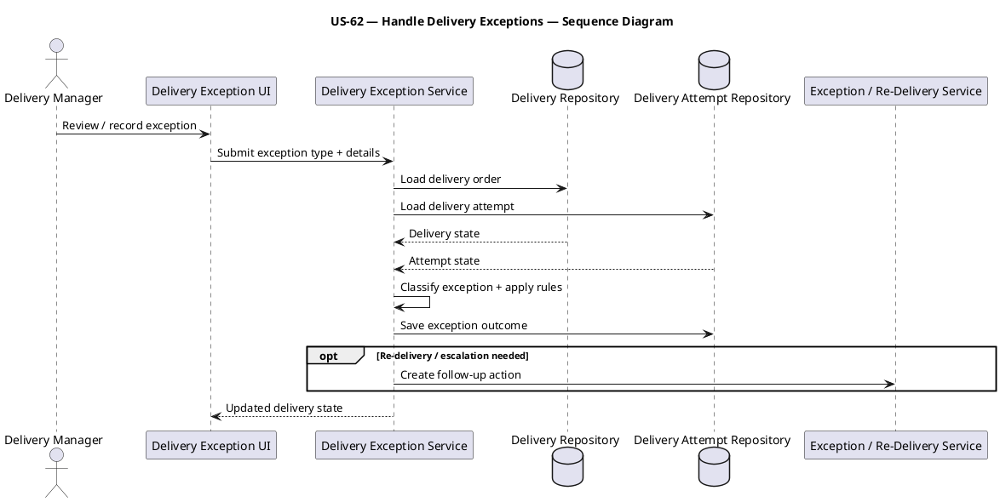

---

# US-63 — Manage Delivery Zones

**Primary Actor:** Last-Mile Planner  
**Goal:** Create dynamic delivery zones, manage capacity, overrides, and micro-hubs so last-mile coverage can adapt to demand.

## Use Case Diagram — PlantUML

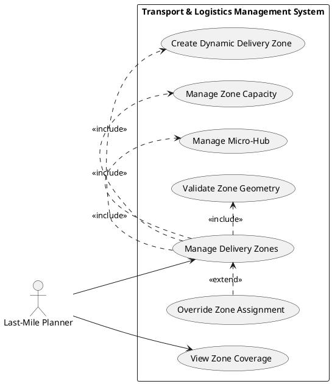

## Activity Diagram — PlantUML

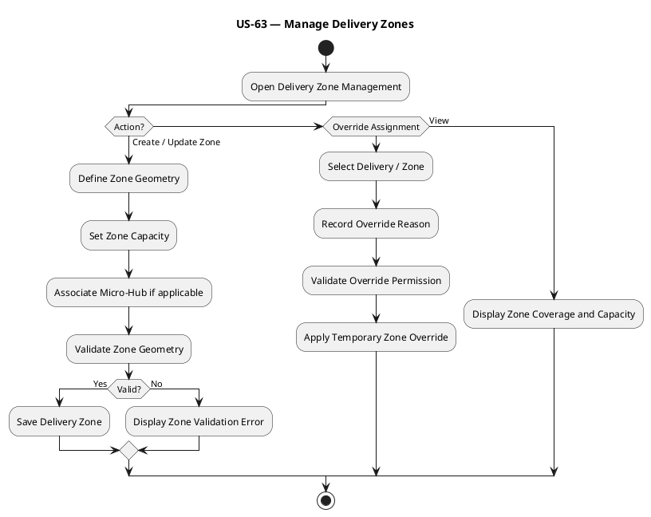

## Sequence Diagram — PlantUML

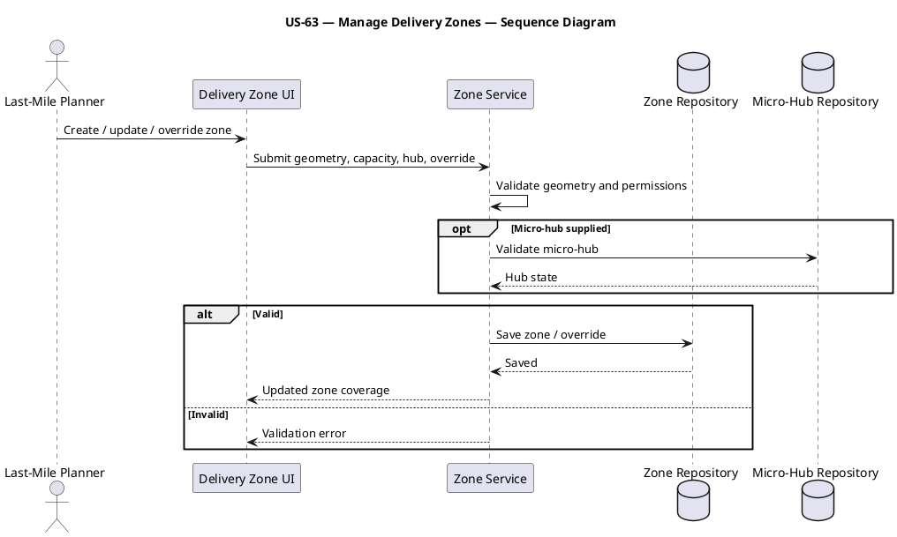

---

# US-64 — Manage Delivery Slots

**Primary Actor:** Last-Mile Planner  
**Goal:** Plan slot capacity, peak hours, cutoffs, and buffers so delivery promises remain feasible.

## Use Case Diagram — PlantUML

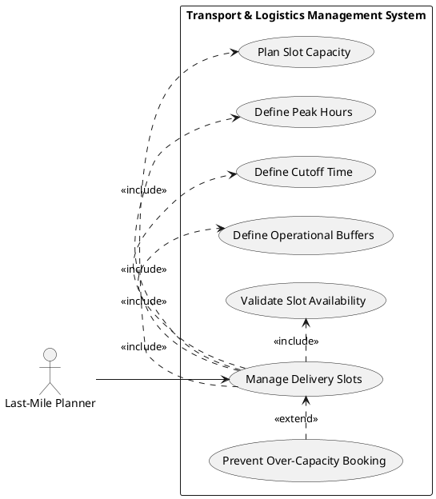

## Activity Diagram — PlantUML

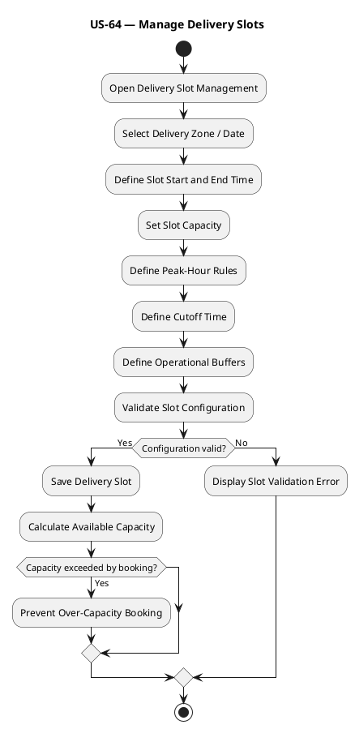

## Sequence Diagram — PlantUML

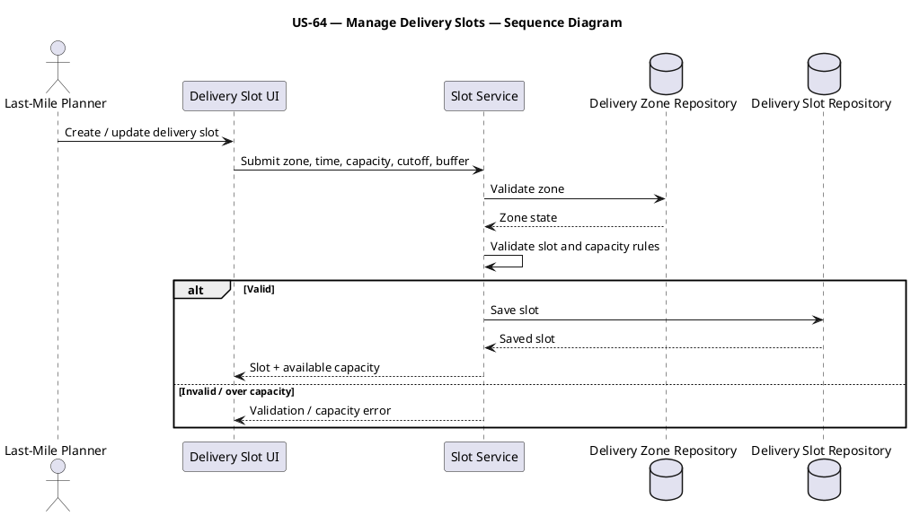

---

# US-65 — Manage Riders

**Primary Actor:** Last-Mile Planner  
**Goal:** Onboard and manage gig or full-time riders with identity, shifts, and availability so valid riders can be assigned.

## Use Case Diagram — PlantUML

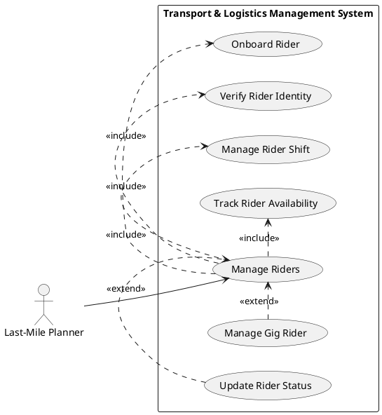

## Activity Diagram — PlantUML

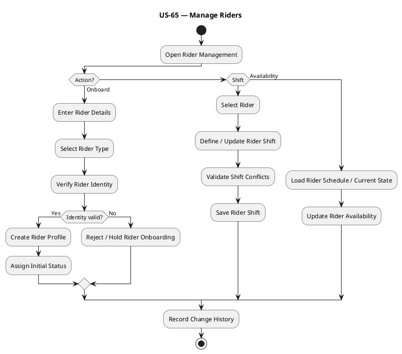

## Sequence Diagram — PlantUML

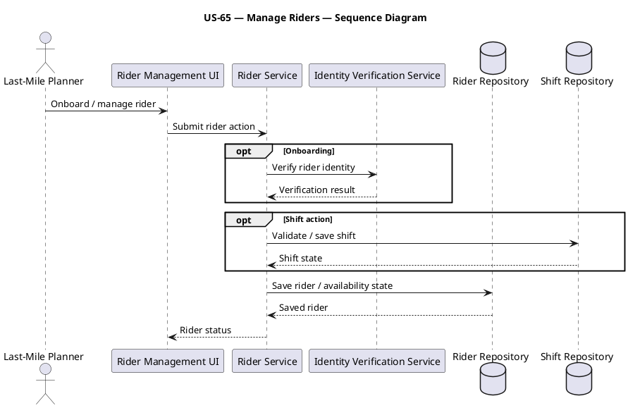

---

# US-66 — Batch Delivery Orders

**Primary Actor:** Last-Mile Planner  
**Goal:** Cluster deliveries by proximity, rider capacity, and priority so rider workloads are efficient.

## Use Case Diagram — PlantUML

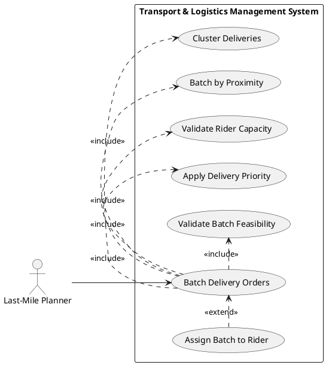

## Activity Diagram — PlantUML

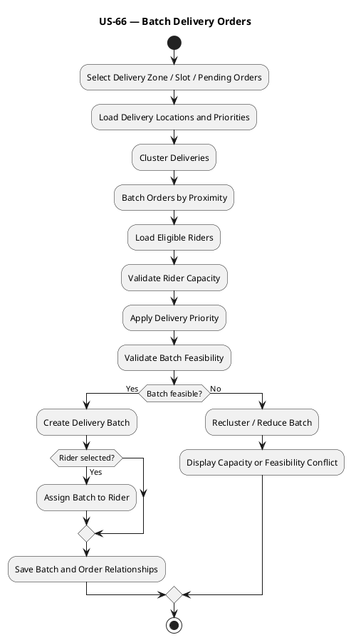

## Sequence Diagram — PlantUML

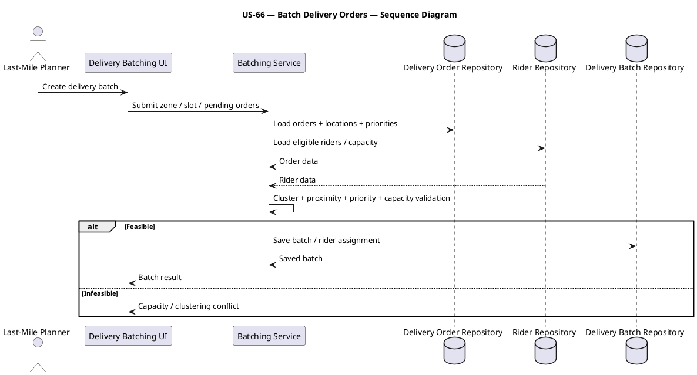

---

# US-67 — Calculate Last-Mile ETA

**Primary Actor:** Last-Mile Planner  
**Goal:** Calculate and recalculate traffic-adjusted ETA after delays or sequence changes so customers receive realistic arrival times.

## Use Case Diagram — PlantUML

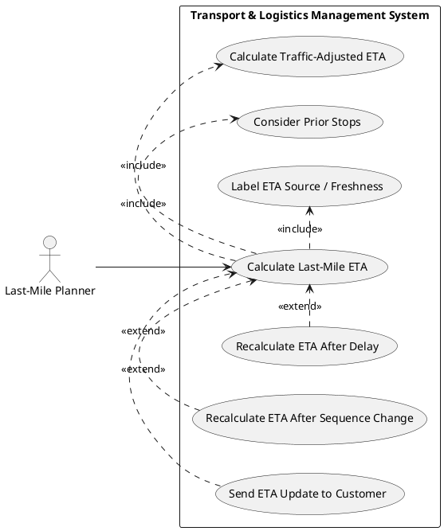

## Activity Diagram — PlantUML

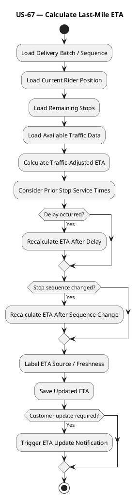

## Sequence Diagram — PlantUML

```plantuml
@startuml
title US-67 — Calculate Last-Mile ETA — Sequence Diagram
actor "Last-Mile Planner" as LP
participant "Last-Mile ETA UI" as UI
participant "ETA Service" as ES
database "Delivery Batch Repository" as BR
participant "Position / Traffic Service" as PT
participant "Notification Service" as NS
LP -> UI: Calculate / recalculate ETA
UI -> ES: Submit batch / delivery
ES -> BR: Load sequence + remaining stops
BR --> ES: Batch data
ES -> PT: Load rider position + traffic
PT --> ES: Position / traffic data
ES -> ES: Calculate ETA and apply delay / sequence effects
ES --> UI: Updated ETA + freshness
opt Customer update required
 ES -> NS: Send ETA update event
end
@enduml
```

---

# US-68 — Handle Last-Mile Exceptions

**Primary Actor:** Last-Mile Planner  
**Goal:** Handle rider no-show, multiple attempts, address not found, access restrictions, contactless delivery, and cash disputes so last-mile disruptions can be resolved.

## Use Case Diagram — PlantUML

```plantuml
@startuml
left to right direction
actor "Last-Mile Planner" as LP
rectangle "Transport & Logistics Management System" {
 usecase "Handle Last-Mile Exception" as U0
 usecase "Handle Rider No-Show" as U1
 usecase "Manage Multiple Delivery Attempts" as U2
 usecase "Handle Address Not Found" as U3
 usecase "Handle Access Restriction" as U4
 usecase "Support Contactless Delivery" as U5
 usecase "Handle Cash Dispute" as U6
 usecase "Assign Replacement Rider" as U7
 usecase "Escalate / Re-Schedule" as U8
}
LP --> U0
U1 -|> U0
U2 -|> U0
U3 -|> U0
U4 -|> U0
U5 -|> U0
U6 -|> U0
U7 .> U0 : <<extend>>
U8 .> U0 : <<extend>>
@enduml
```

## Activity Diagram — PlantUML

```plantuml
@startuml
title US-68 — Handle Last-Mile Exceptions
start
:Detect / Report Last-Mile Exception;
:Load Rider, Delivery and Batch Data;
:Classify Exception;
if (Rider No-Show?) then (Yes)
 :Mark Rider Unavailable;
 :Search Replacement Rider;
elseif (Multiple Attempts)
 :Load Prior Attempts;
 :Determine Next Attempt / RTO;
elseif (Address Not Found)
 :Record Address Failure;
 :Request Customer / Agent Clarification;
elseif (Access Restriction)
 :Record Access Constraint;
elseif (Contactless Delivery)
 :Apply Contactless POD Rules;
else (Cash Dispute)
 :Record Cash Dispute;
 :Place Settlement on Hold if required;
endif
if (Re-Schedule / Escalation required?) then (Yes)
 :Create Follow-Up / Escalation Action;
endif
:Record Exception Outcome;
stop
@enduml
```

## Sequence Diagram — PlantUML

```plantuml
@startuml
title US-68 — Handle Last-Mile Exceptions — Sequence Diagram
actor "Last-Mile Planner" as LP
participant "Last-Mile Exception UI" as UI
participant "Last-Mile Exception Service" as ES
database "Delivery / Batch Repository" as DR
database "Rider Repository" as RR
participant "Re-Delivery / Escalation Service" as RS
LP -> UI: Review last-mile exception
UI -> ES: Submit exception type + details
ES -> DR: Load delivery / batch
ES -> RR: Load rider state
DR --> ES: Delivery data
RR --> ES: Rider data
ES -> ES: Apply exception-specific rules
opt Replacement / reschedule / escalation
 ES -> RS: Create follow-up action
end
ES --> UI: Updated operational outcome
@enduml
```

---

# US-69 — Receive Delivery Notifications

**Primary Actor:** Customer / Recipient  
**Goal:** Receive SMS, app, email, OTP, and delay notifications so delivery status and expected arrival remain visible.

## Use Case Diagram — PlantUML

```plantuml
@startuml
left to right direction
actor "Customer / Recipient" as CUST
rectangle "Transport & Logistics Management System" {
 usecase "Receive Delivery Notifications" as U0
 usecase "Receive SMS Notification" as U1
 usecase "Receive App Notification" as U2
 usecase "Receive Email Notification" as U3
 usecase "Receive OTP" as U4
 usecase "Receive Delay Notification" as U5
 usecase "Receive ETA Update" as U6
 usecase "Record Notification Delivery Status" as U7
}
CUST --> U0
U1 -|> U0
U2 -|> U0
U3 -|> U0
U4 .> U0 : <<extend>>
U5 .> U0 : <<extend>>
U6 .> U0 : <<extend>>
U0 .> U7 : <<include>>
@enduml
```

## Activity Diagram — PlantUML

```plantuml
@startuml
title US-69 — Receive Delivery Notifications
start
:Delivery Event / ETA Update Occurs;
:Load Customer Notification Preferences;
:Select Applicable Notification Type;
if (Notification Type?) then (OTP)
 :Generate Delivery OTP;
elseif (Delay)
 :Prepare Delay Notification;
elseif (ETA Update)
 :Prepare Updated ETA Message;
else (General Delivery Update)
 :Prepare Delivery Status Message;
endif
:Select Configured Channel;
:Send SMS / App / Email Notification;
if (Delivery successful?) then (Yes)
 :Record Notification Delivered;
else (No)
 :Record Notification Failure;
 :Apply Retry / Escalation Rule if configured;
endif
stop
@enduml
```

## Sequence Diagram — PlantUML

```plantuml
@startuml
title US-69 — Receive Delivery Notifications — Sequence Diagram
actor "Customer / Recipient" as CUST
participant "Delivery Event Source" as EV
participant "Notification Service" as NS
database "Customer Preference Repository" as PR
participant "SMS / App / Email Channel" as CH
database "Notification Repository" as NR
EV -> NS: Delivery / OTP / delay / ETA event
NS -> PR: Load customer preferences
PR --> NS: Preferred channels
NS -> CH: Send notification
CH --> NS: Delivery status
NS -> NR: Save notification result
NS --> CUST: Delivery notification
@enduml
```

---

# US-70 — Use Customer Self-Service

**Primary Actor:** Customer / Recipient  
**Goal:** Use shipment tracking, delivery preferences, issue reporting, and feedback so customers can manage their service experience.

## Use Case Diagram — PlantUML

```plantuml
@startuml
left to right direction
actor "Customer / Recipient" as CUST
rectangle "Transport & Logistics Management System" {
 usecase "Use Customer Self-Service" as U0
 usecase "View Self-Service Tracking" as U1
 usecase "Manage Delivery Preferences" as U2
 usecase "Submit Customer Issue" as U3
 usecase "Capture Customer Feedback" as U4
 usecase "Request Re-Delivery / Preference Change" as U5
 usecase "Validate Customer Access" as U6
}
CUST --> U0
U0 .> U6 : <<include>>
U1 -|> U0
U2 -|> U0
U3 -|> U0
U4 -|> U0
U5 .> U0 : <<extend>>
@enduml
```

## Activity Diagram — PlantUML

```plantuml
@startuml
title US-70 — Use Customer Self-Service
start
:Customer opens Self-Service Portal;
:Authenticate / Validate Customer Access;
if (Action?) then (Tracking)
 :Load Authorized Delivery / Shipment Status;
 :Display Current Status and ETA;
elseif (Preferences)
 :Load Existing Delivery Preferences;
 :Update Allowed Preferences;
 :Save Preferences;
elseif (Issue)
 :Enter Customer Issue;
 :Validate Required Details;
 :Create Customer Issue Record;
elseif (Feedback)
 :Select Completed Delivery / Service;
 :Enter Feedback / Rating;
 :Save Customer Feedback;
else (Re-Delivery Request)
 :Submit Re-Delivery / Preference Change Request;
 :Route to Delivery Scheduling Workflow;
endif
:Display Confirmation / Updated State;
stop
@enduml
```

## Sequence Diagram — PlantUML

```plantuml
@startuml
title US-70 — Use Customer Self-Service — Sequence Diagram
actor "Customer / Recipient" as CUST
participant "Customer Portal" as UI
participant "Customer Experience Service" as CS
participant "Access Service" as AS
database "Delivery Repository" as DR
database "Customer Preference / Issue Repository" as CR
CUST -> UI: Open self-service action
UI -> AS: Validate customer access
AS --> UI: Authorized
UI -> CS: Tracking / preference / issue / feedback request
alt Tracking
 CS -> DR: Load authorized delivery state
 DR --> CS: Status / ETA
else Preference / issue / feedback
 CS -> CR: Save / load customer experience data
 CR --> CS: Updated record
end
CS --> UI: Result / confirmation
UI --> CUST: Display self-service outcome
@enduml
```

---

## Coverage Summary

| User Story | Title | Use Case | Activity | Sequence |
|---|---|---:|---:|---:|
| US-61 | Analyze Delivery Performance | Yes | Yes | Yes |
| US-62 | Handle Delivery Exceptions | Yes | Yes | Yes |
| US-63 | Manage Delivery Zones | Yes | Yes | Yes |
| US-64 | Manage Delivery Slots | Yes | Yes | Yes |
| US-65 | Manage Riders | Yes | Yes | Yes |
| US-66 | Batch Delivery Orders | Yes | Yes | Yes |
| US-67 | Calculate Last-Mile ETA | Yes | Yes | Yes |
| US-68 | Handle Last-Mile Exceptions | Yes | Yes | Yes |
| US-69 | Receive Delivery Notifications | Yes | Yes | Yes |
| US-70 | Use Customer Self-Service | Yes | Yes | Yes |

## Source Basis

The diagrams preserve the story boundaries in the supplied Transport & Logistics requirements. Delivery analytics remains read-only analysis of operational records; delivery exceptions remain distinct from failed-delivery and re-delivery workflows; last-mile zones, slots, riders, batching, and ETA are modeled as separate planning capabilities; and customer self-service consumes existing delivery capabilities rather than duplicating them in a second, cheerfully redundant logistics system.
