# Transport & Logistics Management System

## UML Diagrams — US-71 to US-80

This document consolidates UML diagrams for **US-71 through US-80** based on the supplied Transport & Logistics requirements. Each story includes a **Use Case Diagram**, **Activity Diagram**, and **Sequence Diagram** in PlantUML.

> Scope: US-71–US-78 cover cross-cutting platform concerns such as offline synchronization, compliance, integrations, security, audit/reporting, mobile operations, notifications, and exception management. US-79–US-80 begin the supporting capabilities with Master Data Management and Workflow configuration.

---

# US-71 — Support Offline Data Synchronization

**Primary Actor:** Operations User  
**Goal:** Capture and synchronize offline transactions with conflict handling and recovery so field operations continue during poor connectivity.

## Use Case Diagram — PlantUML

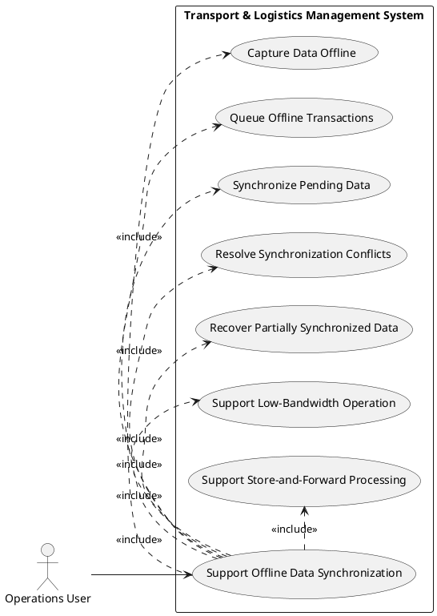

## Activity Diagram — PlantUML

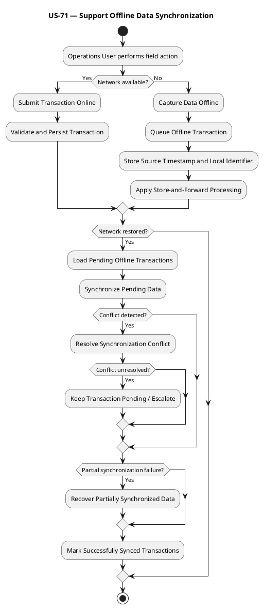

## Sequence Diagram — PlantUML

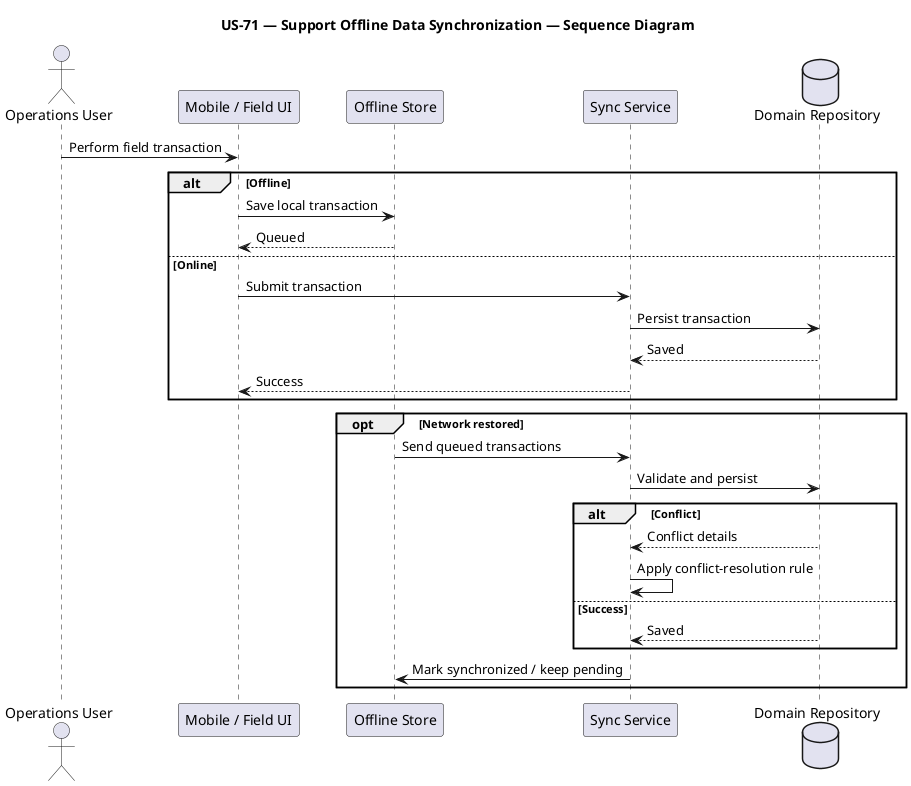

---

# US-72 — Enforce Compliance

**Primary Actor:** Compliance Officer  
**Goal:** Validate vehicle, driver, cargo, hazmat, tax, regional, and retention rules so regulated operations remain compliant.

## Use Case Diagram — PlantUML

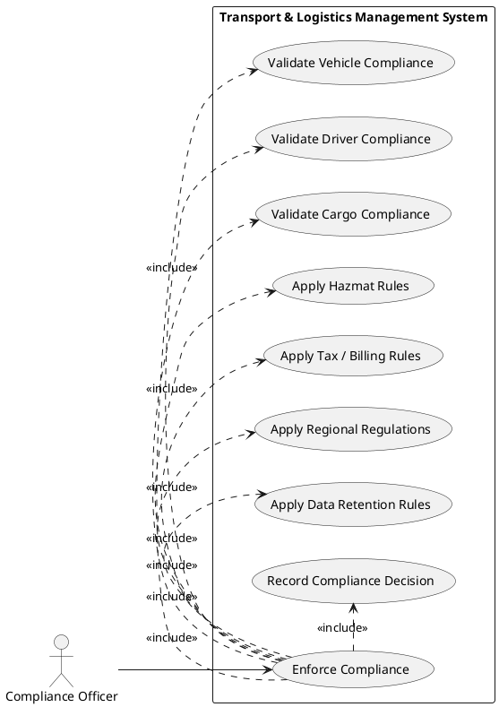

## Activity Diagram — PlantUML

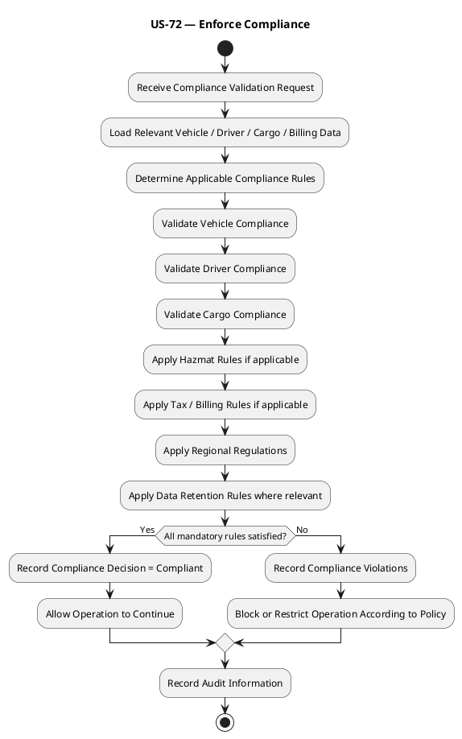

## Sequence Diagram — PlantUML

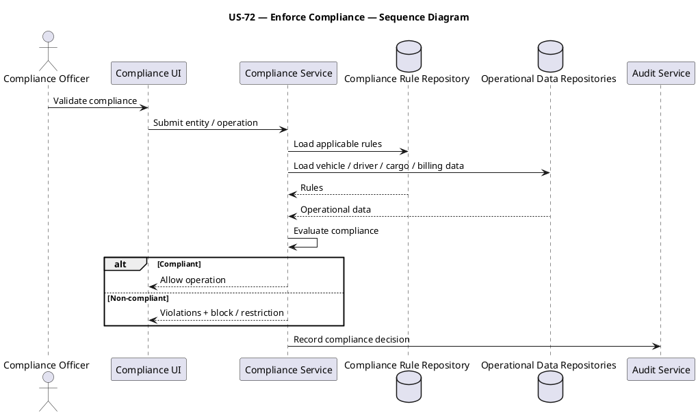

---

# US-73 — Manage External Integrations

**Primary Actor:** System Administrator  
**Goal:** Configure and monitor external system integrations so business data can be exchanged reliably.

## Use Case Diagram — PlantUML

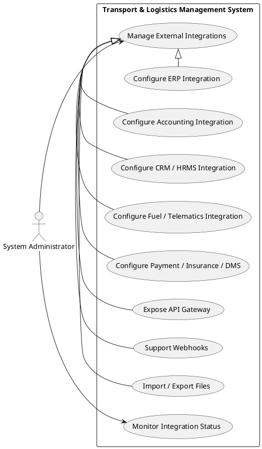

## Activity Diagram — PlantUML

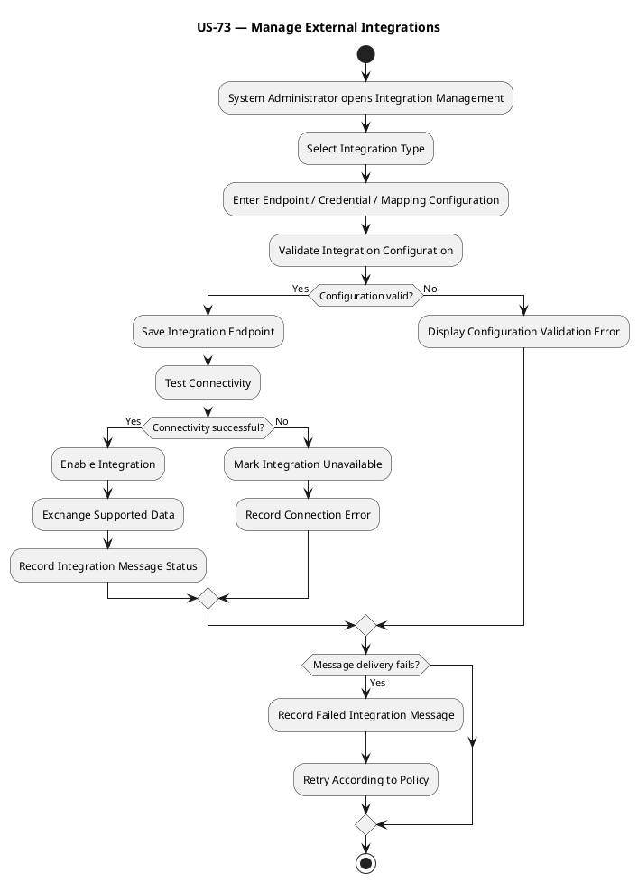

## Sequence Diagram — PlantUML

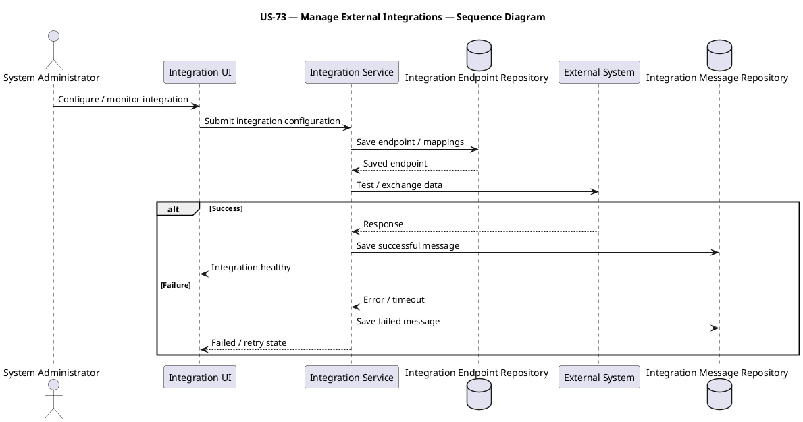

---

# US-74 — Manage Security

**Primary Actor:** System Administrator  
**Goal:** Enforce RBAC, ABAC, SSO, MFA, encryption, device authentication, session controls, and segregation of duties so system access remains secure.

## Use Case Diagram — PlantUML

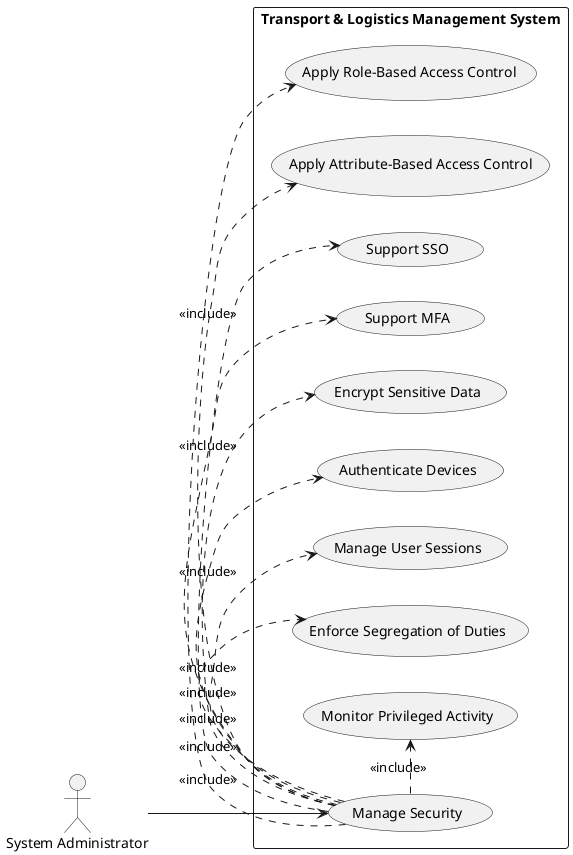

## Activity Diagram — PlantUML

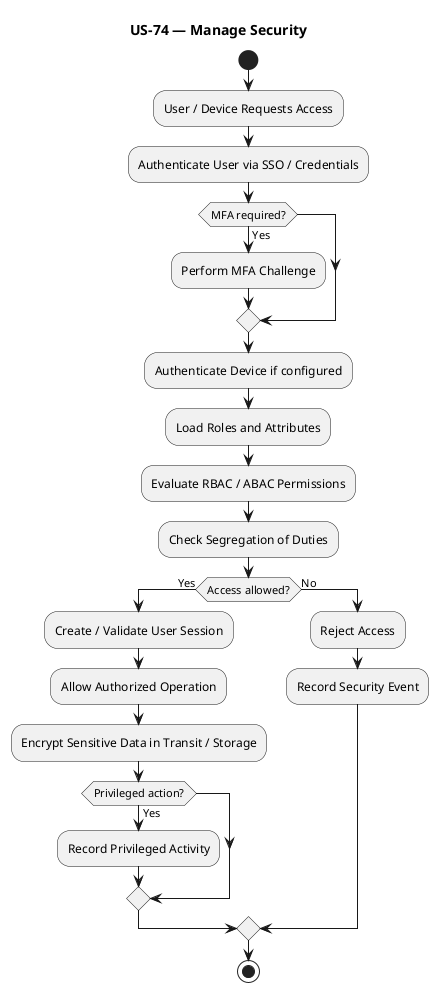

## Sequence Diagram — PlantUML

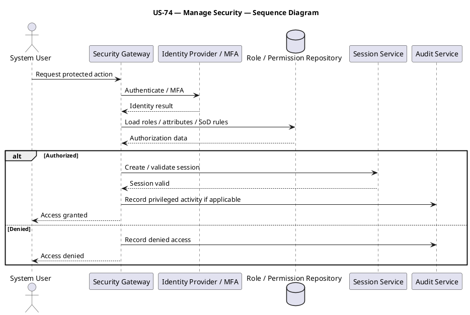

---

# US-75 — Maintain Audit and Reports

**Primary Actor:** Compliance Officer  
**Goal:** Maintain user logs, transaction trails, change history, and regulatory or operational reports so system activity remains auditable.

## Use Case Diagram — PlantUML

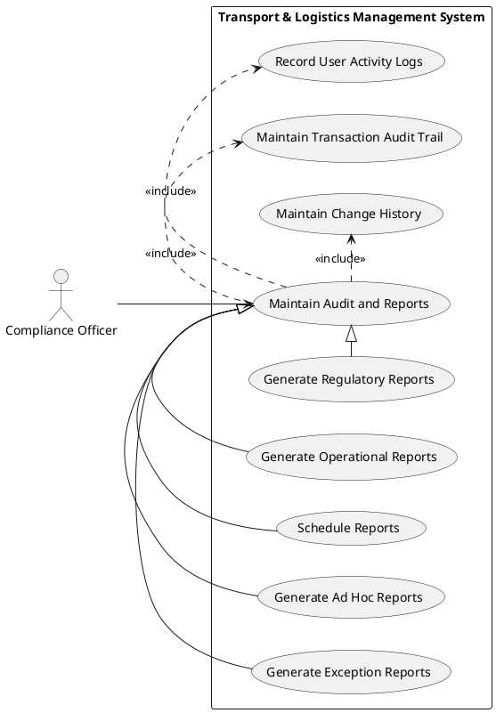

## Activity Diagram — PlantUML

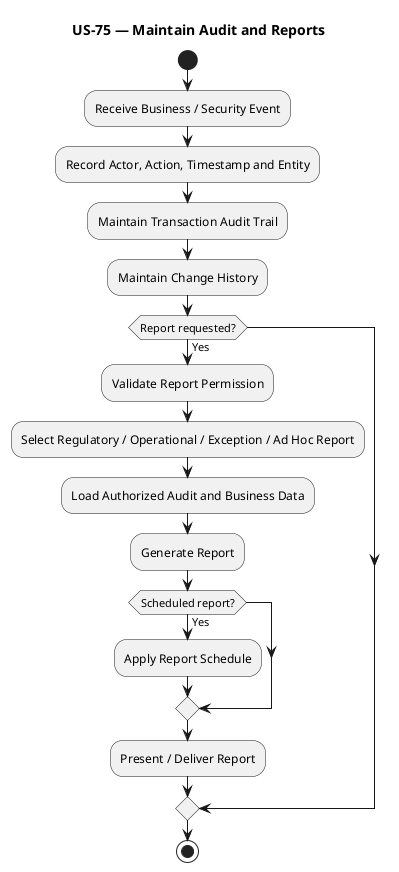

## Sequence Diagram — PlantUML

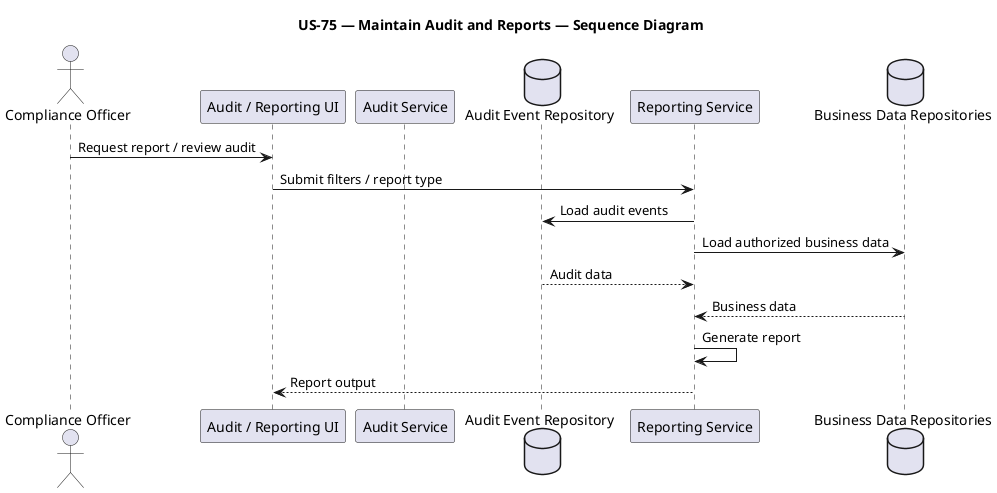

---

# US-76 — Support Mobile Operations

**Primary Actor:** Operations User  
**Goal:** Provide driver, dispatcher, and delivery mobile capabilities with offline-first workflows, camera, signature, push, background sync, and device health.

## Use Case Diagram — PlantUML

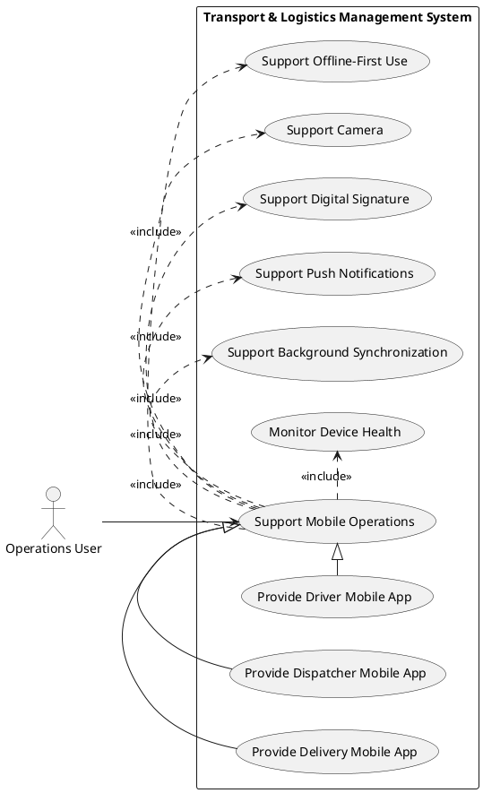

## Activity Diagram — PlantUML

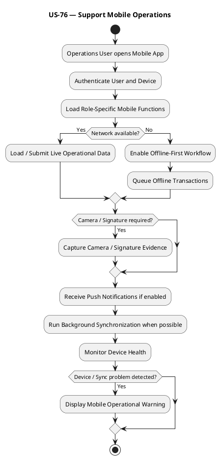

## Sequence Diagram — PlantUML

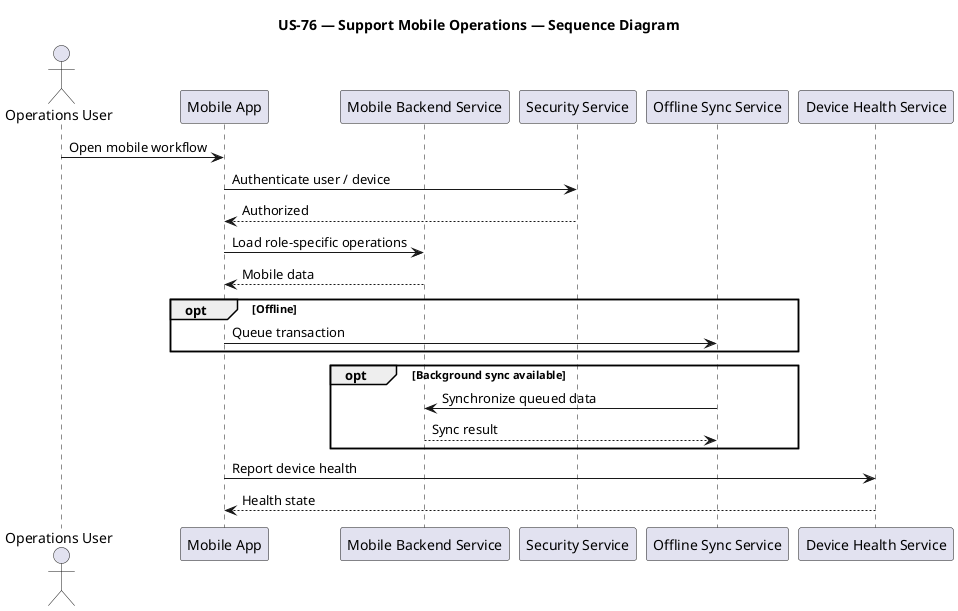

---

# US-77 — Manage Notification Rules

**Primary Actor:** System Administrator  
**Goal:** Configure channels, templates, escalations, and quiet hours so notifications are controlled consistently across the platform.

## Use Case Diagram — PlantUML

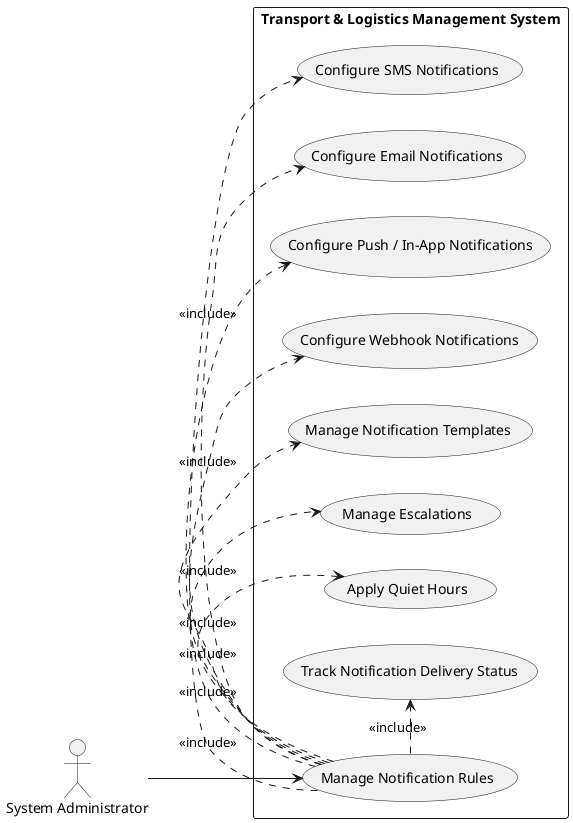

## Activity Diagram — PlantUML

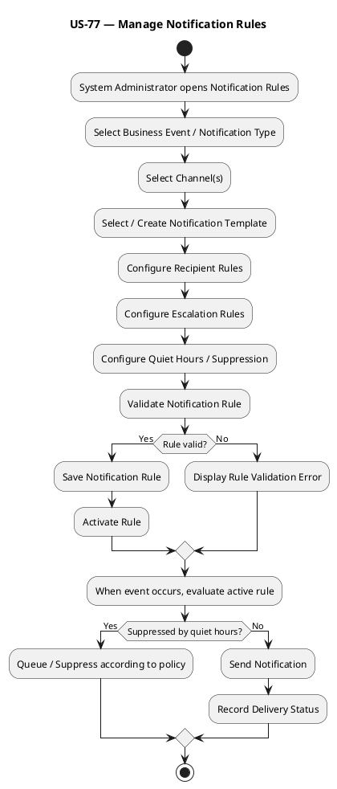

## Sequence Diagram — PlantUML

```plantuml
@startuml
title US-77 — Manage Notification Rules — Sequence Diagram
actor "System Administrator" as SA
participant "Notification Rule UI" as UI
participant "Notification Rule Service" as RS
database "Template / Rule Repository" as RR
participant "Notification Engine" as NE
database "Notification Repository" as NR
SA -> UI: Configure notification rule
UI -> RS: Submit channels, template, escalation, quiet hours
RS -> RS: Validate rule
RS -> RR: Save active rule
RR --> RS: Saved
NE -> RR: Load rule for business event
RR --> NE: Rule / template
NE -> NE: Apply quiet hours / escalation
NE -> NR: Record delivery / suppression status
NE --> UI: Notification status
@enduml
```

---

# US-78 — Manage Operational Exceptions

**Primary Actor:** Operations Manager  
**Goal:** Classify, assign, prioritize, escalate, and close operational exceptions with SLA, corrective action, and root cause tracking.

## Use Case Diagram — PlantUML

```plantuml
@startuml
left to right direction
actor "Operations Manager" as OM
rectangle "Transport & Logistics Management System" {
 usecase "Manage Operational Exceptions" as U0
 usecase "Classify Exception" as U1
 usecase "Auto-Assign Exception" as U2
 usecase "Set Severity" as U3
 usecase "Apply Escalation Matrix" as U4
 usecase "Track SLA" as U5
 usecase "Record Corrective Action" as U6
 usecase "Record Root Cause Analysis" as U7
 usecase "Close Exception" as U8
}
OM --> U0
U0 .> U1 : <<include>>
U0 .> U2 : <<include>>
U0 .> U3 : <<include>>
U0 .> U4 : <<include>>
U0 .> U5 : <<include>>
U0 .> U6 : <<include>>
U0 .> U7 : <<include>>
U0 .> U8 : <<include>>
@enduml
```

## Activity Diagram — PlantUML

```plantuml
@startuml
title US-78 — Manage Operational Exceptions
start
:Operational Exception Created;
:Classify Exception;
:Set Severity;
:Auto-Assign Responsible Owner;
:Start SLA Timer;
:Apply Escalation Matrix;
:Investigate Exception;
:Record Corrective Action;
if (Root Cause Analysis required?) then (Yes)
 :Record Root Cause Analysis;
endif
if (SLA at risk / breached?) then (Yes)
 :Escalate Exception;
endif
:Validate Resolution;
if (Resolution complete?) then (Yes)
 :Close Exception;
else (No)
 :Keep Exception Open;
endif
stop
@enduml
```

## Sequence Diagram — PlantUML

```plantuml
@startuml
title US-78 — Manage Operational Exceptions — Sequence Diagram
actor "Operations Manager" as OM
participant "Exception Management UI" as UI
participant "Exception Service" as ES
database "Exception Repository" as ER
participant "Workflow / SLA Service" as WS
OM -> UI: Review operational exception
UI -> ES: Submit classification / action
ES -> ER: Load exception
ER --> ES: Exception state
ES -> WS: Apply assignment / SLA / escalation rules
WS --> ES: Workflow state
ES -> ER: Save severity, corrective action, RCA, status
alt Resolution complete
 ES -> ER: Close exception
else SLA risk / incomplete
 ES -> WS: Escalate / continue tracking
end
ES --> UI: Updated exception state
@enduml
```

---

# US-79 — Manage Master Data

**Primary Actor:** System Administrator  
**Goal:** Maintain company, branch, vendor, customer, depot, product, and commodity reference data so operational transactions use controlled master records.

## Use Case Diagram — PlantUML

```plantuml
@startuml
left to right direction
actor "System Administrator" as SA
rectangle "Transport & Logistics Management System" {
 usecase "Manage Master Data" as U0
 usecase "Manage Company" as U1
 usecase "Manage Branch" as U2
 usecase "Manage Vendor" as U3
 usecase "Manage Customer" as U4
 usecase "Manage Depot" as U5
 usecase "Manage Product" as U6
 usecase "Manage Commodity" as U7
 usecase "Validate Master Data" as U8
 usecase "Prevent Unsafe Deletion" as U9
}
SA --> U0
U1 -|> U0
U2 -|> U0
U3 -|> U0
U4 -|> U0
U5 -|> U0
U6 -|> U0
U7 -|> U0
U0 .> U8 : <<include>>
U9 .> U0 : <<extend>>
@enduml
```

## Activity Diagram — PlantUML

```plantuml
@startuml
title US-79 — Manage Master Data
start
:System Administrator opens Master Data Management;
:Select Master Data Type;
if (Action?) then (Create / Update)
 :Enter Master Data Details;
 :Validate Mandatory Fields;
 :Check Duplicate / Invalid Master Data;
 if (Valid and unique?) then (Yes)
  :Save Master Record;
  :Record Change History;
 else (No)
  :Display Validation / Duplicate Error;
 endif
else (Delete / Deactivate)
 :Select Master Record;
 :Check Referential Usage;
 if (Record referenced?) then (Yes)
  :Prevent Unsafe Deletion;
  :Offer Deactivation where allowed;
 else (No)
  :Delete / Deactivate Master Record;
 endif
endif
stop
@enduml
```

## Sequence Diagram — PlantUML

```plantuml
@startuml
title US-79 — Manage Master Data — Sequence Diagram
actor "System Administrator" as SA
participant "Master Data UI" as UI
participant "Master Data Service" as MS
database "Master Data Repository" as MR
database "Operational References" as OR
SA -> UI: Create / update / delete master record
UI -> MS: Submit master-data command
MS -> MS: Validate mandatory / duplicate data
opt Delete / deactivate
 MS -> OR: Check referential usage
 OR --> MS: Reference state
end
alt Valid / safe
 MS -> MR: Save master record state
 MR --> MS: Saved
 MS --> UI: Success
else Invalid / referenced
 MS --> UI: Validation / deletion restriction
end
@enduml
```

---

# US-80 — Configure Workflows

**Primary Actor:** System Administrator  
**Goal:** Configure approval states, conditions, and escalation rules so business processes follow defined workflow logic.

## Use Case Diagram — PlantUML

```plantuml
@startuml
left to right direction
actor "System Administrator" as SA
rectangle "Transport & Logistics Management System" {
 usecase "Configure Workflows" as U0
 usecase "Configure Approval Workflow" as U1
 usecase "Configure Escalation" as U2
 usecase "Configure Workflow States" as U3
 usecase "Configure Workflow Conditions" as U4
 usecase "Validate State Transitions" as U5
 usecase "Activate Workflow Definition" as U6
 usecase "Version Workflow Definition" as U7
}
SA --> U0
U0 .> U1 : <<include>>
U0 .> U2 : <<include>>
U0 .> U3 : <<include>>
U0 .> U4 : <<include>>
U0 .> U5 : <<include>>
U0 .> U6 : <<include>>
U7 .> U0 : <<extend>>
@enduml
```

## Activity Diagram — PlantUML

```plantuml
@startuml
title US-80 — Configure Workflows
start
:System Administrator opens Workflow Configuration;
:Create / Select Workflow Definition;
:Define Workflow States;
:Define Allowed State Transitions;
:Define Approval Rules;
:Define Workflow Conditions;
:Define Escalation Rules;
:Validate Workflow Definition;
if (Definition valid?) then (Yes)
 :Save Workflow Version;
 :Activate Workflow Definition;
else (No)
 :Display Workflow Validation Error;
endif
if (Workflow updated later?) then (Yes)
 :Create New Workflow Version;
 :Preserve Existing Instance History;
endif
stop
@enduml
```

## Sequence Diagram — PlantUML

```plantuml
@startuml
title US-80 — Configure Workflows — Sequence Diagram
actor "System Administrator" as SA
participant "Workflow Configuration UI" as UI
participant "Workflow Definition Service" as WS
database "Workflow Definition Repository" as WR
participant "Workflow Engine" as WE
SA -> UI: Create / update workflow
UI -> WS: Submit states, conditions, approvals, escalation
WS -> WS: Validate transitions / logic
alt Valid
 WS -> WR: Save workflow version
 WR --> WS: Saved
 WS -> WE: Activate definition
 WE --> WS: Activated
 WS --> UI: Workflow active
else Invalid
 WS --> UI: Validation errors
end
@enduml
```

---

## Coverage Summary

| User Story | Title | Use Case | Activity | Sequence |
|---|---|---:|---:|---:|
| US-71 | Support Offline Data Synchronization | Yes | Yes | Yes |
| US-72 | Enforce Compliance | Yes | Yes | Yes |
| US-73 | Manage External Integrations | Yes | Yes | Yes |
| US-74 | Manage Security | Yes | Yes | Yes |
| US-75 | Maintain Audit and Reports | Yes | Yes | Yes |
| US-76 | Support Mobile Operations | Yes | Yes | Yes |
| US-77 | Manage Notification Rules | Yes | Yes | Yes |
| US-78 | Manage Operational Exceptions | Yes | Yes | Yes |
| US-79 | Manage Master Data | Yes | Yes | Yes |
| US-80 | Configure Workflows | Yes | Yes | Yes |

## Source Basis

The diagrams preserve the supplied requirements model and terminology. Offline synchronization is treated as a reusable platform capability; compliance evaluates domain data without owning it; integrations handle connectivity and message exchange rather than business decisions; security separates authentication, authorization, sessions, device trust, SoD, and privileged monitoring; audit/reporting remains observational; and workflow configuration is modeled as a reusable engine rather than a dozen mutually incompatible approval buttons breeding across modules.
