# Transport & Logistics Management System

## UML Diagrams — US-81 to US-90

This document is based strictly on the supplied Transport & Logistics requirements. The source defines user stories through **US-87 only**. Therefore **US-81–US-87** are fully documented below with Use Case, Activity, and Sequence diagrams, while **US-88–US-90 are explicitly marked as undefined** rather than invented.

---

# US-81 — Manage Scheduling

**Primary Actor:** Operations Manager  
**Goal:** Maintain resource, holiday, shift, and maintenance-blackout calendars so scheduling reflects true resource availability.

## Use Case Diagram — PlantUML

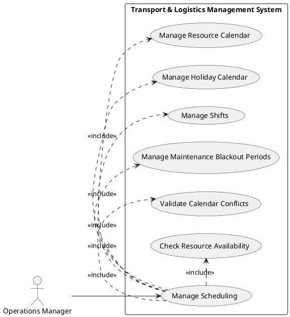

## Activity Diagram — PlantUML

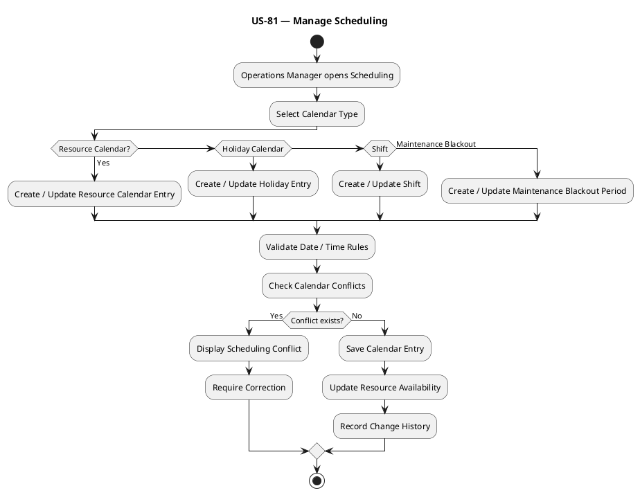

## Sequence Diagram — PlantUML

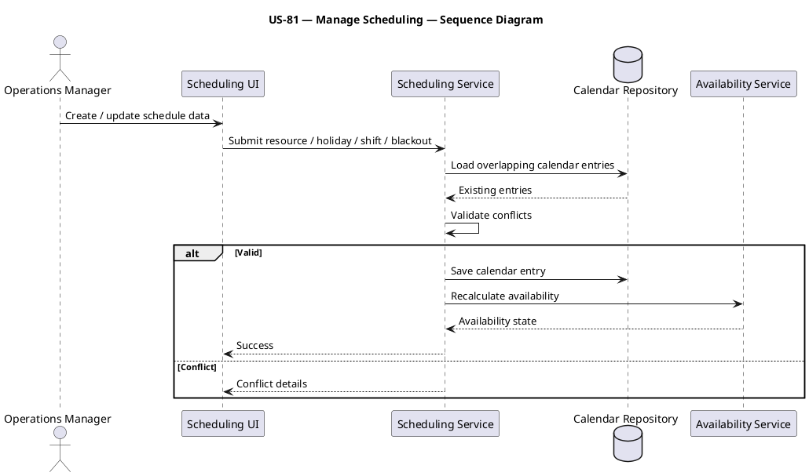

---

# US-82 — Use Operational Analytics

**Primary Actor:** Operations Manager  
**Goal:** Use dashboards, KPIs, predictive maintenance, demand forecasting, risk scoring, and recommendations so operational decisions are data-driven.

## Use Case Diagram — PlantUML

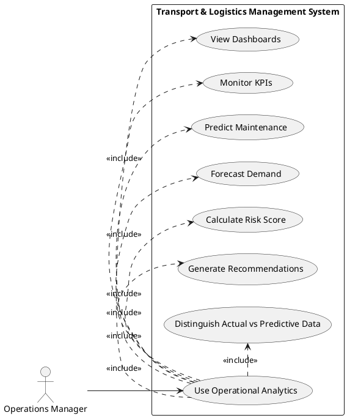

## Activity Diagram — PlantUML

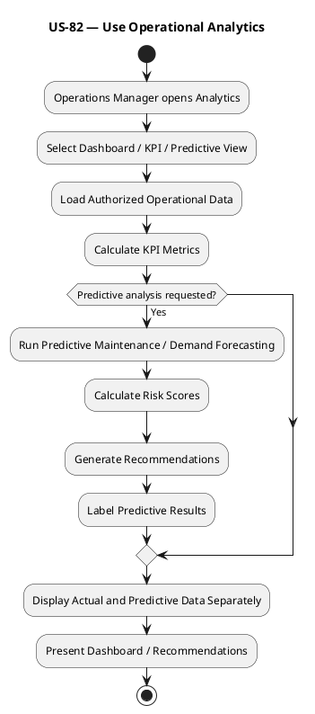

## Sequence Diagram — PlantUML

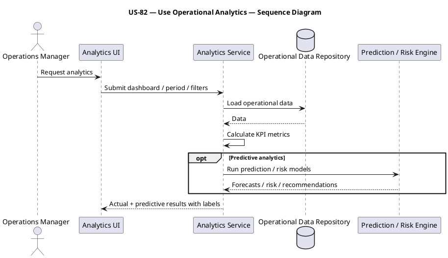

---

# US-83 — Manage Documents

**Primary Actor:** Authorized User  
**Goal:** Upload, version, retain, permission, and OCR-process documents so supporting documentation is controlled and traceable.

## Use Case Diagram — PlantUML

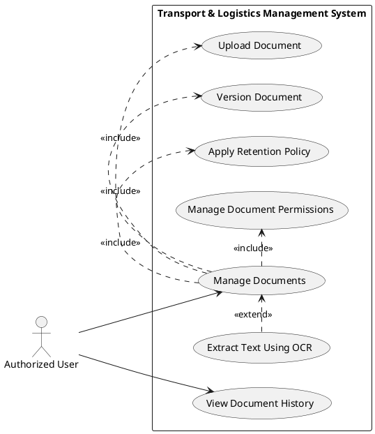

## Activity Diagram — PlantUML

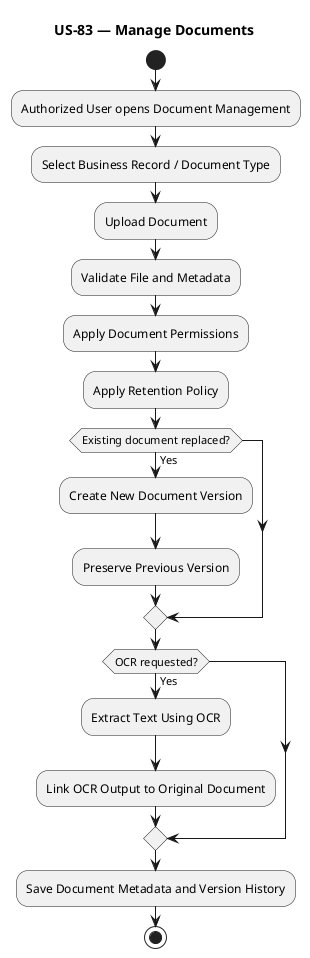

## Sequence Diagram — PlantUML

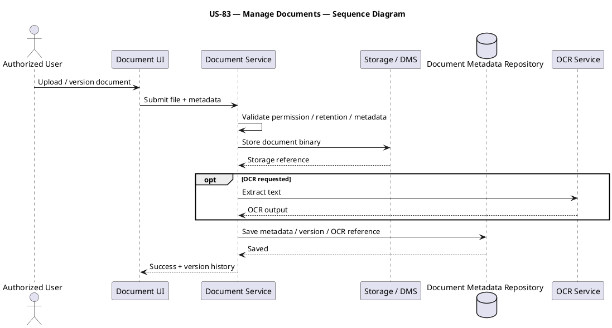

---

# US-84 — Handle Global System Failures

**Primary Actor:** Operations Manager  
**Goal:** Handle server outage, replication lag, third-party downtime, message queue backlog, and clock drift so operational continuity is protected.

## Use Case Diagram — PlantUML

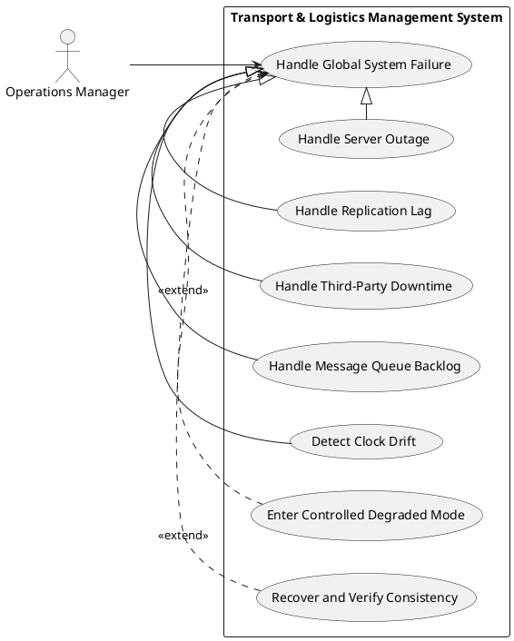

## Activity Diagram — PlantUML

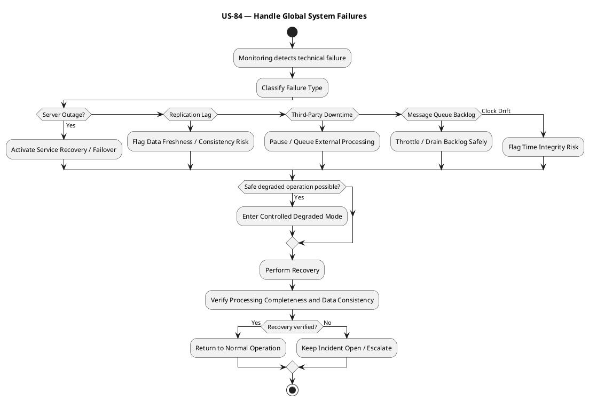

## Sequence Diagram — PlantUML

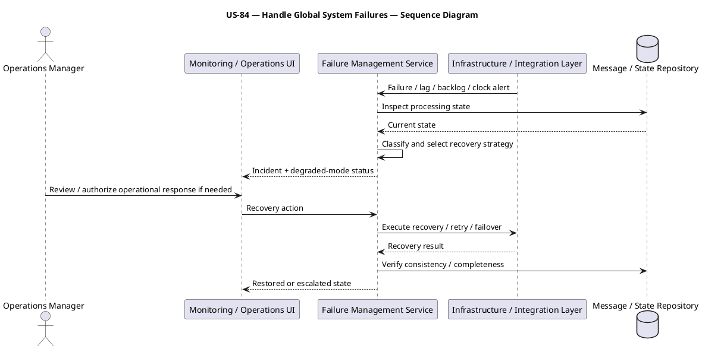

---

# US-85 — Protect Data Integrity

**Primary Actor:** Operations Manager  
**Goal:** Detect duplicates, orphaned transactions, mismatches, and invalid master data so transactional integrity remains trustworthy.

## Use Case Diagram — PlantUML

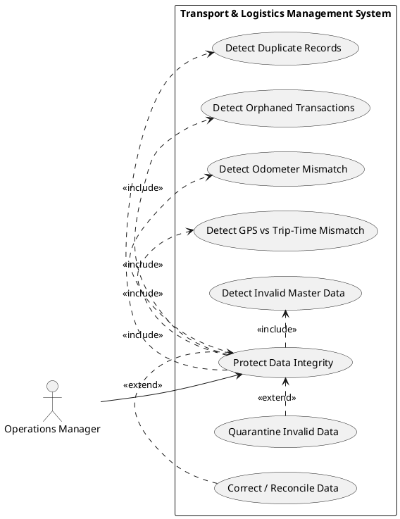

## Activity Diagram — PlantUML

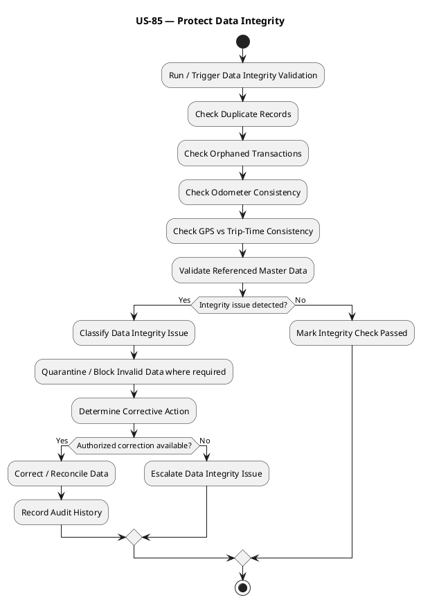

## Sequence Diagram — PlantUML

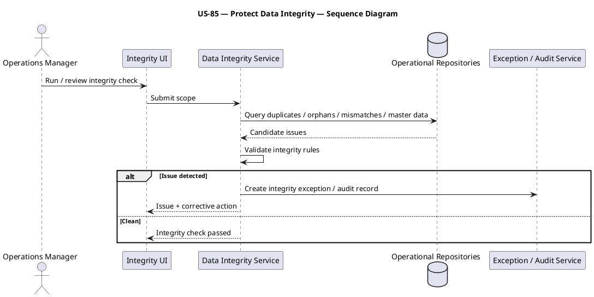

---

# US-86 — Handle Operational Disruptions

**Primary Actor:** Operations Manager  
**Goal:** Represent disasters, restrictions, strikes, border delays, and demand spikes as operational constraints so logistics plans can adapt.

## Use Case Diagram — PlantUML

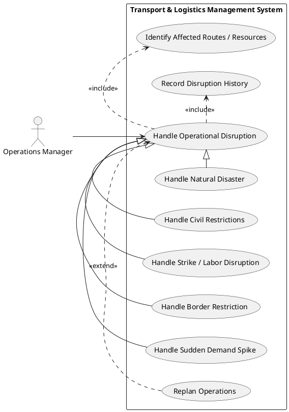

## Activity Diagram — PlantUML

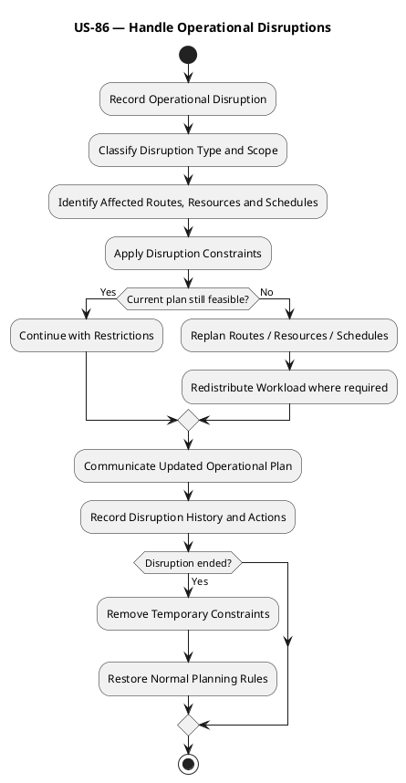

## Sequence Diagram — PlantUML

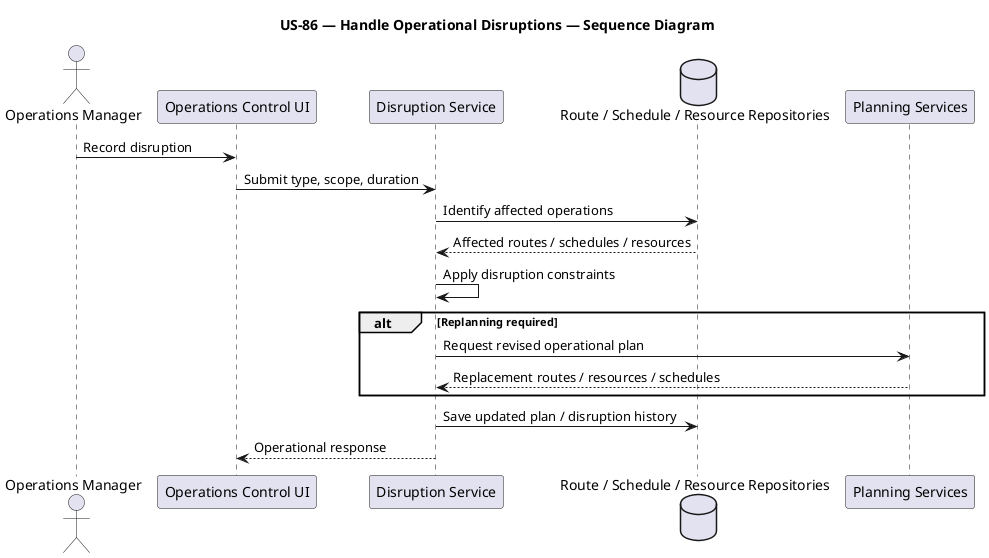

---

# US-87 — Detect User Risk

**Primary Actor:** System Administrator  
**Goal:** Detect unauthorized overrides, missing mandatory fields, fraudulent activity, shared logins, and delayed reporting so operational misuse can be controlled.

## Use Case Diagram — PlantUML

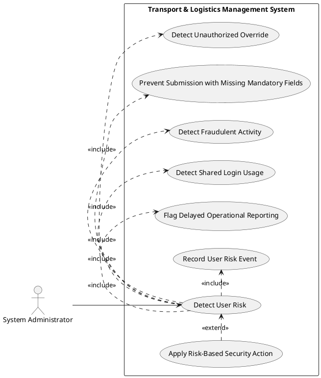

## Activity Diagram — PlantUML

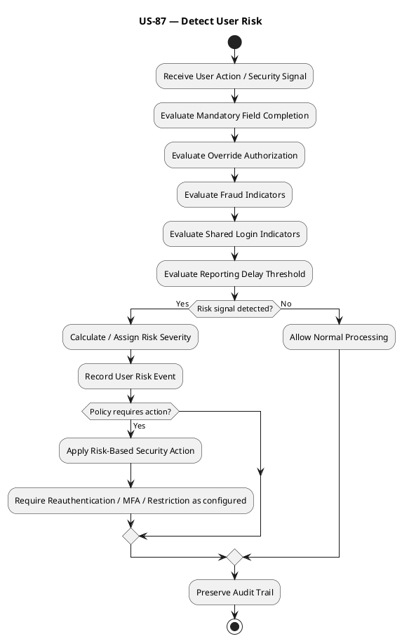

## Sequence Diagram — PlantUML

```plantuml
@startuml
title US-87 — Detect User Risk — Sequence Diagram
actor "System Administrator" as SA
participant "Security / Risk UI" as UI
participant "User Risk Service" as RS
participant "User Activity Stream" as US
database "Audit / Session Repository" as AR
participant "Security Enforcement Service" as SE
US -> RS: User action / behavioral signal
RS -> AR: Load session / audit context
AR --> RS: Historical context
RS -> RS: Evaluate override / fields / fraud / shared login / delay
alt Risk detected
 RS -> AR: Save risk event
 RS -> SE: Apply configured risk action
 SE --> RS: Enforcement state
 RS --> UI: Risk alert / restriction
else No risk
 RS --> UI: Normal state
end
SA -> UI: Review user-risk events
@enduml
```

---

# US-88 — Not Defined in Supplied Requirements

**Status:** Not available in the supplied source material.

No Use Case, Activity, or Sequence diagram has been generated for this ID because doing so would require inventing a user story that is not present in the provided requirements.

---

# US-89 — Not Defined in Supplied Requirements

**Status:** Not available in the supplied source material.

No Use Case, Activity, or Sequence diagram has been generated for this ID because doing so would require inventing a user story that is not present in the provided requirements.

---

# US-90 — Not Defined in Supplied Requirements

**Status:** Not available in the supplied source material.

No Use Case, Activity, or Sequence diagram has been generated for this ID because doing so would require inventing a user story that is not present in the provided requirements.

---

## Coverage Summary

| User Story | Title / Status | Use Case | Activity | Sequence |
|---|---|---:|---:|---:|
| US-81 | Manage Scheduling | Yes | Yes | Yes |
| US-82 | Use Operational Analytics | Yes | Yes | Yes |
| US-83 | Manage Documents | Yes | Yes | Yes |
| US-84 | Handle Global System Failures | Yes | Yes | Yes |
| US-85 | Protect Data Integrity | Yes | Yes | Yes |
| US-86 | Handle Operational Disruptions | Yes | Yes | Yes |
| US-87 | Detect User Risk | Yes | Yes | Yes |
| US-88 | Not defined in supplied requirements | No | No | No |
| US-89 | Not defined in supplied requirements | No | No | No |
| US-90 | Not defined in supplied requirements | No | No | No |

## Source Boundary Note

The supplied requirements model ends at **US-87 — Detect User Risk**. US-88, US-89, and US-90 are not defined in the uploaded material, so they are intentionally left without invented diagrams. This preserves traceability and prevents three imaginary requirements from sneaking into the backlog wearing very convincing UML costumes.
